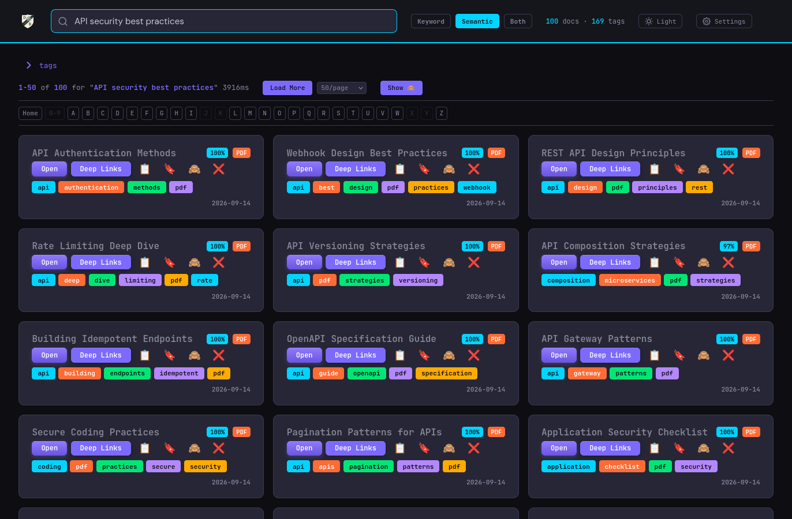
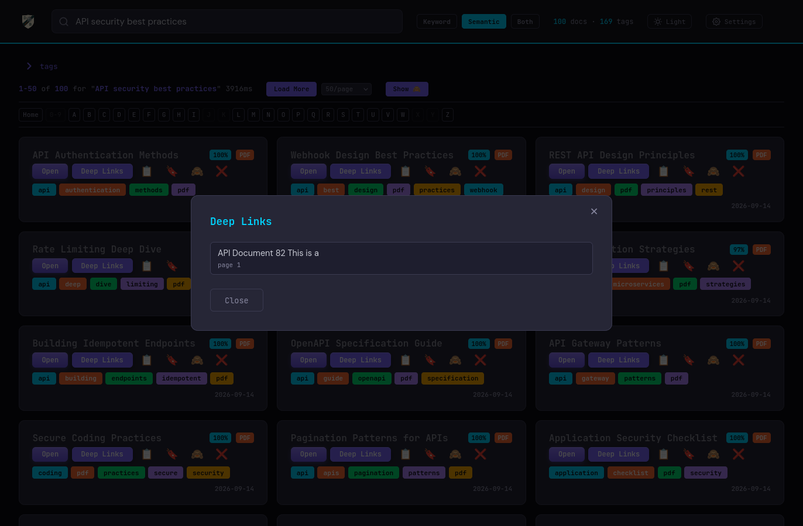
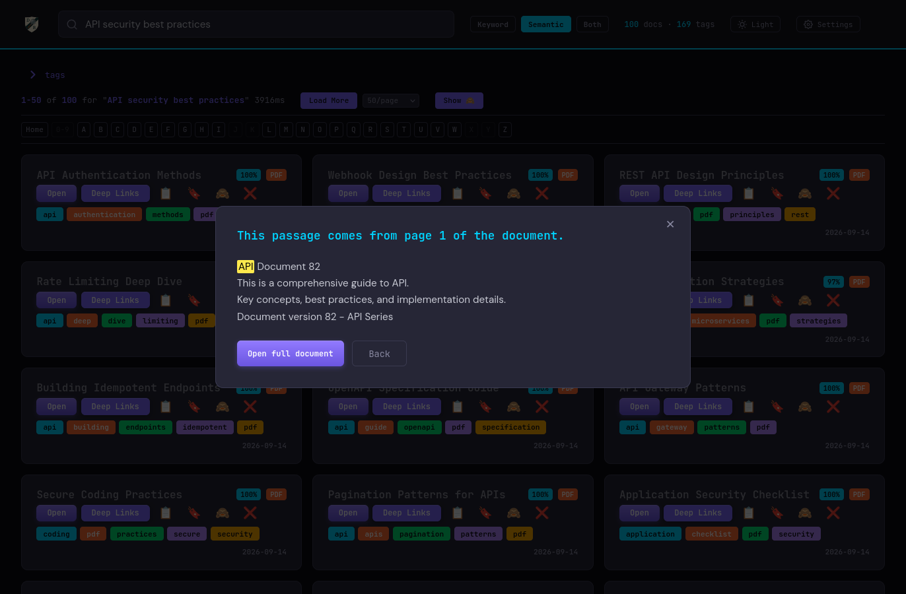
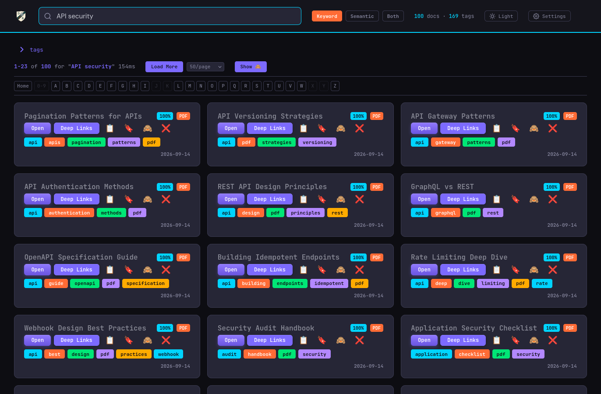
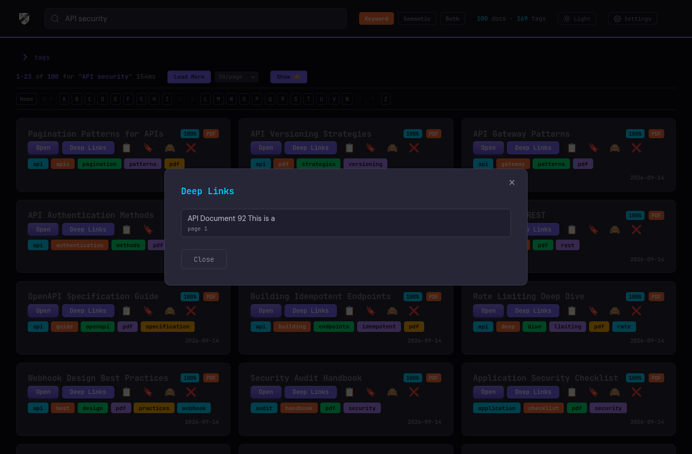
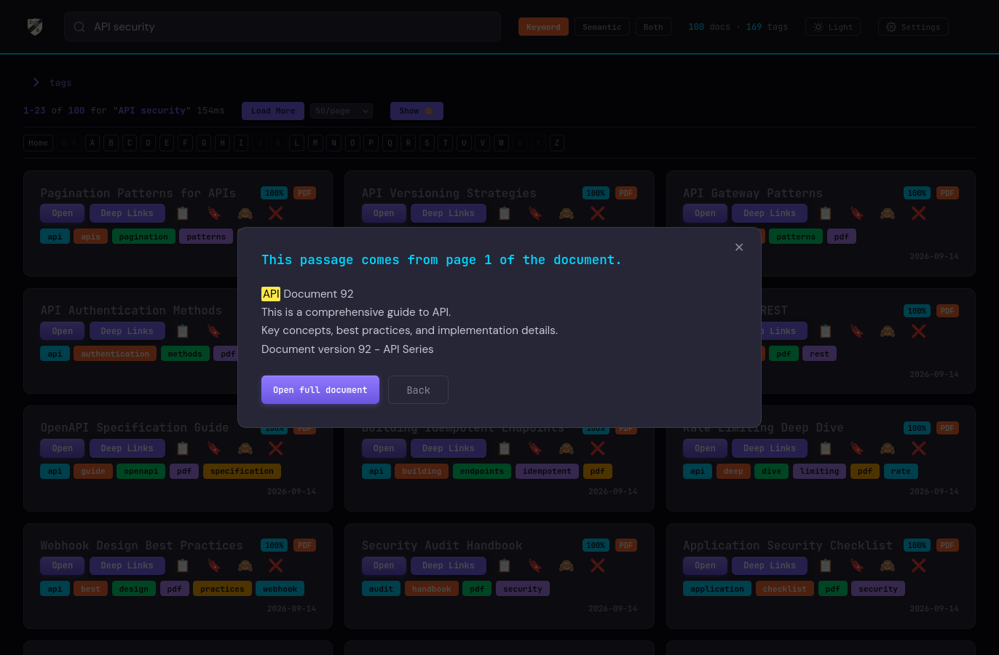

<!-- 翻訳版 — 英語版 README.md と同期して更新してください / Translation — keep in sync with README.md -->

**言語 / Language:** [English](README.md) | **日本語**

# DocuBrowse v1.3.0

<a name="top"></a>

Linux（RPM・DEB・tarball）、Windows（zip）、macOS（dmg）向けにパッケージ化されています。
インターフェースは安定しており、可能な限り破壊的変更を避けています。

**DocuBrowse は、散らかった大量の文書を実際に検索できるものへと変えます。**
手持ちのファイル（PDF、電子書籍、Word 文書、メモ、何でも）を指定すると、キーワードだけでなく
「意味」まで理解するスマートなインデックスを構築します。「あの賃貸更新に関する契約書」と尋ねれば、
その正確な語句が一度も現れていなくても見つけ出せます。任意の検索結果をクリックすれば、
ファイルを開く前に AI による即時要約が表示されます。PII（個人情報）を認識し、複数の文書ディレクトリに対応します。

DocuBrowse はローカル AI モデルを使い、完全にご自身のマシン上で動作します。インターネット接続は不要、
アカウントも API キーも不要、トークン予算を消費するクエリ単位のコストもありません。**あなたのデータ。あなたの AI。**

内部構成：SQLite FTS5 によるキーワード検索に加え、AI による意味的類似検索と要約生成
（Ollama + nomic-embed-text + dolphin3）。複数の文書形式・ソースコード形式に対応します。

> **Docker（実験的 — まだ推奨しません）：** コンテナ化されたデプロイを `docker-experiment`
> ブランチで試行中です。Docker/OS の制約と DocuBrowse のセキュリティモデルのため、完全に動作する
> 構成にはまだ到達していません。特に、ブラウザベースのコンテナからデスクトップアプリで文書を開く
> ことができません（サーバーはヘッドレスで、ブラウザはサンドボックス化されているため）。試したい方の
> ために当該ブランチで利用可能ですが、**利用は推奨しません**。ブランチ上の `docker/README.md`
> を参照してください。

---

## ナビゲーション

| | | |
|---|---|---|
| [機能](#features) | [検索のコツとテクニック](#search-tips-and-tricks) | [スクリーンショット](#screenshots) |
| [クイックスタート](#quick-start) | [言語](#languages) | |
| [CLI リファレンス](#cli-reference) | [設定](#configuration) | [アーキテクチャ](#architecture) |
| [API エンドポイント](#api-endpoints) | [検索アルゴリズム](#search-algorithm) | [セキュリティ](#security) |
| [ファイル構成](#file-structure) | [トラブルシューティング](#troubleshooting) | [既知の制限事項](#known-limitations) |
| [変更履歴](#recent-changes) | | |
| [ロードマップ](#roadmap) | [AI 支援開発](#ai-assisted-development) | [ライセンス](#license) |

---

<a name="features"></a>

## 機能

[↑ トップ](#top)

### 🔍 2 つの検索モード
- **キーワード検索** — SQLite FTS5 による高速な全文検索（タイトル、著者、件名、タグ、抜粋）
- **意味検索** — Ollama の埋め込み（nomic-embed-text:latest）による AI 類似検索。意味検索はクエリに関連する *どの文書* が該当するかを特定し、**Deep Links**（後述）が文書の *どこ* に一致箇所があるかを絞り込みます。
- **ハイブリッドモード**（既定、"Both"）— キーワードと意味を統合し、各文書について 2 つのスコアのうち高い方を採用します（両方が該当した場合はわずかに加点）。表示されるにはキーワードヒットか意味スコアの下限を満たす必要があります。[検索のコツとテクニック](#search-tips-and-tricks)を参照。

### 🎯 Deep Links — 文書内パッセージ検索
- 任意のキーワード検索・意味検索の結果から **Deep Links** をクリックすると、その文書の *内部* で一致するパッセージを見つけられます。オンデマンドで、再インデックス不要・スキーマ変更なしです。
- 各パッセージには短い抜粋と位置ラベル（**ページ**、**行**、または**セクション**）が表示され、クリックすると一致テキストがハイライトされた状態でパッセージが開きます。
- モードは検索に追随します。**意味**検索は意味でパッセージを見つけ、**キーワード**（またはハイブリッド）検索は語句で見つけます。
- 散文形式：**PDF、TXT、HTML、Markdown、DOCX、RTF、ODT**、電子書籍（EPUB、MOBI、AZW3）、DjVu、加えて SGML/XML ファミリ（XHTML、XML、DocBook、RSS/Atom、OPML）やその他のテキスト/マークアップ形式（reST、AsciiDoc、LaTeX、設定ファイル、JSON/YAML、メール、ソースコード）。散文以外（表計算、プレゼンテーション、図表）は、それぞれのリーダーで開く動作にフォールバックします。
- Deep Links が「見つかりません（Not Found）」を返す場合、その文書タイプがまだ実装に組み込まれていない可能性が高いです。文書に割り当て済みのキーワードは拾えていますが、実際に文書を読み込んで Deep Links を作成することはまだできていません。可能な限り、そして価値のある範囲で拡張を進めています（モナ・リザの画像だけの PDF を深く検索するようなケースは、この方法ではおそらく永遠に検索できません）。

### 📖 AI 要約
- 任意の文書タイトルをクリックすると、Kindle の「本の帯」風の要約が Ollama（`dolphin3:latest`）によりオンデマンド生成され、初回生成後にデータベースにキャッシュされます。
  最小構成のハードウェア（CPU のみ、GPU なし）では、ある文書の初回要約に時間がかかることがあります。以降のリクエストはキャッシュされているため即時です。
  意味検索の埋め込みは、もう 1 つのローカルモデル（`nomic-embed-text:latest`）で生成されます。

### 📚 文書のインデックス化
- **対応形式**：PDF、DOCX、PPTX、XLSX、ODT、ODS、ODP、OTT/OTS/OTP（ODF テンプレート）、VSDX/VSDM、VSD/VSS/VST（旧 Visio）、VDX（Visio 2003 XML）、draw.io/diagrams.net（.drawio/.dio）、PlantUML（.puml/.plantuml）、Mermaid（.mmd）、SGML/XML ファミリ（.xml/.xhtml/.sgml/.sgm）、DocBook（.docbook/.dbk）、SVG、フィード（.rss/.atom/.opml）、reStructuredText（.rst）、AsciiDoc（.adoc/.asciidoc）、LaTeX（.tex/.latex）、メール（.eml）、RTF（.rtf）、CSV / TSV、EPUB、MOBI、AZW3、AZW、DjVu（.djvu/.djv）、HTML、TXT、Markdown、加えて設定系プレーンテキスト（.ini/.conf/.cfg/.log/.lst）
- **PDF インテリジェンス**：pdfplumber（優先）に加え、肥大化オブジェクトのファイル向けに pypdf フォールバック。複雑なレイアウトには `layout=False` で再試行。スキャン（画像のみ）PDF を検出して `ocr_list_pdfs.txt` へ振り分け。
- **Word 文書**：python-docx が段落・表・コアプロパティ（タイトル、著者、件名）を抽出。
- **プレゼンテーション**：python-pptx がスライドテキスト・ノート・コアプロパティを抽出。
- **表計算**：openpyxl がセル値とシート名を抽出。
- **OpenDocument**：ODF テキスト文書（.odt）、表計算（.ods）、プレゼンテーション（.odp）、およびそれらのテンプレート派生（.ott/.ots/.otp）。段落、見出し、リスト、表、セル値、スライドテキストを Python 標準ライブラリ（`zipfile` + `xml.etree.ElementTree`）で抽出。テンプレートは mimetype 接頭辞により対応する抽出器へ振り分け。メタデータ（タイトル、著者、件名、説明、キーワード）は `meta.xml` から読み取り。追加依存は不要。
- **Visio と図表**：
  - 最新の Visio（`.vsdx`/`.vsdm`）— OOXML zip を標準ライブラリで解析。シェイプテキスト、ページ名、コアプロパティ（タイトル/著者/件名/キーワード）をサードパーティ依存なしで抽出。
  - 旧 Visio（`.vsd`/`.vss`/`.vst`）— バイナリの複合文書。**libvisio-tools** の任意ツール `vsd2xml`（`sudo dnf install libvisio-tools` / `sudo apt install libvisio-tools`）が必要です。無い場合、旧ファイルはメタデータのみでインデックス化され（ファイル名をタイトルに、本文なし）、パスが `visio_legacy_missing.txt` に追記されるため、インストール後の再スキャンで拾われます。
  - draw.io / diagrams.net（`.drawio`/`.dio`）— プレーンな `mxfile` XML と、圧縮（`deflate + base64 + URL エンコード`）された図の両方に対応。すべての `mxCell` ラベルと `object` ラベル、ページ名を抽出。標準ライブラリのみ。
  - テキストベースの図表 — PlantUML（`.puml`/`.plantuml`）と Mermaid（`.mmd`）のソースはプレーンテキストとしてインデックス化され、`diagram` タグが付与されます。
- **マークアップファミリ**（すべて標準ライブラリ、追加依存なし）：
  - XML/SGML（`.xml`/`.xhtml`/`.sgml`/`.sgm`）、DocBook（`.docbook`/`.dbk`）、SVG（`diagram` タグも付与）、フィード（`.rss`/`.atom`/`.opml`）はタグ除去されます。DOCTYPE、コメント、CDATA ラッパー、`<script>`・`<style>` ブロックを除去し、残りのタグを削除、エンティティをアンエスケープします。除去の前に、よく知られた要素（`<title>`、`<dc:title>`、`<author>`、`<dc:creator>`）からタイトル/著者/件名を推定するため、DocBook、Atom、RSS、SVG のいずれも有用なメタデータを提示します。
  - reStructuredText（`.rst`）、AsciiDoc（`.adoc`/`.asciidoc`）、LaTeX（`.tex`/`.latex`）はそのままインデックス化され（すべてのマークアップが検索可能テキストになります）、形式ごとのタイトル推定を行います。reST の下線スタイルのタイトル、AsciiDoc のレベル 0 `= Title`、LaTeX の `\title{}` / `\section{}`。LaTeX の `\author{}` も取得し、行頭 `%` コメントは除去します。
  - すべてのマークアップファイルには、閲覧・フィルタ用に `markup` タグが付与されます。`.vdx`（Visio 2003 XML）には `diagram` タグも付きます。
- **メール、RTF、表形式、設定系テキスト**：
  - メール（`.eml`）— 標準ライブラリの `email` パッケージで解析。Subject をタイトル、From を著者、To/Cc/Date と本文（プレーンテキスト、または HTML 本文をタグ除去したもの）を検索対象コンテンツにします。添付ファイル名も追記され、ファイル名検索でヒットします。
  - RTF（`.rtf`）— **striprtf**（純 Python、MIT）でデコード。無い場合はメタデータのみでインデックス化され、パスが `rtf_missing_striprtf.txt` に追記されます。`striprtf` をインストールして再スキャンすれば本文が拾われます。
  - CSV / TSV — 先頭約 500 行をパイプ区切りの行として描画してインデックス化。ヘッダー行は `description` フィールドに入るため、列名がキーワード検索に効きます。標準ライブラリのみ、区切り文字は自動検出。
  - 設定系プレーンテキスト — `.ini`、`.conf`、`.cfg`、`.log`、`.lst` は標準のテキスト処理を通り、同じ 200 KB の読み取り上限が適用されます。
- **電子書籍**：EPUB は ebooklib、MOBI/AZW3 のテキスト抽出は mobi パッケージ + Calibre の `ebook-convert` フォールバック。DRM で暗号化された AZW ファイルはメタデータのみでインデックス化されます（タイトル/著者は表示可、本文は検索不可）。
- **DjVu**：`.djvu`/`.djv` のテキストレイヤーを **DjVuLibre**（`djvutxt`/`djvused`、pip 以外の外部ツール）で抽出。無い場合はメタデータのみでインデックス化され、パスが `djvu_missing_djvulibre.txt` に追記されます。DjVuLibre をインストールして再スキャンすれば本文が拾われます。テキストレイヤーの無い画像のみの DjVu はメタデータのみでインデックス化されます（OCR は行いません。スキャン PDF と同様）。
- **プラットフォーム**：すべての抽出ライブラリは純 Python か、x86_64 と ARM64 の両方に wheel が存在します。32 ビットシステムは非対応です。
- **メタデータ**：文書のメタデータフィールドからタイトル・著者・件名を抽出。ディレクトリ構成とコンテンツのキーワードから自動でタグを生成。
- **PII 保護**：取り込み後スキャナが SSN、クレジットカード、銀行の ABA ルーティング番号/口座番号、生年月日、MRN、運転免許証、パスポートのパターンを検出。該当文書を削除し、恒久的にブラックリスト化します。

### 🎨 ユーザーインターフェース
- ダーク/ライトテーマの切り替え
- ページネーション付き結果（1 ページ 50 件）と戻る/次へ操作
- クイックナビ用のアルファベット索引バー（A–Z、0–9）。ページ読み込みをまたいで状態を保持。リセット用の Home ボタンあり
- トピックで絞り込むためのタグクラウド
- すべての結果に関連度スコアのバッジ（0–100%）
- 各結果カードの **Open ボタン** — `xdg-open` で既定アプリを起動してファイルを開きます
- 文書タイトルをクリックで AI 要約。📋 でパスをクリップボードにコピー。🗑 でファイルをディスクとインデックスから削除（確認あり）
- 移動/削除された文書：ファイルが存在しない文書をクリックすると、そのファイルシステムがマウント済みなら閉じられるモーダル（閉じるとインデックスから削除）が、ファイルシステムを確認できない場合（例：アンマウントされたドライブ）はトースト（インデックス変更なし）が表示されます

### ⚙️ 設定（`/settings`）
- 全般パネル：文書ディレクトリ（ライブのディレクトリブラウザ付き）、任意個数の追加スキャンディレクトリ（同じパネルで追加/削除でき、`scan`/`rescan` に自動的に含まれます。追加コマンド不要）、作業ディレクトリ、ポート
- 除外ディレクトリパネル：`ignore_dirs.txt` にディレクトリを追加。追加時にはその配下のインデックス済み文書を削除する前に確認プロンプトが、エントリ削除時にも確認が表示されます

### ⚡ パフォーマンス
- 検索レイテンシ：通常 150ms 未満
- `ProcessPoolExecutor` による並列 PDF 抽出（物理コア数を考慮したワーカー数）
- メモリ安全：カーネルによる RLIMIT_AS（ワーカーあたり 6 GB）+ 空きメモリしきい値での一時停止/再開

---

<a name="search-tips-and-tricks"></a>

## 検索のコツとテクニック

[↑ トップ](#top)

DocuBrowse には 3 つの検索モードがあります（右上で切り替え）：**Keyword**、**Semantic**、**Both**（既定のハイブリッド）。**Enter キーで検索が実行されます** — 入力欄を空にすると全文書が再表示されます。**Deep Links** をクリックしたときの文書内でも同じルールが適用され、Deep Links は検索で使ったモードに追随します。

### 3 つのモード

- **Keyword** — SQLite FTS5 による文字どおりのテキスト。各語は前方一致し、語同士は OR 結合されます。したがって `budget report` は *budget…* **または** *report…* を含む文書を見つけます（両方とは限りません）。ヒット位置でランク付けされ、**タイトル**や**著者**での一致は本文やタグでの一致より上位になります。文書に実際に含まれる語・名前・コードが分かっているときに最適です。
- **Semantic** — AI 埋め込みによる「意味」。正確な語を含まなくても、クエリに *関する* 文書を見つけます。概念的な近さでランク付けされます。正確な表現が分からず「X についての文書」を探すときに最適です。
- **Both**（既定）— 両方を実行し、各文書について高い方のスコアを採用します（両方で該当した場合はわずかに加点）。表示されるにはキーワードヒットか意味のある意味スコアが必要なため、弱い意味的ノイズが確実なキーワード一致を埋もれさせません。

### 語の組み合わせによる挙動

| 入力 | Keyword モード | Semantic モード |
|---|---|---|
| `budget report` | *budget…* **または** *report…* を含む文書（前方一致、いずれか） | 予算編成/財務報告に「関する」文書を意味で |
| `"budget report"` | 完全なフレーズ **budget report** を含む文書のみ | 同じ完全一致フレーズの集合を、意味でランク付け |
| `freedom and liberty` | *freedom…* または *and…* または *liberty…*（Keyword はすべての語を保持） | **freedom liberty** を埋め込み — 冠詞と接続詞は一致を薄めないよう除去されます |
| `man in the middle` | *man… in… the… middle…*（前方一致、いずれか） | **man in middle** を埋め込み — 冠詞 *the* は除去されますが、前置詞 *in* は保持されます（前置詞は意味を持つため） |
| `"man in the middle"` | その完全なフレーズを含む文書のみ（大文字小文字は区別なし） | まず完全フレーズを要求し、その集合を意味でランク付け |
| 人名、例：`fred` | *fred* で始まるトークン — Frederick、Fredonia… | 曖昧：短いトークンは緩く埋め込まれるため、類似語（例：*Fedora*）が出ることがあります。名前には **Keyword** を使ってください |

### 引用符 = 完全フレーズ

語を `"..."`（または `'...'`）で囲むと、その **連続した完全フレーズ** を要求します（一致は大文字小文字を区別しません）。`"machine learning"` は、この 2 語がその順で並んで現れる文書のみに一致し、*machine* と *learning* を別々に言及しているだけの文書には一致しません。これはすべてのモードで機能します。Semantic/Both では、まず存在フィルタとして働き、その後フレーズを含む集合を意味でランク付けします。形式を混在させることもできます：`golang "import fmt"` は *フレーズ "import fmt"* または緩い語 *golang* を意味します。

具体的には、引用符は小さな語を数えるかどうかを決めます。**`"man in the middle"`** はそのフレーズ全体（すべての語を含む）を検索します。**`man in the middle`**（引用符なし）は Semantic モードでは一致前に冠詞 *the* を除去し、*man*、*in*、*middle* で検索します。フィラーとして扱われるのは冠詞（*a/an/the*）と接続詞（*and/or/but/nor/for/so/yet*）のみだからです。正確な表現が重要な場合はフレーズを引用符で囲んでください。

### 使い分けの目安

- 正確な語・名前・エラーコードが分かる → **Keyword**。
- トピックに *関する* 文書を探す → **Semantic** または **Both**。
- 完全フレーズが欲しい → **引用符で囲む**（どのモードでも）。
- **名前** を検索 → **Keyword** が Semantic に勝ります（名前は曖昧に埋め込まれるため）。
- Semantic は、文字どおり名指ししていない概念でも文書を提示できます。例：MIT ライセンスのファイルは、ライセンス文の記述ゆえに *freedom* で出てくることがあります。これは意味検索が意図どおり働いているのであって、バグではありません。

---

<a name="screenshots"></a>

## スクリーンショット

[↑ トップ](#top)

サムネイルをクリックすると原寸で表示されます。

| ダークモード | ライトモード |
|---|---|
| [](screenshots/screenshot-dark-mode.png) | [](screenshots/screenshot-light-mode.png) |

| 設定 | AI 要約 |
|---|---|
| [](screenshots/screenshot-settings-page.png) | [](screenshots/screenshot-synopsis-modal.png) |

### Deep Links — 文書内パッセージ検索

任意のキーワード検索・意味検索の結果から、**Deep Links** はその文書の *内部* で一致するパッセージを見つけ、ひとつにジャンプし、一致テキストをハイライトします。

3 つの段階 — 結果上の **Deep Links** ボタン、一致パッセージを列挙するモーダル、選択したパッセージのハイライト表示：

| 意味検索の結果 | 一致パッセージ | ハイライトされたパッセージ |
|---|---|---|
| [](screenshots/deep-links-semantic-results.png) | [](screenshots/deep-links-semantic-list.png) | [](screenshots/deep-links-semantic-passage.png) |

| キーワード検索の結果 | 一致パッセージ | ハイライトされたパッセージ |
|---|---|---|
| [](screenshots/deep-links-keyword-results.png) | [](screenshots/deep-links-keyword-list.png) | [](screenshots/deep-links-keyword-passage.png) |

> Deep Links は文書から抽出したテキストを描画し、一致した抜粋を黄色で示し、その位置（ページ / 行 / セクション）でラベル付けします。モードは検索に追随し、意味検索は意味パッセージを、キーワードはキーワードパッセージを開きます。

> 設定は `/settings` の独立ページです（歯車アイコンから新しいタブで開きます）。全般パネルは文書ディレクトリ（ライブのディレクトリブラウザと任意個数の追加スキャンディレクトリ）、作業ディレクトリ、ポートを扱います。除外ディレクトリパネルはスキャン除外を管理し、それぞれにディレクトリブラウザ、追加/クリア操作、削除前の確認があります。

---

<a name="quick-start"></a>

## クイックスタート

[↑ トップ](#top)

### システム要件

**最小：** RAM 8 GB、x86_64 または ARM64 CPU、空きディスク 2 GB（加えて文書とインデックス用の容量）。GPU なしでも動作しますが、要約生成は遅くなります（機能はします）。32 ビットシステムは非対応です（Ollama が 32 ビットビルドを提供していないため）。

**推奨：** RAM 12 GB、vRAM 4 GB 以上（NVIDIA または Apple Silicon）。GPU アクセラレーションは要約生成と埋め込みを大幅に高速化します。

### 前提条件
- Python 3.9+
- `pdfplumber`、`pypdf` — PDF 抽出
- `python-docx` — Word 文書
- `python-pptx` — PowerPoint プレゼンテーション
- `openpyxl` — Excel 表計算
- `ebooklib`、`beautifulsoup4`、`mobi` — 電子書籍
- `striprtf` — RTF テキスト抽出（純 Python。無い場合 .rtf はメタデータのみでインデックス化）
- `psutil` — クロスプラットフォームのプロセス・ハードウェア検出
- **Calibre** — 電子書籍のメタデータと変換（MOBI/AZW3/AZW のインデックス化に必要）：
  `sudo dnf install calibre` または `sudo apt install calibre`
- **libvisio-tools** — *任意*。旧バイナリ Visio（`.vsd`/`.vss`/`.vst`）から本文テキストを抽出する場合のみ必要。
  無くてもこれらのファイルはメタデータのみでインデックス化されます。
  `sudo dnf install libvisio-tools` または `sudo apt install libvisio-tools`
- **DjVuLibre** — *任意*。DjVu（`.djvu`/`.djv`）からテキストを抽出する場合のみ必要。
  無くてもこれらのファイルはメタデータのみでインデックス化されます。
  `sudo dnf install djvulibre` / `sudo apt install djvulibre-bin` / `brew install djvulibre` / `choco install djvu-libre`
- Ollama — 無い場合 `docubrowser start` が自動でインストールします
- 最新のブラウザ（Chrome、Firefox、Safari、Edge）

詳細な手順は [INSTALL.md](INSTALL.md) を参照してください。

### インストール（推奨）

DocuBrowse は RPM、DEB、tarball、Windows zip、macOS dmg のパッケージとして提供されます。
適切なパッケージを [Releases](https://github.com/linuxrebel/DocuBrowser/releases) ページからダウンロードしてください。

```bash
# Fedora / RHEL
sudo dnf install ./docubrowser-foss-<VERSION>-<RELEASE>.noarch.rpm

# Debian / Ubuntu / Mint
sudo apt install ./docubrowser-foss_<VERSION>-<RELEASE>_all.deb

# 任意の Linux（tarball）
tar xzf docubrowser-foss-<VERSION>-<RELEASE>.tar.gz
cd docubrowser-foss-<VERSION>-<RELEASE>
sudo ./install.sh
```

**Windows：** zip を展開し、`Install.bat` をダブルクリックします。Python 3.9+ と Ollama が
事前にインストールされている必要があります。`%USERPROFILE%\DocuBrowse` にインストールされ、
スタートメニューのショートカットが作成されます（管理者権限不要）。
ショートカットが表示されるまでに、いったんログアウトして再ログインが必要な場合があります。

**macOS：** dmg を開き、`Install.command` をダブルクリックします（初回は右クリック → 開く。
スクリプトは署名されていないため）。Python 3.9+ が必要です。
`~/Applications/DocuBrowse/` に Python 仮想環境と共にインストールされ、CLI ラッパーが
`/usr/local/bin/docubrowser` と `/usr/local/bin/docuback` に作成され（sudo を要求。拒否した場合は
`~/bin/` にフォールバック）、サーバーを起動して Web UI を Terminal で開く `DocuBrowse.app`
ランチャーが作成されます。

すべての Linux 方式は `/opt/docubrowser/` に Python 仮想環境と共にインストールし、CLI ラッパーを
`/usr/bin/docubrowser` と `/usr/bin/docuback` に、デスクトップメニュー項目を Office 配下に、
`requirements.txt` のすべての Python 依存を導入します。

インストール後、CLI は `docubrowser` コマンドです。以下の各例から `./` と `.py` を外してください。
例：`docubrowser start` と `docubrowser rescan`。本 README の残りで示す `./docubrowser.py <cmd>`
形式は、開発 / クローンしたリポジトリ（チェックアウトから直接実行）向けです。

アンインストール：`sudo dnf remove docubrowser-foss`（RPM）、
`sudo apt remove docubrowser-foss`（DEB）、`sudo ./uninstall.sh`（tarball）、
`Uninstall.bat` をダブルクリック（Windows）、または `Uninstall.command` をダブルクリック
（macOS — dmg 上、または `~/Applications/DocuBrowse/` 内）。

### 初回起動（開発 / クローンしたリポジトリ）

```bash
cd /path/to/DocuBrowse

# 文書をスキャンしてインデックス化
./docubrowser.py rescan

# サーバーを起動
./docubrowser.py start

# UI を開く
./docubrowser.py open
```

> インストール済みのシステムでは、代わりに `docubrowser` コマンドを使ってください。例：
> `docubrowser rescan` / `docubrowser start` / `docubrowser open`。

`docubrowser.py start` は、Ollama がインストール済みで稼働しており、必要な 2 つのモデル
（`nomic-embed-text:latest`（埋め込み）と `dolphin3:latest`（要約生成））が揃っていることを
自動的に検証し、必要に応じてインストール/起動/プルします。

---

<a name="cli-reference"></a>

## CLI リファレンス

[↑ トップ](#top)

```
Usage: docubrowser.py <command> [options]
```

### コマンド

| コマンド | 説明 |
|---------|-------------|
| `start` | 検索サーバーを起動（先に Ollama チェックを実行） |
| `stop` | サーバーを停止 |
| `restart` | 停止してから起動 |
| `status` | サーバー状態、文書数、埋め込み数、タグ数を表示 |
| `scan [TYPE ...]` | 文書をスキャン・インデックス化・埋め込み（`rescan` と同じ。埋め込みを省くには `--no-embed`） |
| `rescan [TYPE ...]` | `scan` のエイリアス（後方互換のため保持） |
| `scan-file --file PATH` | 単一ファイルを抽出・インデックス化し、埋め込みを行う |
| `embed` | 未埋め込みの文書について埋め込みを生成/更新 |
| `open` | 既定のブラウザで DocuBrowse UI を開く |
| `purge` | インデックスの PII をスキャンし、該当文書を削除 |
| `ignore add\|remove\|list DIR` | スキャンから除外するディレクトリを管理（追加時に自動削除） |
| `report` | 文書ディレクトリを走査してファイルタイプの内訳を表示（DB 変更なし） |
| `scan-missing [--db PATH] [--dry-run]` | 任意のクリーンアップ：インデックス済みの各パスを present/missing/unmounted に分類し、`missing` 行を削除（カスケード）、`unmounted` 行は残す |
| `stopall` | 実行中のすべてのスキャン・埋め込み・サーバーを停止 |
| `duplist` | 重複文書を一覧（厳密 SHA256 + 任意で近似重複） |
| `dupclean` | 重複文書を確認・削除する対話型 TUI |

### グローバルオプション

```
--db PATH      SQLite データベースパス（設定を上書き）
--port PORT    サーバーポート（設定を上書き）
--config FILE  設定ファイルパス
```

### コマンド例

```bash
# サーバー管理
./docubrowser.py start
./docubrowser.py start --port 9000
./docubrowser.py status
./docubrowser.py stop
./docubrowser.py stopall

# スキャン（scan と rescan は同一）
./docubrowser.py scan                          # すべてのタイプをスキャン・インデックス化・埋め込み
./docubrowser.py scan pdf                      # PDF のみ
./docubrowser.py scan pdf txt                  # PDF とプレーンテキスト
./docubrowser.py scan --limit 100              # 未インデックスの先頭 100 ファイルのみ
./docubrowser.py scan --workers 4              # 抽出ワーカー 4
./docubrowser.py scan --no-embed               # 埋め込みステップなしでスキャン
./docubrowser.py scan --doc-dir /data/docs

# 単一ファイルのインデックス化（ブラックリスト入りファイルの再試行に便利）
./docubrowser.py scan-file --file /path/to/document.pdf
./docubrowser.py scan-file --file /path/with spaces/doc.pdf   # 引用符不要
./docubrowser.py scan-file --file /path/to/doc.pdf --no-embed

# レポートと保守
./docubrowser.py report                         # ファイルタイプの内訳、DB 変更なし
./docubrowser.py embed                          # 未埋め込み文書を埋め込み
./docubrowser.py purge --dry-run               # PII 一致をプレビュー（安全）
./docubrowser.py purge                         # PII 文書を削除（確認あり）

# スキャンからディレクトリを除外
./docubrowser.py ignore add /mnt/data/Documents/myWorkDocs   # 除外 + 配下のインデックス済み文書を削除
./docubrowser.py ignore list                                  # 除外ディレクトリを表示
./docubrowser.py ignore remove /mnt/data/Documents/myWorkDocs # 再許可（再スキャンで再インデックス）

# 重複の検出とクリーンアップ
./docubrowser.py duplist                       # 厳密 SHA256 重複を検出
./docubrowser.py duplist --near-dups           # 近似重複（コサイン ≥97%）も検出
./docubrowser.py duplist --near-dups --threshold 0.95
./docubrowser.py dupclean                      # 対話型 Keep A/Keep B/Keep Both TUI
./docubrowser.py dupclean --near-dups          # 近似重複もクリーンアップ対象に含める

# 移動/削除された文書のクリーンアップ（任意、自動実行されません）
./docubrowser.py scan-missing --dry-run        # 件数のみ報告、DB 変更なし
./docubrowser.py scan-missing                  # 本当に存在しないファイルの行を削除

# 旧バージョンがインデックス化したドットファイルの除去（単体の一回限りツール）
python3 purge_dotfiles.py                       # ドライラン：一覧を全表示、変更なし
python3 purge_dotfiles.py --apply               # 削除（カスケード安全）
python3 purge_dotfiles.py --db /path/du.db --roots /docs /extra --apply
```

> `purge_dotfiles.py` は移行用の一時ツールで、直接実行します（`docubrowser` のサブコマンドでは
> ありません）。スキャナは今後ドットファイルをスキップします（D-6）。本ツールは旧バージョンが残した
> 行を除去します。スキャナと同じルート考慮の隠しパス判定（意図的にスキャンしたドットディレクトリの
> ルートは除外）とカスケード安全な削除経路を使うため、FTS 行、タグ、埋め込みが正しくクリーンアップ
> されます。既定はドライラン。`--apply` で削除、`--db` / `--roots` で既定値を上書きします。

### scan / rescan のタイプフィルタ

```
Types: pdf  txt  md  html  (default: all supported)

Examples:
  scan pdf               PDFs only
  scan pdf txt           PDFs and plain text
  scan                   all supported types (prompts if unfiltered)
```

### scan-file の詳細

`scan-file` は個々の問題ファイルの再試行のために設計されています：
- 記載があれば `scan_blacklist.txt` からファイルを削除（明示的な再試行）
- `pii_blacklist.txt` のファイルは拒否（恒久的な PII ブロック）
- スキャン（画像のみ）PDF を検出 → `ocr_list_pdfs.txt` に追加
- スペースを含むパスは引用符なしで動作：`--file` は複数トークンを受け取り、それらを再結合します

---

<a name="configuration"></a>

## 設定

[↑ トップ](#top)

DocuBrowse は最初に見つかった設定ファイルを読み込みます：

1. `/etc/docubrowse.config`（システム全体）
2. `./docubrowse.config`（`docubrowser.py` の隣）

どちらも無い場合は組み込みの既定値が適用されます。ただし `doc_dir` には既定値がありません。文書ディレクトリが
（Web UI の設定歯車アイコン経由、または `docubrowse.config` の `doc_dir` 設定で）構成されるまで、
Web UI は構成を促すバナーを表示し、文書ディレクトリを必要とする CLI コマンド（`rescan`、`report`、`scan`）は
設定方法を説明するエラーで終了します。

### 設定ファイル形式

```ini
# docubrowse.config
doc_dir      = /mnt/data/Documents
db_path      = /home/user/DocuBrowse/du-docs.db
port         = 8643
work_dir     = /home/user/DocuBrowse
lang         = en
```

### 既定値

| キー | 既定 |
|-----|---------|
| `doc_dir` | _(なし — 設定 UI または docubrowse.config で構成する必要があります)_ |
| `db_path` | `<script dir>/du-docs.db` |
| `port` | `8643` |
| `work_dir` | `<script dir>` |
| `lang` | `en` — [言語](#languages)を参照 |

### 環境変数

環境変数は対応する設定ファイルのキーを上書きします（コンテナで便利）。CLI フラグが指定されていればそれが優先します。

| 変数 | 既定 / 上書き対象 | 説明 |
|----------|---------------------|-------------|
| `DOCUBROWSE_DOC_DIR` | 設定 `doc_dir` | インデックス化する主文書ディレクトリ |
| `DOCUBROWSE_DB` / `DOCUBROWSE_DB_PATH` | 設定 `db_path` | `du-docs.db` へのパス |
| `DOCUBROWSE_PORT` | `8643` | HTTP サーバーポート |
| `DOCUBROWSE_WORK_DIR` | 設定 `work_dir` | ランタイムデータ用の作業ディレクトリ |
| `OLLAMA_HOST` | `http://localhost:11434` | Ollama HTTP API のベース URL（埋め込み + 要約）。素の `host:port` も受け付けます（スキームは既定で `http://`）。`DOCUBROWSE_OLLAMA_HOST` としても受け付けます。 |
| `DOCUBROWSE_TRUSTED_CIDRS` | _(空)_ | ループバックに加えてサーバーへの到達を許可するカンマ区切りの CIDR/IP（例：単一 Docker プロキシ用の `172.17.0.2/32`、または正確な Compose サブネット）。空 = ループバックのみ。`/24`（IPv4）や `/120`（IPv6）より広い範囲は拒否されます — ネットワーク全体ではなくホストを信頼してください。`/32` が推奨です。**認証ではありません** — リバースプロキシ / BFF の背後にある私設ネットワークのみ列挙してください。 |
| `DOCUBROWSE_ALLOWED_HOSTS` | _(空)_ | ループバックに加えて受け入れるカンマ区切りの Host ヘッダ名（例：`docubrowse`）。コンテナのサービス名が `Host` に現れる場合に必要です。 |

`doc_search.py` は argv 省略時に `DOCUBROWSE_DB` / `DOCUBROWSE_PORT` も受け付けるため、コンテナの
エントリポイントは環境変数だけでサーバーを起動できます。`OLLAMA_HOST` は `doc_search.py`、`embed_docs.py`、
`ensure_ollama.py` が読み取ります。Ollama が別ホストやコンテナで動作する場合に設定してください
（例：Docker Compose での `http://ollama:11434`）。

ユーザーログインは依然としてありません。信頼されたピアは API 全体を呼び出せます。認証はリバースプロキシや
BFF に置き、DocuBrowse のポートを決して公開しないでください。

---

<a name="languages"></a>

## 言語

[↑ トップ](#top)

DocuBrowse のインストールは、一度に **1 つ** の言語を提供します。インターフェース、FTS トークナイザ、
埋め込みモデル、要約モデルはすべて、その 1 言語向けに選択されます。これは文書単位ではなくインストール単位の
設定です。DocuBrowse は、構成された文書ディレクトリが圧倒的に 1 言語であると仮定し、混在言語コーパスや
文書単位の言語検出には対応しません。

**現在の対応言語：** 英語（`en`、既定）と日本語（`ja`）。
日本語は `bge-m3` の多言語埋め込みモデルを使用します。キーワード（FTS5）検索では、CJK テキスト
（現状は日本語）を標準の `unicode61` トークナイザに加え、アプリ側の文字バイグラム分割
（`cjk.py` を参照）でインデックス化します。FTS5 組み込みの `trigram` トークナイザではありません。
日本語は語間にスペースが無いため、インデックス時とクエリ時の両方のテキストを、FTS5 に渡す前に
重なり合う 2 文字バイグラムへ事前分割します。これは形態素解析器ではなく（MeCab/jieba/konlpy への
依存はありません）、言語的な正確さを引き換えに、2 文字以上のあらゆる CJK 部分文字列を確実に
インデックス化する、依存ゼロの代替手段です。1 文字の CJK クエリは Keyword モードでは完全一致しません
（設計上 — 1 文字一致はノイズが多すぎるため）が、Both/意味検索では引き続き提示されます。

**言語の選択：**

- **インストール時** — 新規インストール時に `install.sh` が「英語か日本語か？」を尋ねます。
  非対話的に答えるには `DOCUBROWSE_LANG=en` または `DOCUBROWSE_LANG=ja` を使います。**アップグレードでは
  再質問されません** — `docubrowse.config` の既存の `lang` 値は常に保持されます。（プラットフォーム
  インストーラ — Windows/macOS/RPM/DEB — は新規インストールを既定で `lang = en` にします。あとから
  設定で変更してください。）
- **インストール後** — Web UI を開き、設定（歯車）アイコンをクリックし、全般パネルの言語ドロップダウンを
  使います（`POST /api/language` を呼び出します）。異なる埋め込みや FTS トークナイザを使う言語へ切り替える
  場合（例：英語 ↔ 日本語）は警告が表示されます。既存の文書は、新しい言語向けに再構築するため
  `docubrowser rescan`（または `embed_docs.py`）を再実行するまで、古い埋め込みと FTS インデックスを
  保持します。それまではインデックス済み文書の検索品質が低下します。

**まだ未対応：** 混在言語または文書単位の言語コーパス、英語/日本語以外の言語（`lang_models.py` の
`LANG_MODELS` テーブルの 1 行と `locales/<code>.json` ファイルが仕組みのすべてであり、追加はコード変更
ではなくデータ変更です）、CJK 文書一覧のためのかな/読みベース（またはピンイン）索引バー（A–Z/0–9 の
文字索引バーはこのバージョンでは日本語では非表示）、日本語の「マイナンバー」PII 検出（現状は米国 PII
パターンのみ実装）。全体の根拠は `status_docs/DECISIONS.md` を参照してください。

---

<a name="architecture"></a>

## アーキテクチャ

[↑ トップ](#top)

```
┌─────────────────────────────────────┐
│  docubrowser.py  (CLI entry point)  │
│  ensure_ollama.py (prereq check)    │
└──────────┬──────────────────────────┘
           │ subprocess / direct call
           ↓
┌──────────────────────┐  ┌─────────────────────────────────┐
│  scan_docs.py        │  │  doc_search.py  (HTTP :8643)    │
│  ProcessPoolExecutor │  │  GET /  /api/search             │
│  pdf_extractor.py    │  │  GET /api/stats  /api/tags      │
│  embed_docs.py       │  │  GET /api/open  /api/config     │
│                      │  │  GET /api/delete /api/synopsis  │
│                      │  │  GET /api/deep-links            │
└──────────┬───────────┘  └──────────────┬──────────────────┘
           │                             │
           └──────────┬──────────────────┘
                      ↓
        ┌──────────────────────────────────────────────────┐
        │  du-docs.db  (SQLite FTS5)                       │
        │  Ollama (nomic-embed-text + dolphin3)            │
        └──────────────────────────────────────────────────┘
```

### 主要スクリプト

| スクリプト | 役割 |
|--------|------|
| `docubrowser.py` | CLI ランチャー — 全コマンド |
| `ensure_ollama.py` | Ollama のバイナリ・サービス・必要モデルを確認/インストール |
| `doc_search.py` | HTTP サーバー。検索 API と UI |
| `docubrowse_db.py` | SQLite スキーマとマイグレーション |
| `platform_paths.py` | クロスプラットフォームのパス解決とプロセス管理 |
| `scan_docs.py` | 文書の発見・抽出・DB 書き込み |
| `pdf_extractor.py` | pdfplumber/pypdf による PDF 抽出 |
| `docx_extractor.py` | Word 文書抽出（python-docx） |
| `odf_extractor.py` | OpenDocument（.odt、.ods、.odp）抽出（標準ライブラリ） |
| `visio_extractor.py` | Visio + draw.io 抽出（.vsdx/.vsdm/.vsd/.vss/.vst/.drawio/.dio） |
| `markup_extractor.py` | SGML/XML ファミリ + reST/AsciiDoc/LaTeX（標準ライブラリ） |
| `eml_extractor.py` | メール（.eml）を標準ライブラリ `email` で |
| `csv_extractor.py` | CSV / TSV を標準ライブラリ `csv` で |
| `rtf_extractor.py` | RTF を `striprtf` で（無ければ機能低下） |
| `djvu_extractor.py` | DjVu（.djvu/.djv）を DjVuLibre `djvutxt`/`djvused` で（無ければ機能低下） |
| `ebook_extractor.py` | EPUB/MOBI/AZW3/AZW 抽出（ebooklib + Calibre） |
| `hardware_utils.py` | CPU/GPU/RAM 検出、ワーカー数の算出 |
| `embed_docs.py` | Ollama にテキストを送信し、768 次元ベクトルを保存 |
| `purge_pii.py` | インデックスの PII をスキャンし、削除・ブラックリスト化 |
| `purge_dotfiles.py` | 一回限りの移行ツール：インデックス済みドットファイルを DB から除去（既定はドライラン） |
| `dup_detect.py` | 厳密（SHA256）および近似重複（コサイン類似度）の検出 |

### ブラックリストファイル

| ファイル | 目的 | 恒久的？ |
|------|---------|-----------|
| `scan_blacklist.txt` | 抽出に失敗したファイル | いいえ — 行を削除して再試行 |
| `pii_blacklist.txt` | PII を含むため削除されたファイル | はい — 二度と取り込まない |
| `ocr_list_pdfs.txt` | OCR が必要な画像のみ PDF | 該当なし — 情報用 |
| `visio_legacy_missing.txt` | `vsd2xml` が無い状態で見つかった旧 `.vsd`/`.vss`/`.vst` | 該当なし — 情報用。libvisio-tools を導入 + 再スキャン |
| `rtf_missing_striprtf.txt` | `striprtf` が無い状態で見つかった `.rtf` | 該当なし — 情報用。`pip install striprtf` + 再スキャン |
| `ignore_dirs.txt` | スキャンから除外するディレクトリ（`ignore` コマンドで管理） | いいえ — `ignore remove` + `rescan` |

---

<a name="api-endpoints"></a>

## API エンドポイント

[↑ トップ](#top)

ベース URL：`http://localhost:8643`

| メソッド | パス | 説明 |
|--------|------|-------------|
| `GET` | `/` | `index.html` を提供（プロセスごとの CSRF トークンを注入） |
| `GET` | `/settings` | `settings.html` を提供 |
| `GET` | `/api/stats` | 総文書数、埋め込み数、ユニークタグ数 |
| `GET` | `/api/tags` | タグ一覧と件数（3 回以上出現） |
| `GET` | `/api/search` | ページネーション付き検索 |
| `GET` | `/api/letters` | アルファベットバー用の先頭文字索引 |
| `GET` | `/api/synopsis` | 文書の AI 要約を生成/返却 |
| `GET` | `/api/deep-links` | 単一のインデックス済み文書内の一致パッセージ（`path`、`q`、`mode=keyword\|semantic`） |
| `GET` | `/api/config` | 現在のサーバー設定 |
| `GET` | `/api/ignore-dirs` | 除外ディレクトリを一覧 |
| `GET` | `/api/scan-dirs` | 追加スキャンディレクトリを一覧 |
| 🔒 `GET` | `/api/browse` | 設定用のディレクトリブラウザ（トークンで保護） |
| 🔒 `POST` | `/api/open` | xdg-open/gio でファイルを開く（DB と照合） |
| 🔒 `POST` | `/api/delete` | ファイルをディスクから削除しインデックスから除去（パスはインデックス済みであること） |
| 🔒 `POST` | `/api/config` | サーバー設定を保存 |
| 🔒 `POST` | `/api/ignore-dirs` | 除外ディレクトリを追加/削除 |
| 🔒 `POST` | `/api/scan-dirs` | 追加スキャンディレクトリを追加/削除 |

🔒 = 状態を変更する、またはファイルシステムを露出するもの。プロセスごとの `X-CSRF-Token` ヘッダと
ループバックの `Origin`/`Referer` を要求します。トークンは提供される HTML に注入されるため、
ファーストパーティの UI のみがこれらを呼び出せます。[セキュリティ](#security)を参照。すべてのリクエストは、
`Host` ヘッダが `localhost`/`127.0.0.1`/`[::1]` でない限り拒否されます（DNS リバインディング保護）。

### /api/open — 存在しない・アンマウントされたファイル

インデックス済みのパスがディスク上に存在しなくなった場合、`/api/open` は次のいずれかを返します：

```json
{"ok": false, "error": "missing", "message": "..."}
{"ok": false, "error": "unmounted", "message": "..."}
```

`missing` は、ファイルのファイルシステムがマウントされており、ファイルが本当に消えていることを意味します。
UI は閉じられるモーダルを表示し、閉じるとインデックス（およびディスク隣接の DB 行）から文書を削除します。
`unmounted` は、パスのファイルシステムを現時点で確認できない（おそらくアンマウントされたドライブ）ことを
意味します。UI はトーストを表示し、DB は変更しません。同等の一括クリーンアップは `scan-missing` を参照。

### 検索パラメータ

```
GET /api/search?q=QUERY&offset=0&mode=both
```

| パラメータ | 値 | 既定 |
|-------|--------|---------|
| `q` | 検索文字列 | `""`（全文書を返す） |
| `mode` | `both` \| `keyword` \| `semantic` | `both` |
| `offset` | 整数 | `0` |

### 検索レスポンス

```json
{
  "documents": [
    {
      "id": 1,
      "name": "doc.pdf",
      "title": "Document Title",
      "author": "Jane Smith",
      "subject": "Cloud Security",
      "description": "First 500 chars of content...",
      "path": "/mnt/data/Documents/doc.pdf",
      "tags": ["pdf", "security", "cloud"],
      "modified_at": "2026-06-07T14:30:00",
      "score": 0.95,
      "fts_score": 0.8,
      "sem_score": 0.98
    }
  ],
  "query": "cloud security",
  "count": 50,
  "total": 312,
  "offset": 0,
  "has_more": true,
  "mode": "both"
}
```

### API の簡易テスト

```bash
# 読み取りエンドポイントは素の GET：
curl "http://localhost:8643/api/stats"
curl "http://localhost:8643/api/search?q=kubernetes&mode=both"
curl "http://localhost:8643/api/search?q=&offset=50"
```

変更系エンドポイント（`/api/delete`、`/api/open`、`POST` の config/dir 経路）と `/api/browse` は、
プロセスごとの CSRF トークンとループバックのオリジンを要求するため、素の `curl` では簡単に実行できません。
UI から操作するか、`-X POST -H "X-CSRF-Token: <token>" -H "Origin: http://localhost:8643"` を渡してください。
`<token>` は `/` の `<meta name="csrf-token">` タグから読み取ります。

---

<a name="search-algorithm"></a>

## 検索アルゴリズム

[↑ トップ](#top)

空でないクエリは 2 通りでスコア付けされて統合されます。メタデータはその後、要求されたページの分だけ取得
されます（コーパス全体をリクエストごとに読み込むことはもうありません）。

```
final_score = 0.3 × keyword_score + 0.7 × semantic_score   (mode=both)
```

### キーワードスコアリング（FTS5 BM25）

- SQLite の **FTS5** インデックスを `MATCH` + `bm25()` で使用します。Python の部分文字列走査ではありません。
- クエリのトークンは引用符付き・前方一致（`"tok"*`）で OR 結合されるため、任意の入力（演算子、引用符、`C++`、`&`）がクエリを壊すことはありません。
- 列ごとの BM25 重みは旧来のフィールド優先度を反映します
  （name 6、title 8、author 7、subject 5、description 3、content_snippet 3、tags 4）。結果は 0–1 に正規化されます。
- 孤立した `doc_fts` の rowid（コンテンツレス FTS には FK カスケードが無い）は、生きている文書集合に対して整理され、総数を水増ししません。

### 意味スコアリング

- クエリ埋め込みと各文書埋め込みのコサイン類似度。
- **プロセス内の L2 正規化済み埋め込み行列**（1 回のベクトル化された NumPy 行列–ベクトル積）に対して計算され、埋め込みテーブルが変わるとキャッシュが無効化されます。リクエストごとにすべての BLOB を再読み込みする代わりです。
- 範囲 0.0–1.0。最小しきい値（意味のみモード）：**0.30**。
- 埋め込み：768 次元の float32 ベクトル（nomic-embed-text:latest）。

---

<a name="security"></a>

## セキュリティ

[↑ トップ](#top)

DocuBrowse は localhost にバインドし、単一ユーザーのローカル利用を想定していますが、たまたま訪れた悪意ある
Web ページが到達できないよう堅牢化されています：

- **Host ヘッダ許可リスト** — `Host` が `localhost`/`127.0.0.1`/`[::1]`（任意で提供ポート付き）でない限り、すべてのリクエストを拒否します。localhost バインドのサーバーに対する DNS リバインディングを無効化します。
- **変更操作の CSRF トークン** — `/api/delete` と `/api/open` は POST のみです。これらに加え、POST の config/dir 経路とファイルシステムを露出する `/api/browse` は、プロセスごとの `X-CSRF-Token`（提供 HTML に注入され、ファーストパーティ UI のみが保持）とループバックの `Origin`/`Referer` を要求します。
- **保存データインジェクションなし** — 文書フィールドは HTML 用にエスケープされ、カード操作は `data-*` 属性 + 委譲リスナーを使います（文書データから組み立てたインラインの `onclick` は使いません）。保存型 XSS ベクターを塞ぎます。
- **PII パージ** は削除前に構造的に検証します：SSN は SSA の割り当て規則、クレジットカードは桁数 + 発行者接頭辞 + Luhn、銀行 ABA ルーティング番号は ABA チェックサム + 連邦準備制度接頭辞で検証。これにより、より多くの実 PII を捉えつつ、偶発的な数字の並びで文書を削除するのを避けます。

サーバーは既定で localhost のみです。ループバックサブネットにバインドし、非ループバック接続をソケット
レベルですべて拒否します。ローカルユーザーのみがサーバーに到達できるため、認証は不要です。

任意：`DOCUBROWSE_TRUSTED_CIDRS`（および通常は `DOCUBROWSE_ALLOWED_HOSTS`）を設定すると、私設ネットワークの
リバースプロキシや BFF（例：Docker Compose）が API に到達できます。これは **公開露出ではなく**、
**認証でもありません** — CIDR 一覧は非公開に保ち、DocuBrowse の前段にログインを置いてください。

信頼されたピアは完全に信頼されます：`DOCUBROWSE_TRUSTED_CIDRS` 内の非ループバックピアは CSRF チェックを
省略するため、サーバー側プロキシが HTML トークンを取得せずに変更系エンドポイントを呼び出せます
（ループバックのブラウザは引き続き要求されます）。これは API 全体への未認証アクセスを与えるため、パーサは
`/24`（IPv4）や `/120`（IPv6）より広い範囲を拒否します — 単一ホスト（`/32`）か小さなサブネットを信頼し、
1 台の侵害されたホストが DocuBrowse に到達しうる `/8` や `/16` の企業ネットワークは決して信頼しないでください。

---

<a name="file-structure"></a>

## ファイル構成

[↑ トップ](#top)

```
DocuBrowse/
├── docubrowser.py          # CLI entry point (all commands)
├── ensure_ollama.py        # Ollama prerequisite checker/installer
├── doc_search.py           # HTTP search server (port 8643)
├── docubrowse_db.py        # SQLite schema and migrations
├── scan_docs.py            # Scanner: discovery, extraction, DB writes
├── pdf_extractor.py        # PDF extraction (pdfplumber + pypdf fallback)
├── docx_extractor.py       # Word document extraction (python-docx)
├── odf_extractor.py        # OpenDocument (.odt/.ods/.odp) extraction (stdlib)
├── visio_extractor.py      # Visio (.vsdx/.vsdm/.vsd) + draw.io (.drawio/.dio)
├── markup_extractor.py     # SGML/XML family + reST/AsciiDoc/LaTeX (stdlib)
├── eml_extractor.py        # Email (.eml) — stdlib `email`
├── csv_extractor.py        # CSV / TSV — stdlib `csv`
├── rtf_extractor.py        # RTF via striprtf (graceful degradation)
├── ebook_extractor.py      # EPUB/MOBI/AZW3/AZW extraction (ebooklib + Calibre)
├── hardware_utils.py       # CPU/GPU/RAM detection, worker formula
├── embed_docs.py           # Embedding generation pipeline
├── purge_pii.py            # PII scanner and purge tool
├── purge_dotfiles.py       # One-off: remove indexed dotfiles from the DB
├── dup_detect.py           # Exact (SHA256) and near-duplicate detection
├── platform_paths.py       # Cross-platform paths and process management
├── index.html              # Frontend UI (single-file, dark/light theme)
├── du-docs.db              # SQLite database (gitignored)
├── du-docs.db.example      # Empty schema for new installs
├── scan_blacklist.txt      # Failed-extraction skiplist (gitignored)
├── pii_blacklist.txt       # PII-removed files — permanent (gitignored)
├── ocr_list_pdfs.txt       # Image-only PDFs needing OCR (gitignored)
├── visio_legacy_missing.txt # Legacy .vsd files seen without vsd2xml (gitignored)
├── rtf_missing_striprtf.txt # .rtf files seen without striprtf (gitignored)
├── ignore_dirs.txt         # Directories excluded from scanning (gitignored)
├── scan_dirs.txt           # Additional scan directories (gitignored)
├── docubrowse.config       # Local config (optional, gitignored)
├── INSTALL.md              # Step-by-step install guide
├── README.md               # 英語版 README
├── README-ja.md            # このファイル（日本語版）
├── LICENSE                 # GPL-3.0
├── packaging/              # RPM spec, DEB control, build scripts, installers
│   ├── build_packages.sh   # Builds RPM, DEB, and tarball (Linux)
│   ├── build_windows_zip.sh # Builds Windows zip
│   ├── docubrowser-foss.spec  # RPM spec
│   ├── docubrowser.desktop # Desktop menu entry (Linux)
│   ├── install.sh          # Tarball installer (Linux)
│   ├── uninstall.sh        # Tarball uninstaller (Linux)
│   ├── windows/            # Windows installer/uninstaller scripts
│   │   ├── Install.bat     # Double-click to install
│   │   ├── Uninstall.bat   # Double-click to uninstall
│   │   ├── install.ps1     # PowerShell installer
│   │   └── uninstall.ps1   # PowerShell uninstaller
│   └── macos/              # macOS installer/uninstaller scripts
│       ├── build_macos_dmg.sh   # Builds the macOS dmg
│       ├── Install.command      # Double-click to install
│       └── Uninstall.command    # Double-click to uninstall
├── systemd/
│   └── docubrowser.service # systemd unit file
├── status_docs/            # Project planning and decision logs
│   ├── project_status.md   # Current version, session history
│   └── DECISIONS.md        # Deferred decisions and known issues
└── test_pdfs_live/         # 100 sample PDFs for testing
```

---

<a name="troubleshooting"></a>

## トラブルシューティング

[↑ トップ](#top)

### Inotify ウォッチ上限

大規模な文書コレクションでは次が発生することがあります：
```
OSError: [Errno 28] inotify watch limit reached
```
これはディスク容量の問題ではなく Linux カーネルの上限です。これらの警告は無視して安全ですが、
見たくない場合はスキャンの間だけ上限を引き上げてください：

1. `/etc/sysctl.conf` を編集し、次の行を探します：
   ```
   fs.inotify.max_user_instances=128
   ```
2. `256` または `512` に引き上げます：
   ```
   fs.inotify.max_user_instances=256
   ```
3. 再起動せずに変更を適用します：
   ```bash
   sudo sysctl -p
   ```

取り込みが終わったら値を `128` に戻す（ファイルを再編集して `sudo sysctl -p` を再実行）ことも、
引き上げたままにしておくこともできます。

### スキャン中に PDF が固まる

一部の PDF は pdfminer を固めます。これらは自動検出されブラックリスト化されます。特定のファイルが問題を
起こす場合は確認してください：

```bash
# PDF オブジェクトはいくつあるか？（>8000 は異常）
pdfinfo /path/to/file.pdf | grep -i objects

# ブラックリスト化された後にファイルを再試行
./docubrowser.py scan-file --file /path/to/file.pdf
```

8,000 を超える PDF オブジェクトを持つファイル（通常は ExifTool のメタデータ更新の繰り返しが原因）は、
pdfminer ではなく自動的に pypdf を経由します。

### 画像のみ（スキャン）PDF

抽出可能なテキストを持たない PDF は検出され、`ocr_list_pdfs.txt` に追加されます。これらはプレースホルダ
（`[scanned PDF — OCR required]`）でインデックス化されるため閲覧には現れますが、OCR を実行するまでは
キーワード検索にも意味検索にも一致しません。

### スキャンの進行が止まって見える

ログを確認してください：
```bash
tail -f /var/log/docubrowser.log
# または
tail -f ~/.local/share/docubrowser/docubrowser.log
```

### Ollama が起動しない

```bash
ollama serve                       # 手動で起動
ollama list                        # 両方のモデルが存在するか確認
ollama pull nomic-embed-text:latest              # 埋め込み、無ければ
ollama pull dolphin3:latest                      # 要約生成、無ければ
```

---

<a name="known-limitations"></a>

## 既知の制限事項

[↑ トップ](#top)

| 制限 | 状況 |
|------------|--------|
| DRM 暗号化の AZW は完全には検索不可 | メタデータはインデックス化。本文には DeDRM_tools が必要 |
| スキャン PDF は検索不可 | ocr_list_pdfs.txt に記載。OCR は保留 |
| 画像のみの DjVu は検索不可 | テキストレイヤーの無い DjVu はメタデータのみでインデックス化。OCR は保留（スキャン PDF と同様） |
| 複数のトップレベル文書ディレクトリ | 完全対応 — 全般パネルで任意個数の追加スキャンディレクトリ（`scan_dirs.txt`）を構成でき、`scan`/`rescan` がそれらすべてを単一の共有データベースへ自動的にスキャンします |
| 移動/リネームされたファイル | 移動としては検出されません — 旧パスは削除され（対話的に、または `scan-missing` で）、新パスは次回の再スキャンで新規エントリとして拾われます。真の重複は `duplist`/`dupclean` が捕捉します |
| 隠しファイル/ドットファイルは非インデックス | 設計上 — ドット始まりのパス要素を含むファイル（`.env`、`.bashrc`、および `.git/`/`.venv/` のような隠しディレクトリの中身）はスキャン時にスキップされます。**旧** バージョンがインデックス化したドットファイルは再スキャンでは自動削除されません（ファイルはディスク上に存在するため）。単体の `purge_dotfiles.py` ツール（またはインデックス再構築）で除去してください |
| 認証なし | ローカル利用専用。クロスオリジン/CSRF/DNS リバインディングに対して堅牢化（[セキュリティ](#security)参照）していますが、ネットワーク露出向けではありません |
| 意味的な *ランク付け* は文書単位 | 文書全体の埋め込みが *どの* 文書が一致するかをランク付けし、**Deep Links** がオンデマンドで結果内の *どこ* かを絞り込みます。コーパス全体のチャンク単位ランク付けは今後の課題です |
| 混在言語コーパス非対応 | 1 インストールは 1 言語を提供します（英語または日本語、インストール時または設定で選択）。文書単位の言語検出や混在言語コーパスには対応しません。[言語](#languages)を参照 |
| PII 検出は米国パターンのみ | `purge_pii.py` は米国形式（SSN、電話番号など）を検出します。日本の「マイナンバー」やその他の非米国 PII パターンはまだ実装されていません |
| ETA 表示が高めにぶれる | 単純平均を使用。スライディングウィンドウは保留 |

---

<a name="recent-changes"></a>

## 変更履歴

[↑ トップ](#top)

## 未リリース（v1.4.0 を予定）— 多言語対応（日本語が最初）

DocuBrowse を完全に第 2 言語で動作させられるようになりました。[言語](#languages)を参照。

- **インストール単位の言語。** 1 インストールは 1 言語を提供します — インターフェース文字列、埋め込みモデル、要約モデル、FTS トークナイザがまとめて選択されます。現在は英語（`en`、既定）と **日本語**（`ja`）に対応。言語の追加はデータ変更（`lang_models.py` の 1 行 + `locales/<code>.json`）であり、新規コードではありません。
- **ローカライズ UI。** すべてのインターフェース文字列は言語ごとのロケールファイル（`locales/en.json`、`locales/ja.json`）から提供され、クライアント側で解決されます。有効なロケールは `GET /api/config` に含まれます。
- **言語に適した AI。** 日本語は `bge-m3` の多言語埋め込みと日本語の要約モデルを使います。モデルは初回起動時（および言語切り替え時）に Ollama からオンデマンドでプルされ、何も同梱しません。
- **CJK キーワード検索** は `unicode61` トークナイザ上でのアプリ側文字バイグラム分割を使います（`trigram` ではありません）。そのため 2 文字以上の日本語の語（例：2 文字の漢字熟語）が確実に一致します。1 文字クエリは Both/意味検索で提示されます。依存ゼロで、中国語/韓国語が登場した際にも一様に適用されます。
- **言語の選択。** 新規インストール時に一度尋ねられ（アップグレードでは再質問なし — 既存の `lang` は保持）、あとから設定歯車で切り替えられます（`POST /api/language`）。切り替え時には、新しい言語向けに埋め込み/インデックスを再構築するため再スキャンが必要である旨の警告が表示されます。
- **推論モデル要約の修正。** ハイブリッド推論型の要約モデル（例：日本語の nemotron）が空の要約を返さなくなりました。大型のコールドモデル向けに要約タイムアウトも引き上げました。

## v1.3.0 (2026-08-25) — Deep Links のカバレッジ拡大 + 意味検索の調整

- **より多くの形式で Deep Links** — HTML、Markdown、EPUB/MOBI/AZW3、DjVu、SGML/XML ファミリ、メール、JSON/YAML、ソースコード、その他のテキスト/マークアップ形式が文書内パッセージ検索に対応。散文以外（表計算、プレゼンテーション、図表）はリーダーで開く動作にフォールバック。
- **意味検索の調整** — 埋め込み前にクエリから冠詞と接続詞を除去し、フィラー語が一致を薄めないように。Deep Links は意味的関連度の下限を得て、内容のないパッセージ（コメントマーカー、数字だけ）を除外。意味埋め込みは範囲が制限され、大きな文書でもタイムアウトしなくなりました。
- **Enter で検索** — 入力中ではなく Enter キーで検索が実行されます。入力欄を空にすると全文書が再表示されます。
- **ドットファイルをスキップ（D-6）** — ドット始まりのパス要素を含むファイル（`.env`、`.git/`、`.venv/`）はインデックス化されなくなりました。新しい一回限りの `purge_dotfiles.py` ツールが、旧バージョンが DB に残したドットファイルを除去します（既定はドライラン）。
- **ドキュメント** — 新しい「検索のコツとテクニック」セクション。引用符あり/なしのフレーズ検索と大文字小文字の扱いを明確化。

## v1.2.0 (2026-08-24) — Deep Links

- **Deep Links — 文書内パッセージ検索。** 任意のキーワード検索・意味検索の結果から、その文書の *内部* で一致するパッセージを見つけ、それぞれ位置ラベル（ページ / 行 / セクション）を付け、一致テキストをハイライトしてジャンプします。オンデマンドで計算され、再インデックス不要・スキーマ変更なし・新規依存なし。散文形式：PDF、TXT、HTML、Markdown、DOCX、RTF、ODT、電子書籍（EPUB/MOBI/AZW3）、DjVu、加えて SGML/XML ファミリ、メール、JSON/YAML、ソースコード、その他のテキスト/マークアップ形式。散文以外はリーダーで開く動作にフォールバック。新エンドポイント `GET /api/deep-links`。
- **ヘッダのロゴが GitHub のプロジェクトにリンク。**
- **修正：** `--db` / `--port` がサブコマンドの前に置かれても尊重されるように（`docubrowser --db PATH start`）— 以前は暗黙に無視され既定のデータベースが使われていました。
- v1.0.3.1 で最初に提供された **Intel Arc GPU 検出**（`xpu-smi` 経由、`nvidia-smi` フォールバック）と **tar トラバーサルのリストア堅牢化** を含みます。

## v1.0.3 (2026-08-21) — コンテナ & 環境設定

- **Ollama ホストを設定可能に** — `OLLAMA_HOST`（または `DOCUBROWSE_OLLAMA_HOST`）で埋め込み・検索サーバー・前提条件チェッカーをリモートやサイドカーの Ollama に向けられます。素の `host:port` を受け付け、スキームは既定で `http://`。既定は `http://localhost:11434` のまま。
- **パス/ポート/DB を環境変数で** — `DOCUBROWSE_DOC_DIR`、`DOCUBROWSE_DB` / `DOCUBROWSE_DB_PATH`、`DOCUBROWSE_PORT`、`DOCUBROWSE_WORK_DIR` が設定ファイルに重ねられます（環境がファイルを上書き、CLI が優先）。そのためコンテナは `docubrowse.config` 無しで動作できます。`GET /api/config` もこれらを反映し、`doc_search.py` は `DOCUBROWSE_DB` / `DOCUBROWSE_PORT` だけで起動できます。
- **私設ネットワークアクセスをオプトイン** — `DOCUBROWSE_TRUSTED_CIDRS` と `DOCUBROWSE_ALLOWED_HOSTS` により、私設のリバースプロキシ / BFF がループバックのみのゲートを越えて API に到達できます。信頼範囲は `/24`（IPv4）/ `/120`（IPv6）に制限され（`/32` ホストが推奨）、はぐれた `/8` がネットワーク全体に未認証 API アクセスを与えないようにします。既定はループバックのみのまま。
- **ドキュメント** — README、INSTALL、管理者ガイドが環境変数一式と信頼ピアのセキュリティモデルを記載。再現可能なエンドツーエンドの機能テスト（`test_features.py`）とテストノートを追加。

## v1.0.2 (2026-08-19) — DjVu と ODF テンプレート

- **DjVu 対応**（`.djvu`/`.djv`）— **DjVuLibre**（`djvutxt`/`djvused`、任意の外部ツール）によるテキストレイヤー抽出。無い場合、DjVu ファイルはメタデータのみでインデックス化され、パスが `djvu_missing_djvulibre.txt` に記録されます。DjVuLibre を導入して再スキャンすれば本文が拾われます。テキストレイヤーの無い画像のみの DjVu はメタデータのみ（OCR は保留、スキャン PDF と同様）。
- **ODF テンプレート対応**（`.ott`/`.ots`/`.otp`）— OpenDocument テンプレート派生を既存の ODF 抽出器で、mimetype 接頭辞により対応するテキスト/表計算/プレゼンテーションハンドラへ振り分けてインデックス化。新規依存なし。
- **パッケージング** — `djvu_extractor.py` をすべてのパッケージングマニフェスト（RPM、DEB、tarball、Windows、macOS）に追加。

## v1.0.0 (2026-07-23) — 機能完成のマイルストーン

DocuBrowse は v1.0.0 に到達：機能完成、実運用テスト済み、3 つのデスクトッププラットフォーム向けに
パッケージ化。本リリースは MVP（v0.1.0）から始まった 7 週間の開発（形式拡張、セキュリティ堅牢化、
コード品質）の集大成です。

- **40 以上の対応ファイル形式** を 15 の抽出モジュールで — PDF、DOCX、PPTX、XLSX、ODF、Visio、draw.io、SGML/XML ファミリ、メール、RTF、CSV/TSV、EPUB、MOBI、AZW、HTML、Markdown、LaTeX、reST、AsciiDoc、設定系プレーンテキスト。
- 28 の Python ソースファイルすべてで **Pylint 10.00/10**。
- **Python 3.9 から 3.14 までテスト済み** — Python 3.14 の厳格化されたキーワード引数処理の修正を含む。
- **Linux**（RPM、DEB、tarball）、**Windows**（zip）、**macOS**（dmg）向けにパッケージ化。
- **セキュリティ堅牢化** — CSRF 保護、Host ヘッダ許可リスト、未認証 GET による変更なし、SSN/CC/ルーティング番号検証付き PII 検出。
- **AI 駆動** — 意味検索、キーワード+意味のハイブリッドモード、オンデマンド AI 要約生成。すべて Ollama でローカル動作。

---

## v0.9.3 (2026-07-17)

### 形式拡張 — 図表、マークアップ、メール、RTF、CSV、設定系テキスト

大幅なカバレッジ拡大。5 つの新規抽出モジュールで 40 以上の新ファイル拡張子を追加。可能な限り純 Python /
標準ライブラリ。

- **Visio & 図表** — 新しい `visio_extractor.py` が最新 Visio（`.vsdx`/`.vsdm`）、旧バイナリ Visio（`.vsd`/`.vss`/`.vst` — 本文には任意の `libvisio-tools` が必要。無ければメタデータのみに低下）、draw.io / diagrams.net（`.drawio`/`.dio`）— プレーンと圧縮（deflate + base64 + URL エンコード）の mxfile 両方 — を処理。シェイプテキスト、ページ名、コアプロパティを取得。PlantUML（`.puml`/`.plantuml`）と Mermaid（`.mmd`）のソースはテキストとしてインデックス化され `diagram` タグが付与。
- **SGML/XML マークアップファミリ** — 新しい `markup_extractor.py` が `.xml`/`.xhtml`/`.sgml`/`.sgm`、DocBook（`.docbook`/`.dbk`）、SVG（`diagram` タグも付与）、Visio 2003 XML（`.vdx`、`diagram` タグ付き）、フィード（`.rss`/`.atom`/`.opml`）、reStructuredText（`.rst`）、AsciiDoc（`.adoc`/`.asciidoc`）、LaTeX（`.tex`/`.latex`）を処理。スキーマ非依存のタグ除去と、共通のローカル名（`<title>`、`<dc:title>`、`<author>`、`<dc:creator>`）からのタイトル/著者推定。標準ライブラリのみ。
- **メール、RTF、表形式** — 新しい `eml_extractor.py`、`csv_extractor.py`、`rtf_extractor.py`。メール（`.eml`）は標準ライブラリの `email` パッケージで（Subject → タイトル、From → 著者、To/Cc/Date → 件名フィールド、プレーンまたはタグ除去した HTML 本文）。CSV/TSV は標準ライブラリの `csv` で区切り文字の自動判別と BOM 安全な読み取り、ヘッダー行 → 説明。RTF は任意の `striprtf`（`requirements.txt` に追加）で。無い場合は `rtf_missing_striprtf.txt` サイドカーと共にメタデータのみに低下 — `visio_legacy_missing.txt` のパターンと同様。
- **設定系プレーンテキスト** — `.ini`、`.conf`、`.cfg`、`.log`、`.lst` は既存のテキスト処理を通ります。
- **タグ付け** — すべての図表ファイルに `diagram` タグ、すべてのマークアップファイルに `markup` タグ。自動キーワードタグ生成を新形式すべてに拡張。
- **CLI** — 30 以上の新しい `_TYPE_MAP` エントリで `scan vsdx drawio eml rtf` などが自然に動作。
- **新しいサイドカーファイル**（gitignore、情報用）：`visio_legacy_missing.txt`、`rtf_missing_striprtf.txt`。

### コード品質 — pylint 10/10 + Python 3.14 互換

- **28 の Python ソースファイルすべてが pylint 10.00/10** — 未使用インポート、docstring 欠落、広い例外捕捉、行長、命名規則に対処する 2 回のクリーンアップ。挙動変更なし。
- **Python 3.14 互換修正** — Python 3.14 は、`_` 始まりのパラメータを別のキーワード名で渡せないよう強制します。`scan_docs.py` と `embed_docs.py` は `wait_for_memory(is_tty=...)` を呼んでいましたが、関数は `_is_tty` を定義しています。修正済み — Python 3.14+ でスキャンがクラッシュしなくなりました。

## v0.9.2 (2026-07-13)

### バグ修正

- **壊れたシンボリックリンクと権限エラーでスキャンがクラッシュしなくなりました** — ディレクトリ走査中の `is_file()` と `stat()` 呼び出しが `OSError` を伝播させず捕捉するように。影響箇所：スキャン前のファイル数、`report` コマンド、`scan_docs.py` の主なファイル収集、両方のデータ整理用重複排除スクリプト。アクセス不能なエントリ（壊れたシンボリックリンク、ext4 にコピーされた NTFS ジャンクション/リパースポイント、sshfs/ネットワークマウントの権限拒否パス）はスキップされ、サマリ出力で件数計上されます。

---

## v0.9.2 (2026-07-09)

### OpenDocument 形式対応

- **ODF スキャン** — `.odt`（テキスト）、`.ods`（表計算）、`.odp`（プレゼンテーション）がインデックス化されるように。抽出は Python 標準ライブラリ（`zipfile` + `xml.etree.ElementTree`）のみ — 追加依存不要。メタデータ（タイトル、著者、件名、説明、キーワード）は `meta.xml` から読み取り、本文テキストは `content.xml` から段落・見出し・リスト・表・スライドフレームの完全な名前空間処理で抽出。
- **バージョン更新** — すべてのパッケージングファイルを 0.9.2 に更新。

### バグ修正

- **関連度スコアを 100% で上限** — ハイブリッド検索の統合式 `max(fts, sem) + 0.1 × min(fts, sem)` は、キーワードと意味の両スコアが高いと 1.0 を超え、100% を超える関連度を生じさせていました。1.0 にクランプするように。

---

## v0.9.0 (2026-07-05)

### ネイティブパッケージングと Windows 対応

DocuBrowse は Linux と Windows でネイティブインストーラを備えてパッケージ化されました。

- **RPM、DEB、tarball、Windows zip パッケージ** — `build_packages.sh` が Linux パッケージを、`build_windows_zip.sh` が Windows zip を生成。Linux は `/opt/docubrowser/` に Python 仮想環境で、CLI ラッパーを `/usr/bin/docubrowser` と `/usr/bin/docuback` に、Office 配下のデスクトップメニュー項目と共にインストール。Windows は `%USERPROFILE%\DocuBrowse` にスタートメニューショートカット付き（管理者不要）でインストール。
- **Windows インストーラ** — `Install.bat` / `install.ps1` が Python を検出し、仮想環境を作成、依存を導入、スタートメニューショートカットを作成。`Uninstall.bat` がすべてを元に戻します。
- **クロスプラットフォームのパス抽象化** — 新しい `platform_paths.py` がすべてのランタイムパス選択（PID ファイル、ログファイル、バックアップディレクトリ）とプロセス管理（kill、スクリプト検索、ポート kill）を集約。Linux パスは不変、Windows パスは `%USERPROFILE%\DocuBrowse\` を使用。
- **Windows 互換** — すべての Unix 専用構文（`resource`、`SIGALRM`、`os.killpg`、`/proc` アクセス）をプラットフォームチェックで保護。プロセス管理は `psutil` を使い、Linux では `/proc` フォールバック。
- **バックアップ/リストア** — `backup_restore.py` が Windows の権限チェック（`IsUserAnAdmin`）に対応し、`pwd` モジュールの欠如を穏当に処理。
- **デスクトップメニュー項目** — `.desktop` ファイルはすべてのデスクトップ環境で確実に端末を起動するため `xdg-terminal-exec` を使用、Office 配下に分類。
- **systemd サービスファイル** — Linux のシステムレベル配備向けに同梱。
- **dist/ の整理** — ビルドスクリプトは形式ごとに最新 2 リリースのみ保持。
- **macOS dmg インストーラ** — `packaging/macos/build_macos_dmg.sh` がダブルクリック可能な `Install.command` / `Uninstall.command` スクリプト付きの dmg を生成。`~/Applications/DocuBrowse/`（アプリ自体は sudo 不要）に Python 仮想環境、CLI ラッパー、`icons/icon-512.png` から sips/iconutil で生成したアイコンを持つ `DocuBrowse.app` ランチャーと共にインストール。

### v0.8.4 (2026-07-02)

### コードベースの整理と簡素化

FOSS リリースに含まれなかった未使用のコード経路と実験的機能を削除し、よりクリーンで焦点の定まった
コードベースに。

- **より軽量なサーバー** — `doc_search.py` を約 300 行削減。開発中に蓄積した未使用のネットワーク設定、プロトコルネゴシエーション、ハンドラコードを削除。
- **より軽量な CLI** — `docubrowser.py` を約 240 行削減。localhost アプリに不要な `setup-tls` コマンドと関連ヘルパーを削除。
- **古いファイルを削除** — 実運用で使われなかった `branding.json.example` などの開発専用ファイルを削除。
- **ドキュメント更新** — README、INSTALL、アーキテクチャノートを現在の機能セットに正確に合わせて整理。

---

## v0.8.3.1 (2026-06-28)

### タグベースの可視性制御による文書の表示・非表示・再表示

- **文書を表示から隠す** — 各カードに 🙈 の非表示アイコンが付き、文書を "hidden" とタグ付けして一覧から薄れさせます。非表示文書はデータベースに残り、いつでも復元できます。
- **"Show 🙈" 切り替えボタン** — すべてのビュー（全文書、文字フィルタ、検索結果）のページ数の隣に追加。クリックすると非表示カードを通常カードと共に表示し、ボタンラベルは "Hide 🙈" に切り替わります。
- **再表示（👀）アイコン** — 非表示カードが見えているとき、🙈 の代わりに 👀 アイコンを表示。クリックするとサーバー側で "hidden" タグを削除し、アイコンを 🙈 に戻し、カードから "hidden" タグチップを除去します。
- **新 API エンドポイント：`POST /api/remove-tag`** — 文書から単一のタグを削除。パラメータ：`path`（URL エンコードされたファイルパス）、`tag`（タグ名）。更新後のタグ一覧を返します。CSRF 保護。
- **カード操作アイコンの再スタイル** — すべてのアイコン（📋 🔖 🙈 ❌）が不透明のはっきりしたカラー絵文字に。ダークモードで薄暗いアイコンはもうありません。

[↑ トップ](#top)

## v0.8.3 (2026-06-27)

### UI 刷新、検索修正、スキャン改善

- **ダーク & ライトモードのパレット再設計** — `data-theme` 属性切り替えによる新しい CSS 変数テーマ。ダークモードはシアン・オレンジ・バイオレットのアクセントを持つ深いネイビー/パープル調。ライトモードは可読性のために暗めのアクセント派生を持つクリーンな白。タグ色は `nth-child` セレクタで 5 つの異なる色相を巡回。スコアバッジ、モードボタン、操作ボタンすべてが新パレットを使用。
- **ゴミ箱アイコンが即削除ではなく 4 択モーダルを開くように**：（1）インデックスからのみ削除（ファイルはディスクに残り次回再スキャン）、（2）削除 & ブラックリスト（ファイルは残り以後のスキャンでスキップ）、（3）削除 & ディスクからファイルを削除（二重確認あり）、（4）キャンセル。サーバー API を更新：`POST /api/delete?path=...&mode=db_only|blacklist|delete_file`（後方互換のため既定は `db_only`）。
- **"both" モードの検索スコアを修正** — 以前はキーワード一致が何千もの低類似度の意味結果の下に埋もれていました。意味の下限（`SEM_FLOOR=0.30`）を適用し、キーワードのみのヒットを 0.3 で頭打ちにしていた加重平均の代わりに `max(fts, sem)` スコアを使用。
- **`scan` コマンドが既定で埋め込みを行うように**（`rescan` と同じ）— 新規インストールが最初から動作する意味検索を得られます。オプトアウト用の `--no-embed` と `--embed-workers` フラグを追加。
- **セキュリティ堅牢化** — `/api/synopsis` に CSRF 保護を追加。クライアントへの例外漏洩を抑制。

---

## v0.8.2 (2026-06-27)

### UI：Open ボタン、CLI 改善

- **Open 操作ボタン** が各結果カードの古いクリック可能なファイルパスリンクを置き換え — `xdg-open` で既定アプリを起動してファイルを開きます。
- **ボタンのスタイル** を更新 — 以前の薄暗い外観を置き換え、アクセント色の枠線とテキスト、塗りつぶしのホバー状態を使用。

---

## v0.8.1 (2026-06-14)

### バグ修正：古いサンプルデータベーススキーマ

- **`du-docs.db.example` を現行スキーマで再生成** — 新規インストールが初回ページ読み込み時に HTTP 500（"no such column: d.subject"）に当たらなくなりました。古いサンプルは旧スキーマ（author/subject/synopsis 列以前、完全 FTS5 インデックス以前）でビルドされており、遅延マイグレーションが最初の検索リクエストと競合していました。新しいサンプルは最初から正しいスキーマを持ちます。

---

## v0.8.0 (2026-06-13)

### 設定ページ、アルファ索引バー、マルチルートスキャン
- **設定を独立ページへ移動**（`/settings`、歯車アイコンから新タブで開く）— 旧モーダルを置き換え。全幅レイアウト、設定を保存して検索タブに戻るヘッダの "Done" ボタン、再設計された除外ディレクトリパネル（説明文、"Add a directory to exclude" 行、インライン ✕ 削除ボタン付きの "Currently excluded directories" 一覧、追加時の削除前確認と削除時の再スキャンリマインダ）。
- **アルファ索引バー（0-9、A-Z）が真のグローバルフィルタに** — 文字をクリックすると `/api/search?letter=X` で *すべての* 一致文書を照会し（読み込み済みページだけではなく）、既存のページサイズ設定でページ分割。フィルタ中も Next/Back とページサイズ変更が機能し、有効な文字を再クリックすると全文書に戻ります。"Home" ボタン（"0-9" の左）はどこからでも全文書に戻し、索引バーはすべてのビュー（全文書、文字フィルタ、検索、ページ分割）で保持されます。
- **複数文書ディレクトリが完全自動であることを確認**：`resolve_doc_dirs()` が構成された docPath と `scan_dirs.txt` を 1 つの順序付き一覧に統合。`scan`/`rescan` はすべてのディレクトリを単一の共有データベースへループし、最後に一度だけ埋め込みを実行 — ディレクトリごとの手動再スキャンは不要。
- ヘッダの統計バーから "N embedded" 件数を削除（現在は "N docs · N tags"）。
- `index.html` の `friendlyError()` ヘルパーが、ページ読み込み中にサーバーが落ちている場合に汎用的なネットワークエラーではなく明確な "Cannot reach the DocuBrowse service" メッセージを表示 — 検索、フィルタ、ページネーション、要約、開く、削除に適用。
- 要約モーダルの "Generating synopsis..." メッセージが 6 秒/25 秒で安心させるテキストに更新され、Ollama のコールドスタート（最大約 90 秒）が固まって見えないように。

### 既定 doc_dir なし、構成バナー、uninstall.sh
- `doc_dir`/`docPath` が `/mnt/data/Documents` を既定にしなくなりました — 未構成の文書ディレクトリが CLI（`docubrowser.py`）、API（`doc_search.py` の `/api/config`）、`install.sh` の生成する設定を通じて有効な状態に。
- 文書ディレクトリを必要とする CLI コマンド（`rescan`、`report`、`scan`）は、未構成の場合、設定歯車・`docubrowse.config`・`--doc-dir` を指す明確なエラーで終了。
- `index.html` は `/api/config` が空の `docPath` を報告するたびにバナー（"No document directory configured yet. Click the Settings (gear) icon..."）を表示。
- `uninstall.sh` を追加。`install.sh` のユーザー/システムモード検出をミラーし、systemd ユニットを停止/無効化/削除、CLI ラッパーとインストールディレクトリを削除、pid/ログファイルを整理、（システムモード、別途確認）専用の `docubrowse` ユーザー/グループを削除できます。

### インストーラ
- **インストーラ：** `install.sh`/`uninstall.sh` を、明確なユーザー対システムの分割で書き直し — ユーザーモードは `~/.docubrowse`（独自 venv、ラッパーは `~/.local/bin/docubrowser`、root なし、systemd なし）に、システムモードは `/opt/docubrowse` に専用 `docubrowse` ユーザーで（自動有効化しない）`docubrowser.service` systemd ユニットと `/usr/local/bin/docubrowser` ラッパー付きでインストール。
- **プレフライトチェック：** インストーラはすべての前提条件を前もって検証し（python3 ≥ 3.9 + venv/ensurepip、rsync、curl、tar、calibre、ollama、加えてシステムモードでは getent/useradd/groupadd/systemctl）、何も変更する前に不足をまとめて報告。
- **CLI：** ランチャーは `docubrowser` コマンドとしてインストールされるように（`.py` なし）。
- **requirements.txt** を追加し `pip install -r requirements.txt` で導入 — 従来欠けていた依存（numpy、python-pptx、openpyxl）を pdfplumber、pypdf、python-docx、ebooklib、beautifulsoup4、mobi と共に含みます。
- **新規インストールは空で開始：** `du-docs.db.example` が空で同梱されるようになり、新規インストールは文書がインデックス化されていない状態から始まります。
- **複数文書ディレクトリ：** 設定は単一の "Document directories" 一覧を表示（旧来の別々の docPath + "additional directories" パネルは統合）。`rescan`/`scan` は列挙された **すべての** ディレクトリをインデックス化。明示的な `--doc-dir` は 1 つだけを対象にします。`doc_dir` は任意になりました。

### セキュリティ & 信頼性の堅牢化
完全なコード品質 + セキュリティ監査の是正（詳細は `status_docs/DECISIONS.md`）。主な点：
- **セキュリティ：** Host ヘッダ許可リスト（DNS リバインディング対策）。`/api/delete` と `/api/open` を POST に移し、POST の config/dir 経路と `/api/browse` と共にプロセスごとの CSRF トークン + ループバックオリジンで保護。保存型 XSS ベクターを塞ぐ（data 属性 + 委譲リスナー）。PII パージが SSA 規則 + Luhn/IIN で検証するように。
- **検索：** キーワード経路が FTS5 `bm25()` インデックスを使い、意味スコアリングはリクエストごとにコーパス全体を読み込む代わりにキャッシュした NumPy 埋め込み行列を使用（keyword 約 4ms、both 約 55ms）。サーバー側の意味検索を修正（以前は暗黙に何も返していなかった）。
- **信頼性：** `INSERT … ON CONFLICT` アップサート（再インデックスがタグ/埋め込み/要約を消さないように）。ワーカー死亡時の "容疑者隔離" が真の原因のみをブラックリスト化。スキーマ初期化はプロセスごとに一度。scan/embed は約 2 秒の時間予算でコミットしサーバーをブロックしない。`dupclean` が主経路でディスク/DB を破損しないように。`/proc` ベースの正確なワーカー終了。単一共有の文書削除ヘルパー。各種の中/低修正。
- **UI：** ページネーションの Back/Next がすべてのページサイズで正しく、新しい検索が進行中のページ読み込みを上書き（古い結果なし）。

### 移動/欠落/削除された文書の処理
- `/api/open` が、存在しないファイルに対して汎用エラーではなく `{"ok": false, "error": "missing"|"unmounted", "message": ...}` を返すように。
- UI は `missing` ファイルには閉じられるモーダル（閉じるとインデックスから削除）を、`unmounted` ファイルにはトースト（ファイルシステム確認不可、インデックス変更なし）を表示。
- 新しい任意コマンド `scan-missing [--dry-run]` が、`unmounted` 行に触れずにインデックス全体の `missing` 行を一括クリーンアップ。

### v0.7.2.1 — バグ修正
- 「ファイルを開く」（`/api/open`）が黙って何もしない問題を修正 — サーバーの環境に `DBUS_SESSION_BUS_ADDRESS`/`DISPLAY`/`XAUTHORITY`/`XDG_RUNTIME_DIR` が欠けており、`xdg-open` が既定アプリを起動せずに正常終了していました。`handle_open` がデスクトップセッション環境を再構築し、確実な起動のため `gio open` を優先するように。

---

<a name="roadmap"></a>

## ロードマップ

[↑ トップ](#top)

### フェーズ 2b — 形式拡張 ✅ 完了
- ✅ DOCX 抽出器（python-docx）
- ✅ EPUB/MOBI/AZW3/AZW 抽出（ebooklib + Calibre）
- 拡張子なしファイルの分類（マジックバイト）
- 1 万件以上の文書へのスケール

### フェーズ 2 — 整備 ✅ 完了
- ✅ `duplist` / `dupclean` — 厳密 + 近似重複の検出と対話的クリーンアップ
- ✅ 設定 UI 経由の設定読み書き（port、docPath、workDir）
- 進捗バーのスライディングウィンドウ ETA
- 検索 UI のファイルタイプフィルタ

### フェーズ 3 — 仕上げ
- 設定の永続化
- 高度なフィルタリング（日付範囲、タイプ、著者）
- 結果のエクスポート（CSV/JSON）
- スキャン PDF の OCR 連携

### フェーズ 3+ — 高度
- API キー認証
- 文書類似度クラスタリング
- Docker デプロイ

---

<a name="ai-assisted-development"></a>

## AI 支援開発

[↑ トップ](#top)

DocuBrowse は Claude を能動的なコーディングパートナーとして開発されています。セッションを完全な文脈で
再開するには、開始時に次のファイルを読み込んでください：

| ファイル | 内容 |
|------|---------|
| `.claude/CLAUDE.md` | プロジェクト規約、主要ファイル、得られた教訓 |
| `status_docs/project_status.md` | バージョン、セッション履歴、進行中の作業 |
| `status_docs/DECISIONS.md` | 保留中の決定、既知の問題、根拠 |

```bash
# 3 つすべてを出力して任意の AI アシスタントへコピー/貼り付け
cat .claude/CLAUDE.md status_docs/project_status.md status_docs/DECISIONS.md
```

---

<a name="license"></a>

## ライセンス

[↑ トップ](#top)

GNU General Public License v3.0 以降（GPL-3.0-or-later）。

Copyright (C) 2026 James Sparenberg

[LICENSE](LICENSE) または https://www.gnu.org/licenses/gpl-3.0.html を参照してください。

---

**DocuBrowse v1.3.0** — 高速・ローカル・AI 駆動の文書検索。
