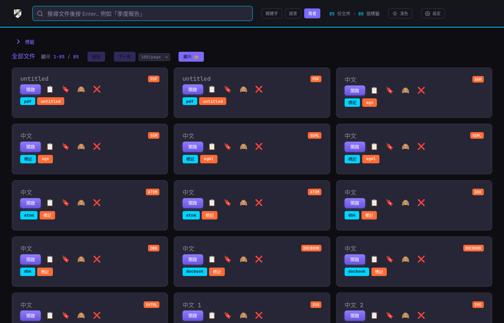
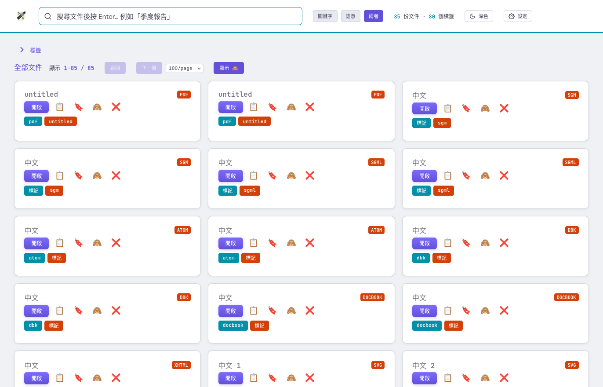
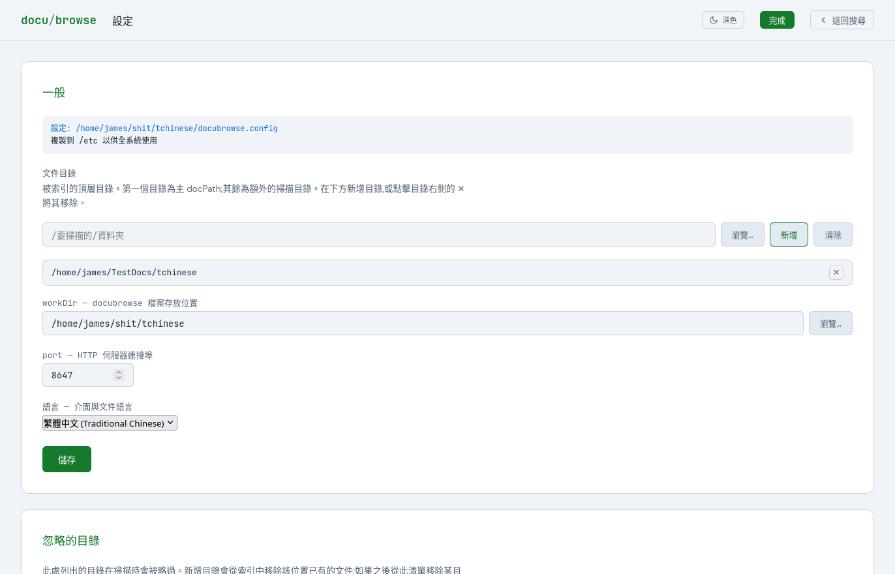
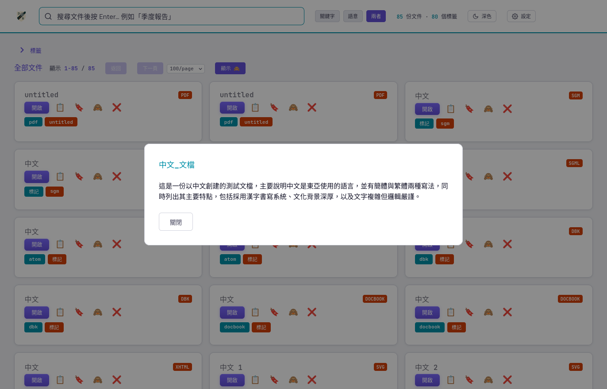
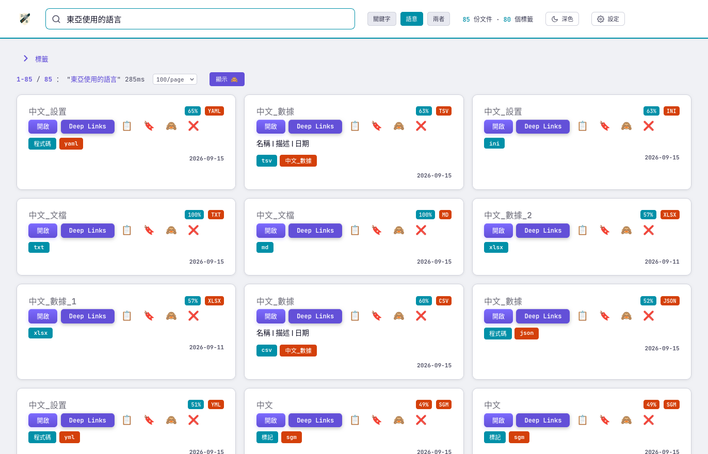
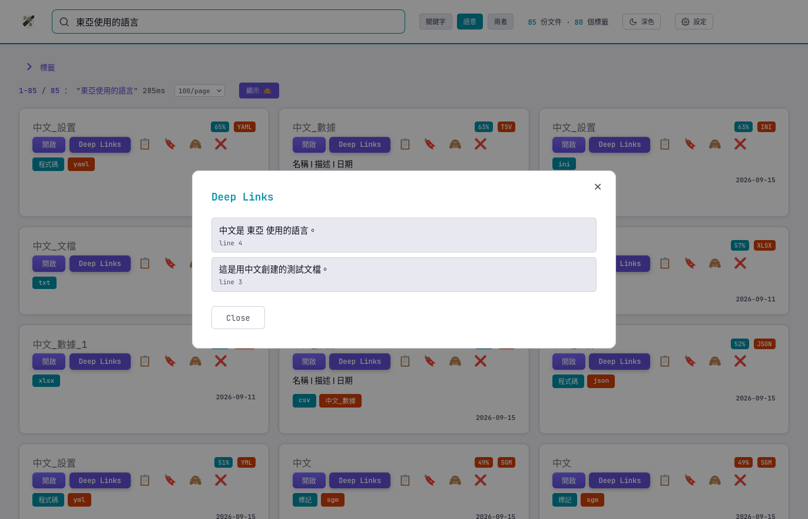
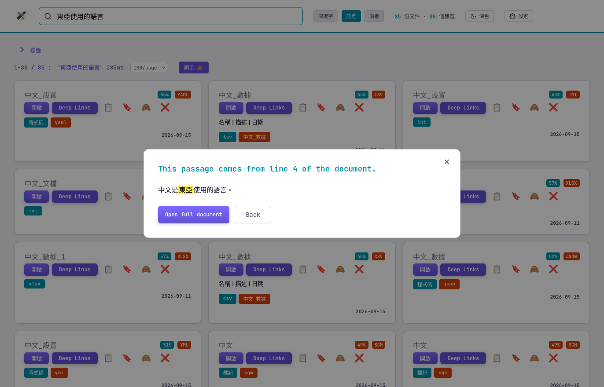
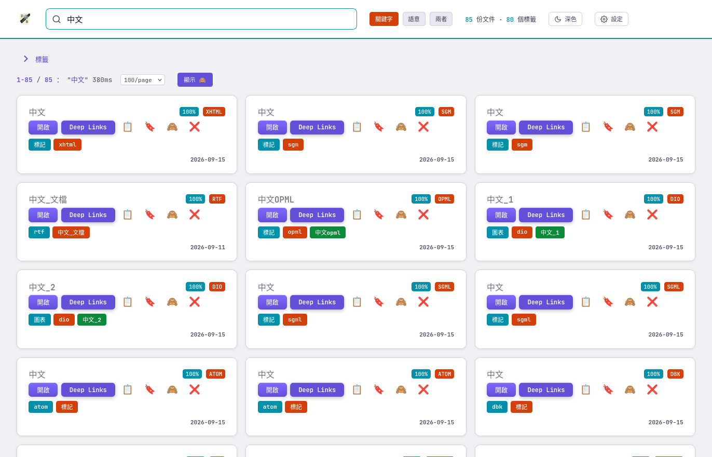
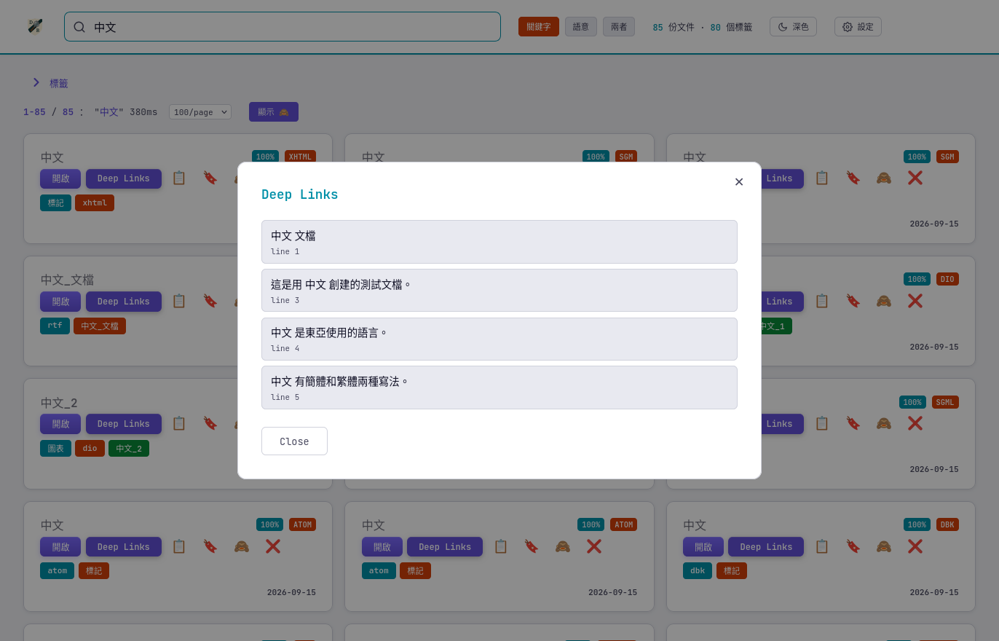
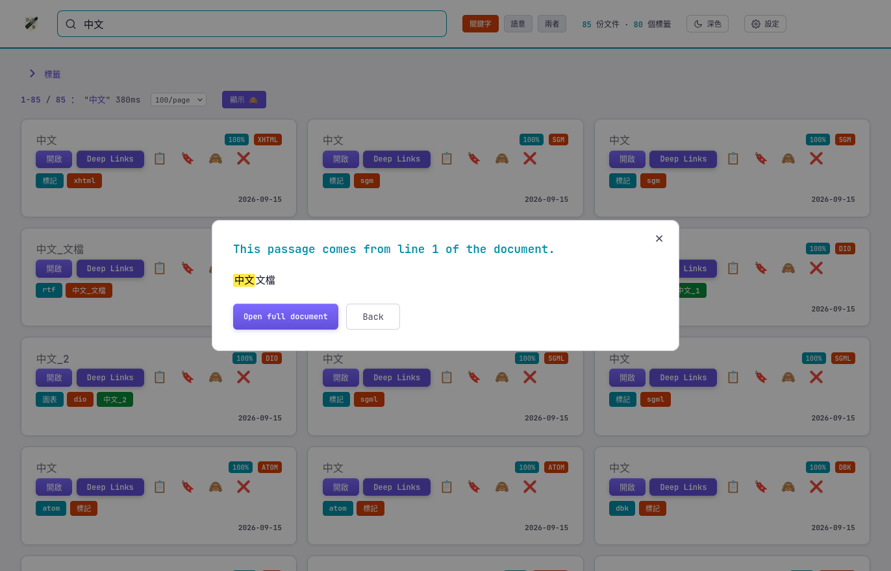

<!-- 翻譯版 — 請與英文版 README.md 保持同步 / Translation — keep in sync with README.md -->

**語言 / Language:** [English](README.md) | [日本語](README-ja.md) | [한국어](README-ko.md) | [简体中文](README-zh.md) | **繁體中文**

# DocuBrowse v1.5.2

<a name="top"></a>

<a href="https://www.producthunt.com/products/docubrowser?embed=true&amp;utm_source=badge-featured&amp;utm_medium=badge&amp;utm_campaign=badge-docubrowser" target="_blank" rel="noopener noreferrer"></a>

為 Linux（RPM、DEB、tarball）、Windows（zip）和 macOS（dmg）打包。
介面保持穩定；在可能的情況下避免破壞性變更。

**DocuBrowse 把一堆雜亂的文件變成你真正能搜尋的東西。**
把它指向你的檔案 —— PDF、電子書、Word 文件、筆記，任何東西 —— 它會建立一個
不僅理解關鍵詞、還理解含義的智慧索引。搜尋“那份關於續租的合同”，即使這些確切
的字眼從未出現也能找到它。點選任意結果，在開啟檔案之前就能得到即時的 AI 摘要。
支援 PII 識別,並可處理多個文件目錄。

DocuBrowse 使用本地 AI 模型完全在你自己的機器上執行 —— 無需聯網,無需賬戶,
無需 API 金鑰,也沒有按次查詢侵蝕令牌預算的費用。**你的資料。你的 AI。**

底層技術:SQLite FTS5 關鍵詞搜尋,加上 AI 驅動的語義相似度與摘要生成
(Ollama + nomic-embed-text + dolphin3)。支援多種文件與原始碼型別。

> **Docker(實驗性 —— 暫不推薦):** 一個容器化部署正在 `docker-experiment`
> 分支上試驗。由於 Docker/作業系統的限制以及 DocuBrowse 的安全模型,目前**尚未**
> 實現一個完全可用的方案 —— 特別是,從基於瀏覽器的容器中在桌面應用裡開啟文件
> 無法工作(伺服器無頭,瀏覽器處於沙箱中)。它在該分支上提供給想要試驗的人,
> 但**不推薦使用**。參見該分支上的 `docker/README.md`。

---

## 導航

| | | |
|---|---|---|
| [功能](#features) | [搜尋技巧與竅門](#search-tips-and-tricks) | [螢幕截圖](#screenshots) |
| [快速開始](#quick-start) | [語言](#languages) | |
| [CLI 參考](#cli-reference) | [配置](#configuration) | [架構](#architecture) |
| [API 端點](#api-endpoints) | [搜尋演算法](#search-algorithm) | [安全](#security) |
| [檔案結構](#file-structure) | [故障排除](#troubleshooting) | [已知限制](#known-limitations) |
| [近期變更](#recent-changes) | | |
| [路線圖](#roadmap) | [AI 輔助開發](#ai-assisted-development) | [許可證](#license) |

---

<a name="features"></a>

## 功能

[↑ 頂部](#top)

### 🔍 雙搜尋模式
- **關鍵詞搜尋** —— 透過 SQLite FTS5 進行快速全文搜尋(標題、作者、主題、標籤、摘錄)
- **語義搜尋** —— 透過 Ollama 嵌入(nomic-embed-text:latest)實現的 AI 相似度。語義搜尋識別*哪些文件*與你的查詢相關;隨後**深度連結**(見下文)精確定位文件*內部*匹配的位置。
- **混合模式**(預設,“兩者”)—— 合併關鍵詞與語義:每份文件取兩個分數中較高的一個(兩者都命中時略有加成),且必須清除關鍵詞命中或語義下限才會出現。參見[搜尋技巧與竅門](#search-tips-and-tricks)。

### 🎯 深度連結 —— 文件內段落搜尋
- 從任意關鍵詞或語義結果中,點選**深度連結**即可在該文件*內部*查詢匹配段落 —— 按需進行,無需重新索引,無需更改架構。
- 每個段落顯示一小段樣本和一個位置標籤(**頁**、**行**或**節**);點選其一即可開啟該段落並高亮匹配文字。
- 模式跟隨搜尋:**語義**搜尋按含義查詢段落;**關鍵詞**(或混合)搜尋按詞條查詢。
- 散文格式:**PDF、TXT、HTML、Markdown、DOCX、RTF、ODT**、電子書(EPUB、MOBI、AZW3)、DjVu,以及 SGML/XML 家族(XHTML、XML、DocBook、RSS/Atom、OPML)和其他文字/標記格式(reST、AsciiDoc、LaTeX、配置檔案、JSON/YAML、電子郵件、原始碼)。非散文(電子表格、簡報、圖表)則回退到用其閱讀器開啟。
- 深度連結可能返回“未找到”;若如此,很可能是該文件型別尚未被編入處理流程。它已識別出分配給文件的關鍵詞,但目前仍無法真正讀取該文件並建立深度連結。我正在儘可能地擴充套件這一能力,並聚焦於能帶來價值的地方(對一份是蒙娜麗莎圖片的 PDF 做深度搜尋,大概永遠不會以這種方式被搜尋到)。

### 📖 AI 摘要
- 點選任意文件標題,即可獲得一段 Kindle 風格的“書封”式摘要,按需透過 Ollama
  (`dolphin3:latest`)生成,並在首次生成後快取到資料庫中。
  在極簡硬體上(僅 CPU、無 GPU),某份文件的首個摘要可能需要一些時間 ——
  由於結果已快取,後續請求都是即時的。
  語義搜尋的嵌入由第二個本地模型(`nomic-embed-text:latest`)生成。

### 📚 文件索引
- **格式**:PDF、DOCX、PPTX、XLSX、ODT、ODS、ODP、OTT/OTS/OTP(ODF 模板)、VSDX/VSDM、VSD/VSS/VST(舊版 Visio)、VDX(Visio 2003 XML)、draw.io/diagrams.net(.drawio/.dio)、PlantUML(.puml/.plantuml)、Mermaid(.mmd)、SGML/XML 家族(.xml/.xhtml/.sgml/.sgm)、DocBook(.docbook/.dbk)、SVG、訂閱源(.rss/.atom/.opml)、reStructuredText(.rst)、AsciiDoc(.adoc/.asciidoc)、LaTeX(.tex/.latex)、電子郵件(.eml)、RTF(.rtf)、CSV / TSV、EPUB、MOBI、AZW3、AZW、DjVu(.djvu/.djv)、HTML、TXT、Markdown,以及類配置純文字(.ini/.conf/.cfg/.log/.lst)
- **PDF 智慧處理**:pdfplumber(優先)加上 pypdf 回退以處理臃腫物件檔案;對複雜版式進行 `layout=False` 重試;檢測掃描(純影象)PDF 並路由到 `ocr_list_pdfs.txt`
- **Word 文件**:python-docx 提取段落、表格和核心屬性(標題、作者、主題)
- **簡報**:python-pptx 提取幻燈片文字、備註和核心屬性
- **電子表格**:openpyxl 提取單元格值和工作表名稱
- **OpenDocument**:ODF 文字文件(.odt)、電子表格(.ods)和簡報(.odp),以及它們的模板變體(.ott/.ots/.otp)—— 透過 Python 標準庫(`zipfile` + `xml.etree.ElementTree`)提取段落、標題、列表、表格、單元格值和幻燈片文字。模板按 mimetype 字首路由到匹配的提取器。後設資料(標題、作者、主題、描述、關鍵詞)從 `meta.xml` 讀取。無需額外依賴。
- **Visio 與圖表**:
  - 現代 Visio(`.vsdx`/`.vsdm`)—— 用標準庫解析的 OOXML zip;提取形狀文字、頁面名稱和核心屬性(標題/作者/主題/關鍵詞),無需第三方依賴。
  - 舊版 Visio(`.vsd`/`.vss`/`.vst`)—— 二進位制複合文件;需要來自 **libvisio-tools** 的可選 `vsd2xml` 工具(`sudo dnf install libvisio-tools` / `sudo apt install libvisio-tools`)。沒有它時,舊版檔案僅按後設資料索引(檔名作為標題,無正文),並將路徑追加到 `visio_legacy_missing.txt`,以便安裝後重新掃描時可以識別它們。
  - draw.io / diagrams.net(`.drawio`/`.dio`)—— 支援純 `mxfile` XML 和壓縮(`deflate + base64 + URL 編碼`)圖表;提取每個 `mxCell` 標籤和 `object` 標籤,以及頁面名稱。僅使用標準庫。
  - 基於文字的圖表 —— PlantUML(`.puml`/`.plantuml`)和 Mermaid(`.mmd`)原始碼作為純文字索引,並標記為 `diagram`。
- **標記家族**(全部使用標準庫,無額外依賴):
  - XML/SGML(`.xml`/`.xhtml`/`.sgml`/`.sgm`)、DocBook(`.docbook`/`.dbk`)、SVG(同時標記為 `diagram`)和訂閱源(`.rss`/`.atom`/`.opml`)會被去標籤 —— 移除 DOCTYPE、註釋、CDATA 包裝、`<script>` 和 `<style>` 塊,並刪除其餘標籤;實體被反轉義。在去標籤之前,會從熟知的元素(`<title>`、`<dc:title>`、`<author>`、`<dc:creator>`)嗅探標題/作者/主題,因此 DocBook、Atom、RSS 和 SVG 都能呈現有用的後設資料。
  - reStructuredText(`.rst`)、AsciiDoc(`.adoc`/`.asciidoc`)和 LaTeX(`.tex`/`.latex`)按原樣索引(所有標記都成為可搜尋文字),並採用逐格式的標題啟發式:reST 下劃線式標題、AsciiDoc 的 0 級 `= 標題`、LaTeX 的 `\title{}` / `\section{}`。LaTeX 的 `\author{}` 會被捕獲,行內 `%` 註釋會被剝除。
  - 每個標記檔案都被標記為 `markup` 以便瀏覽/篩選。`.vdx`(Visio 2003 XML)也會獲得 `diagram` 標籤。
- **電子郵件、RTF、表格與類配置文字**:
  - 電子郵件(`.eml`)—— 用標準庫 `email` 包解析。Subject 成為標題,From 成為作者,To/Cc/Date 和純文字正文(或去標籤的 HTML 正文)成為可搜尋內容。附件檔名會被追加,以便按名稱搜尋仍能命中。
  - RTF(`.rtf`)—— 透過 **striprtf**(純 Python,MIT)解碼。沒有它時,檔案僅按後設資料索引,路徑追加到 `rtf_missing_striprtf.txt`;安裝 `striprtf` 並重新掃描即可提取正文。
  - CSV / TSV —— 前約 500 行被索引,行以豎線分隔渲染;表頭行落入 `description` 欄位,因此列名會計入關鍵詞搜尋。僅使用標準庫;自動檢測分隔符。
  - 類配置純文字 —— `.ini`、`.conf`、`.cfg`、`.log`、`.lst` 走標準文字路徑,採用相同的 200 KB 讀取上限。
- **電子書**:EPUB 使用 ebooklib;MOBI/AZW3 文字提取使用 mobi 包 + Calibre `ebook-convert` 回退;DRM 加密的 AZW 檔案僅按後設資料索引(標題/作者可見,正文不可搜尋)
- **DjVu**:`.djvu`/`.djv` 文字層透過 **DjVuLibre**(`djvutxt`/`djvused`,外部非 pip 工具)提取。沒有它時,DjVu 檔案僅按後設資料索引,路徑追加到 `djvu_missing_djvulibre.txt`;安裝 DjVuLibre 並重新掃描以獲取正文。無文字層的純影象 DjVu 僅按後設資料索引(不執行 OCR,與掃描 PDF 相同)
- **平臺**:所有提取庫都是純 Python 或對 x86_64 和 ARM64 都提供 wheel。不支援 32 位系統。
- **後設資料**:從文件後設資料欄位提取標題、作者、主題;從目錄結構和內容關鍵詞自動生成標籤
- **PII 保護**:攝取後掃描器檢測 SSN、信用卡、銀行路由/賬號、出生日期、MRN、駕照、護照模式;移除匹配的文件並永久將其列入黑名單

### 🎨 使用者介面
- 深色/淺色主題切換
- 分頁結果(每頁 50 份文件),帶上一頁/下一頁控制元件
- 字母索引欄(A–Z、0–9)用於快速導航,狀態在頁面載入間保留;Home 按鈕用於重置
- 用於按主題篩選的標籤雲
- 每個結果上的相關度分數徽章(0–100%)
- 每張結果卡片上的**開啟按鈕** —— 透過 `xdg-open` 在預設應用中啟動檔案
- 點選文件標題獲取 AI 摘要;📋 複製路徑到剪貼簿;🗑 從磁碟和索引中刪除檔案(需確認)
- 已移動/已刪除的文件:點選檔案已不存在的文件,若其檔案系統已掛載,會顯示一個可關閉的模態框(關閉時從索引中移除它);若無法驗證檔案系統(例如未掛載的驅動器),則顯示一個提示條(不更改索引)

### ⚙️ 設定(`/settings`)
- 常規面板:文件目錄(帶實時目錄瀏覽器)、任意數量的額外掃描目錄(在同一面板下新增/移除 —— 自動納入 `scan`/`rescan`,無需額外命令)、工作目錄和埠
- 忽略目錄面板:瀏覽以將目錄新增到 `ignore_dirs.txt`,在清除其下已索引文件前有確認提示,移除條目前也有確認

### ⚡ 效能
- 搜尋延遲:通常 <150ms
- 使用 `ProcessPoolExecutor` 的並行 PDF 提取(按物理核心數確定工作程序數)
- 記憶體安全:核心強制的 RLIMIT_AS(每工作程序 6 GB)+ 在空閒 RAM 閾值上暫停/恢復

---

<a name="search-tips-and-tricks"></a>

## 搜尋技巧與竅門

[↑ 頂部](#top)

DocuBrowse 有三種搜尋模式(在右上角切換):**關鍵詞**、**語義**和**兩者**(預設的混合)。**按下回車時才執行搜尋** —— 清空搜尋框會再次顯示所有文件。當你點選**深度連結**時,文件內部適用相同的規則;深度連結跟隨你的搜尋所用的模式。

### 三種模式

- **關鍵詞** —— 透過 SQLite FTS5 的字面文字。每個詞都做字首匹配,詞之間是“或”的關係,因此 `budget report` 會找到包含 *budget…* **或** *report…* 的文件(不一定兩者都有)。按命中位置排名 —— **標題**和**作者**中的匹配優先於正文或標籤中的匹配。當你知道文件中確實存在的某個詞、名稱或程式碼時最佳。
- **語義** —— 透過 AI 嵌入的含義。即使文件不包含你的確切字眼,也能找到*關於*你查詢的文件。按概念接近度排名。當你不知道確切措辭、想找“關於 X 的文件”時最佳。
- **兩者**(預設)—— 同時執行兩者,併為每份文件保留兩個分數中較強的一個(某文件在兩者上都得分時略有提升)。文件必須贏得一個關鍵詞命中或有意義的語義分數才會出現,因此微弱的語義噪聲不會淹沒紮實的關鍵詞匹配。

### 不同詞語搭配下會發生什麼

| 你輸入 | 關鍵詞模式 | 語義模式 |
|---|---|---|
| `budget report` | 含 *budget…* **或** *report…* 的文件(字首,任一詞) | 關於預算/財務報告的文件,按含義 |
| `"budget report"` | 僅含確切短語 **budget report** 的文件 | 同一確切短語集,然後按含義排名 |
| `freedom and liberty` | *freedom…* 或 *and…* 或 *liberty…*(關鍵詞保留每個詞) | 嵌入 **freedom liberty** —— 冠詞和連詞被丟棄,以免稀釋匹配 |
| `man in the middle` | *man… in… the… middle…*(字首,任意) | 嵌入 **man in middle** —— 冠詞 *the* 被丟棄,但介詞 *in* 被保留(介詞承載含義) |
| `"man in the middle"` | 僅含該確切短語的文件(不區分大小寫) | 首先要求確切短語,然後按含義為該集合排名 |
| 人名,如 `fred` | 以 *fred* 開頭的詞條 —— Frederick、Fredonia… | 模糊:可能浮現相似詞(如 *Fedora*),因為短詞條嵌入得較鬆散 —— 對人名請用**關鍵詞** |

### 引號 = 確切短語

用 `"..."`(或 `'...'`)包住詞語,以要求那個**確切的連續短語**(匹配不區分大小寫)。`"machine learning"` 只匹配這兩個詞按該順序一起出現的文件,而不匹配僅分別提及 *machine* 和 *learning* 的文件。這在每種模式下都有效 —— 在語義/兩者中,它先作為存在過濾器,然後按含義為包含該短語的集合排名。你可以混用形式:`golang "import fmt"` 表示*短語 "import fmt"* 或鬆散的詞 *golang*。

具體來說,引號決定了小詞是否計入。**`"man in the middle"`** 搜尋整個短語,每個詞都包括在內。**`man in the middle`**(無引號)在語義模式下會在匹配前丟棄冠詞 *the* —— 它按 *man*、*in*、*middle* 搜尋 —— 因為只有冠詞(*a/an/the*)和連詞(*and/or/but/nor/for/so/yet*)被視為填充詞。當確切措辭重要時,請給短語加引號。

### 經驗法則

- 知道確切的詞、名稱或錯誤程式碼 → **關鍵詞**。
- 尋找*關於*某主題的文件 → **語義**或**兩者**。
- 想要確切短語 → **給它加引號**(任意模式)。
- 搜尋**人名** → **關鍵詞**勝過語義(人名嵌入得較模糊)。
- 語義可以為一個從未字面命名的概念浮現出文件 —— 例如,一份 MIT 許可的檔案會因為許可證文字的表述而在搜尋 *freedom* 時出現。這是語義按預期工作,而非 bug。

---

<a name="screenshots"></a>

## 螢幕截圖

[↑ 頂部](#top)

點選任意縮圖檢視完整尺寸。

| 深色模式 | 淺色模式 |
|---|---|
| [](screenshots/zh-hant/screenshot-dark-mode.png) | [](screenshots/zh-hant/screenshot-light-mode.png) |

| 設定 | AI 摘要 |
|---|---|
| [](screenshots/zh-hant/screenshot-settings-page.png) | [](screenshots/zh-hant/screenshot-synopsis-modal.png) |

### 深度連結 —— 文件內段落搜尋

從任意關鍵詞或語義結果,**深度連結**會在該文件*內部*查詢匹配段落,跳轉到其中之一,並高亮匹配文字。

三個階段 —— 結果上的**深度連結**按鈕、列出匹配段落的模態框,以及被選中並高亮的段落:

| 語義搜尋結果 | 匹配段落 | 高亮段落 |
|---|---|---|
| [](screenshots/zh-hant/deep-links-semantic-results.png) | [](screenshots/zh-hant/deep-links-semantic-list.png) | [](screenshots/zh-hant/deep-links-semantic-passage.png) |

| 關鍵詞搜尋結果 | 匹配段落 | 高亮段落 |
|---|---|---|
| [](screenshots/zh-hant/deep-links-keyword-results.png) | [](screenshots/zh-hant/deep-links-keyword-list.png) | [](screenshots/zh-hant/deep-links-keyword-passage.png) |

> 深度連結以黃色渲染文件提取文字中的匹配片段,並按其位置(頁/行/節)標註。模式跟隨搜尋:語義搜尋開啟語義段落,關鍵詞開啟關鍵詞段落。

> 設定是位於 `/settings` 的獨立頁面(透過齒輪圖示在新標籤頁中開啟)。常規面板涵蓋文件目錄(帶實時目錄瀏覽器,以及任意數量的額外掃描目錄)、工作目錄和埠;忽略目錄面板管理掃描排除項,每項都帶目錄瀏覽器、新增/清除控制元件,以及移除前的確認。

---

<a name="quick-start"></a>

## 快速開始

[↑ 頂部](#top)

### 系統要求

**最低:** 8 GB 記憶體,x86_64 或 ARM64 CPU,2 GB 可用磁碟(外加你的文件和索引所需空間)。無 GPU 也能工作 —— 摘要生成會較慢但可用。不支援 32 位系統(Ollama 不提供 32 位構建)。

**推薦:** 12 GB 記憶體,4 GB 以上視訊記憶體(NVIDIA 或 Apple Silicon)。GPU 加速能顯著加快摘要生成和嵌入。

### 前置條件
- Python 3.9+
- `pdfplumber`、`pypdf` —— PDF 提取
- `python-docx` —— Word 文件
- `python-pptx` —— PowerPoint 簡報
- `openpyxl` —— Excel 電子表格
- `ebooklib`、`beautifulsoup4`、`mobi` —— 電子書
- `striprtf` —— RTF 文字提取(純 Python;沒有它時 .rtf 僅按後設資料索引)
- `psutil` —— 跨平臺程序與硬體檢測
- **Calibre** —— 電子書後設資料與轉換(MOBI/AZW3/AZW 索引所需):
  `sudo dnf install calibre` 或 `sudo apt install calibre`
- **libvisio-tools** —— *可選*;僅在從舊版二進位制 Visio(`.vsd`/`.vss`/`.vst`)提取正文時需要。
  沒有它時,這些檔案仍按後設資料索引。
  `sudo dnf install libvisio-tools` 或 `sudo apt install libvisio-tools`
- **DjVuLibre** —— *可選*;僅在從 DjVu(`.djvu`/`.djv`)提取文字時需要。
  沒有它時,這些檔案仍按後設資料索引。
  `sudo dnf install djvulibre` / `sudo apt install djvulibre-bin` / `brew install djvulibre` / `choco install djvu-libre`
- Ollama —— 若缺失,由 `docubrowser start` 自動安裝
- 現代瀏覽器(Chrome、Firefox、Safari、Edge)

完整的分步指南參見 [INSTALL.md](INSTALL.md)。

### 安裝(推薦)

DocuBrowse 以 RPM、DEB、tarball、Windows zip 和 macOS dmg 包形式釋出。
從 [Releases](https://github.com/linuxrebel/DocuBrowser/releases) 頁面下載合適的包。

```bash
# Fedora / RHEL
sudo dnf install ./docubrowser-foss-<VERSION>-<RELEASE>.noarch.rpm

# Debian / Ubuntu / Mint
sudo apt install ./docubrowser-foss_<VERSION>-<RELEASE>_all.deb

# 任意 Linux(tarball)
tar xzf docubrowser-foss-<VERSION>-<RELEASE>.tar.gz
cd docubrowser-foss-<VERSION>-<RELEASE>
sudo ./install.sh
```

**Windows:** 解壓 zip,然後雙擊 `Install.bat`。需要預先安裝 Python 3.9+ 和 Ollama。
安裝到 `%USERPROFILE%\DocuBrowse`,並帶一個開始選單快捷方式 —— 無需管理員許可權。
你可能需要登出並重新登入,快捷方式才會出現。

**macOS:** 開啟 dmg,然後雙擊 `Install.command`(首次請右鍵 → 開啟 —— 這些指令碼未簽名)。需要 Python 3.9+。
安裝到 `~/Applications/DocuBrowse/`,帶 Python 虛擬環境、位於 `/usr/local/bin/docubrowser` 和 `/usr/local/bin/docuback` 的 CLI
包裝指令碼(會提示 sudo;若拒絕則回退到 `~/bin/`),以及一個啟動伺服器並在終端中開啟 Web UI 的 `DocuBrowse.app` 啟動器。

所有 Linux 方法都安裝到 `/opt/docubrowser/`,帶 Python 虛擬環境、位於 `/usr/bin/docubrowser` 和 `/usr/bin/docuback` 的
CLI 包裝指令碼、Office 下的桌面選單項,以及來自 `requirements.txt` 的所有 Python 依賴。

安裝後,CLI 就是 `docubrowser` 命令 —— 從下面每個示例中去掉 `./` 和 `.py`。
例如 `docubrowser start` 和 `docubrowser rescan`。本 README 其餘部分顯示的
`./docubrowser.py <cmd>` 形式是開發/克隆倉庫路徑(直接從檢出目錄執行)。

解除安裝:`sudo dnf remove docubrowser-foss`(RPM)、
`sudo apt remove docubrowser-foss`(DEB)、`sudo ./uninstall.sh`(tarball)、
雙擊 `Uninstall.bat`(Windows),或雙擊 `Uninstall.command`
(macOS —— 在 dmg 上或 `~/Applications/DocuBrowse/` 中)。

### 首次執行(開發/克隆倉庫)

```bash
cd /path/to/DocuBrowse

# 掃描並索引你的文件
./docubrowser.py rescan

# 啟動伺服器
./docubrowser.py start

# 開啟 UI
./docubrowser.py open
```

> 在已安裝的系統上,請改用 `docubrowser` 命令,例如
> `docubrowser rescan` / `docubrowser start` / `docubrowser open`。

`docubrowser.py start` 會自動驗證 Ollama 已安裝、正在執行,並具備兩個所需
模型 —— `nomic-embed-text:latest`(嵌入)和 `dolphin3:latest`(摘要生成)——
按需安裝/啟動/拉取。

---

<a name="cli-reference"></a>

## CLI 參考

[↑ 頂部](#top)

```
用法: docubrowser.py <command> [options]
```

### 命令

| 命令 | 描述 |
|---------|-------------|
| `start` | 啟動搜尋伺服器(先執行 Ollama 檢查) |
| `stop` | 停止伺服器 |
| `restart` | 先停止再啟動 |
| `status` | 顯示伺服器狀態、文件數、嵌入數、標籤數 |
| `scan [TYPE ...]` | 掃描、索引並嵌入文件(與 `rescan` 相同;用 `--no-embed` 跳過嵌入) |
| `rescan [TYPE ...]` | `scan` 的別名(為向後相容而保留) |
| `scan-file --file PATH` | 提取並索引單個檔案,然後嵌入它 |
| `embed` | 為未嵌入的文件生成/重新整理嵌入 |
| `open` | 在預設瀏覽器中開啟 DocuBrowse UI |
| `purge` | 掃描索引以查詢 PII 並移除匹配的文件 |
| `ignore add\|remove\|list DIR` | 管理從掃描中排除的目錄(新增時自動清除) |
| `report` | 遍歷文件目錄並顯示檔案型別分佈(不更改資料庫) |
| `scan-missing [--db PATH] [--dry-run]` | 可選清理:將每個已索引路徑分類為存在/缺失/未掛載,刪除 `missing` 行(級聯),不動 `unmounted` 行 |
| `stopall` | 停止所有正在執行的掃描、嵌入以及伺服器 |
| `duplist` | 列出重複文件(精確 SHA256 + 可選近似重複) |
| `dupclean` | 互動式 TUI,用於審查並移除重複文件 |

### 全域性選項

```
--db PATH      SQLite 資料庫路徑(覆蓋配置)
--port PORT    伺服器埠(覆蓋配置)
--config FILE  配置檔案路徑
```

### 命令示例

```bash
# 伺服器管理
./docubrowser.py start
./docubrowser.py start --port 9000
./docubrowser.py status
./docubrowser.py stop
./docubrowser.py stopall

# 掃描(scan 和 rescan 完全相同)
./docubrowser.py scan                          # 掃描、索引並嵌入所有型別
./docubrowser.py scan pdf                      # 僅 PDF
./docubrowser.py scan pdf txt                  # PDF 和純文字
./docubrowser.py scan --limit 100              # 僅前 100 個未索引檔案
./docubrowser.py scan --workers 4              # 4 個提取工作程序
./docubrowser.py scan --no-embed               # 掃描但不執行嵌入步驟
./docubrowser.py scan --doc-dir /data/docs

# 單檔案索引(對重試被列入黑名單的檔案很有用)
./docubrowser.py scan-file --file /path/to/document.pdf
./docubrowser.py scan-file --file /path/with spaces/doc.pdf   # 無需引號
./docubrowser.py scan-file --file /path/to/doc.pdf --no-embed

# 報告與維護
./docubrowser.py report                         # 檔案型別分佈,不更改資料庫
./docubrowser.py embed                          # 嵌入任何未嵌入的文件
./docubrowser.py purge --dry-run               # 預覽 PII 匹配(安全)
./docubrowser.py purge                         # 移除 PII 文件(會提示)

# 從掃描中排除目錄
./docubrowser.py ignore add ~/Documents/myWorkDocs   # 排除 + 清除其下已索引文件
./docubrowser.py ignore list                                  # 顯示已忽略目錄
./docubrowser.py ignore remove ~/Documents/myWorkDocs # 重新允許(重新掃描以重新索引)

# 重複檢測與清理
./docubrowser.py duplist                       # 查詢精確 SHA256 重複
./docubrowser.py duplist --near-dups           # 也查詢近似重複(餘弦 ≥97%)
./docubrowser.py duplist --near-dups --threshold 0.95
./docubrowser.py dupclean                      # 互動式 保留 A/保留 B/兩者都保留 TUI
./docubrowser.py dupclean --near-dups          # 在清理中包含近似重複

# 清理已移動/已刪除的文件(可選,不自動執行)
./docubrowser.py scan-missing --dry-run        # 僅報告數量,不更改資料庫
./docubrowser.py scan-missing                  # 刪除真正缺失檔案的行

# 移除舊版本索引的點檔案(獨立的一次性工具)
python3 purge_dotfiles.py                       # 試執行:分頁顯示完整列表,不做更改
python3 purge_dotfiles.py --apply               # 刪除它們(級聯安全)
python3 purge_dotfiles.py --db /path/du.db --roots /docs /extra --apply
```

> `purge_dotfiles.py` 是一個過渡性遷移工具,直接執行(不是 `docubrowser`
> 子命令)。掃描器今後已經會跳過點檔案(D-6);此工具清除舊版本遺留在資料庫中的行。
> 它使用與掃描器相同的、感知根目錄的隱藏路徑檢查(有意掃描的點目錄根是豁免的)
> 以及級聯安全的刪除路徑,因此 FTS 行、標籤和嵌入都能被正確清理。預設為試執行;
> `--apply` 執行刪除;`--db` / `--roots` 覆蓋預設值。

### scan / rescan 型別過濾器

```
型別: pdf  txt  md  html  (預設: 所有支援的型別)

示例:
  scan pdf               僅 PDF
  scan pdf txt           PDF 和純文字
  scan                   所有支援的型別(未過濾時會提示)
```

### scan-file 細節

`scan-file` 專為重試個別問題檔案而設計:
- 若檔案在 `scan_blacklist.txt` 中列出,則將其移除(顯式重試)
- 拒絕 `pii_blacklist.txt` 中的檔案(永久 PII 阻止)
- 檢測掃描(純影象)PDF → 新增到 `ocr_list_pdfs.txt`
- 帶空格的路徑無需引號即可工作:`--file` 接受多個 token 並將其重新拼接

---

<a name="configuration"></a>

## 配置

[↑ 頂部](#top)

DocuBrowse 讀取它找到的第一個配置檔案:

1. `/etc/docubrowse.config`(系統級)
2. `./docubrowse.config`(在 `docubrowser.py` 旁邊)

若兩者都不存在,則應用內建預設值 —— 但 `doc_dir` 除外,它沒有預設值。
在配置文件目錄之前(透過 Web UI 中的設定齒輪圖示,或在 `docubrowse.config`
中設定 `doc_dir`),Web UI 會顯示一個橫幅提示你去配置一個,而需要文件目錄的
CLI 命令(`rescan`、`report`、`scan`)會以錯誤退出,並說明如何設定它。

### 配置檔案格式

```ini
# docubrowse.config
doc_dir      = ~/Documents
db_path      = /home/user/DocuBrowse/du-docs.db
port         = 8643
work_dir     = /home/user/DocuBrowse
lang         = en
```

### 預設值

| 鍵 | 預設 |
|-----|---------|
| `doc_dir` | _(無 —— 必須透過設定或 docubrowse.config 配置)_ |
| `db_path` | `<指令碼目錄>/du-docs.db` |
| `port` | `8643` |
| `work_dir` | `<指令碼目錄>` |
| `lang` | `en` —— 參見[語言](#languages) |

### 環境變數

環境變數覆蓋對應的配置檔案鍵(對容器有用)。提供 CLI 標誌時仍以其為準。

| 變數 | 預設 / 覆蓋 | 描述 |
|----------|---------------------|-------------|
| `DOCUBROWSE_DOC_DIR` | 配置 `doc_dir` | 要索引的主文件目錄 |
| `DOCUBROWSE_DB` / `DOCUBROWSE_DB_PATH` | 配置 `db_path` | `du-docs.db` 的路徑 |
| `DOCUBROWSE_PORT` | `8643` | HTTP 伺服器埠 |
| `DOCUBROWSE_WORK_DIR` | 配置 `work_dir` | 執行時資料的工作目錄 |
| `OLLAMA_HOST` | `http://localhost:11434` | Ollama HTTP API 的基礎 URL(嵌入 + 摘要)。接受裸 `host:port`(scheme 預設為 `http://`)。也接受為 `DOCUBROWSE_OLLAMA_HOST`。 |
| `DOCUBROWSE_TRUSTED_CIDRS` | _(空)_ | 除迴環外允許訪問伺服器的、以逗號分隔的 CIDR/IP(例如單個 Docker 代理的 `172.17.0.2/32`,或確切的 Compose 子網)。空 = 僅迴環。寬於 `/24`(IPv4)或 `/120`(IPv6)的範圍會被拒絕 —— 信任一臺主機,而非整個網路;首選 `/32`。**這不是身份驗證** —— 只列出反向代理/BFF 之後的私有網路。 |
| `DOCUBROWSE_ALLOWED_HOSTS` | _(空)_ | 除迴環外接受的、以逗號分隔的 Host 頭名稱(例如 `docubrowse`)。當 `Host` 中出現容器服務名時需要。 |

當省略 argv 時,`doc_search.py` 也接受 `DOCUBROWSE_DB` / `DOCUBROWSE_PORT`,
因此容器入口點僅憑環境變數即可啟動伺服器。
`OLLAMA_HOST` 由 `doc_search.py`、`embed_docs.py` 和 `ensure_ollama.py` 讀取 ——
當 Ollama 執行在另一臺主機或容器上時設定它(例如 Docker Compose 中的
`http://ollama:11434`)。

仍然沒有使用者登入。受信任的對等方可以呼叫完整的 API;把身份驗證放在你的反向代理或 BFF 中,永遠不要公開 DocuBrowse 的埠。

---

<a name="languages"></a>

## 語言

[↑ 頂部](#top)

一個 DocuBrowse 安裝一次只服務**一種**語言 —— 介面、FTS 分詞器、嵌入模型和
摘要模型全都為那一種語言選擇。這是每次安裝的設定,而非每份文件的設定:
DocuBrowse 假定所配置的文件目錄壓倒性地是一種語言,不支援混合語言語料庫或
逐文件的語言檢測。

**當前支援:** 英語(`en`,預設)、日語(`ja`)、韓語(`ko`)、簡體中文(`zh`)和
繁體中文(`zh-hant`)。日語、韓語和兩種中文變體都使用 `bge-m3` 多語言嵌入模型
(英語使用 `nomic-embed-text`);韓語的摘要模型是 `exaone3.5`,兩種中文變體都使用
`ornith-1.5:9b`(繁體由一個強制輸出 繁體/正體字 的提示詞驅動)。對於關鍵詞(FTS5)
搜尋,CJK 文字(日語、韓語和中文)使用標準 `unicode61` 分詞器加上應用側字元二元組
分割(參見 `cjk.py`),而非 FTS5 內建的 `trigram` 分詞器 —— 日語詞間沒有空格,
韓語是膠著語,而中文根本沒有詞邊界,因此索引時和查詢時的文字都在 FTS5 看到之前
被預先切分為重疊的 2 字元二元組。同一個分割器同時覆蓋簡體和繁體字元(兩者都在
CJK 統一表意文字範圍內),因此無需單獨處理。這不是形態素分割器(無
MeCab/jieba/konlpy 依賴);它是一個零依賴的替代方案,以語言學上的正確性換取可靠地
索引每個 2 字元以上的 CJK 子串。單個 CJK 字元在關鍵詞模式下不會精確匹配(有意設計
—— 單字元匹配噪聲太大),但仍會透過兩者/語義搜尋浮現。

**韓語字母索引欄:** 韓語是真正的字母文字(不同於假名和漢字沒有首字母排序的日語),
因此文件列表索引欄對韓語啟用,並顯示 14 個基本首子音(初聲):ㄱ ㄴ ㄷ ㄹ ㅁ ㅂ ㅅ
ㅇ ㅈ ㅊ ㅋ ㅌ ㅍ ㅎ。每個按鈕篩選標題以由該子音引導的音節開頭的文件(緊音摺疊回其
基礎子音,例如 ㄲ→ㄱ)。英語使用 A–Z/0–9 欄;該欄對日語和中文(簡體和繁體都)隱藏
—— 中文不是字母文字、沒有首字母排序,與日語被隱藏的原因相同。

**選擇語言:**

- **安裝時** —— 全新安裝時 `install.sh` 會詢問語言。用 `DOCUBROWSE_LANG=en`、
  `=ja`、`=ko`、`=zh` 或 `=zh-hant` 進行非互動式回答。**升級絕不重新詢問** ——
  `docubrowse.config` 中已有的 `lang` 值始終被保留。(平臺安裝程式 ——
  Windows/macOS/RPM/DEB —— 將新安裝預設為 `lang = en`;之後透過設定更改。)
- **啟動時** —— `docubrowser ko start`(或 `docubrowser start ja`)以該語言啟動
  伺服器;程式碼可出現在任一位置。選擇會被寫入 `docubrowse.config`,因此在你選擇
  另一種語言之前,它會為之後普通的 `docubrowser start` 執行持續保留。
- **安裝後** —— 開啟 Web UI,點選設定(齒輪)圖示,並使用常規面板中的語言下拉選單
  (呼叫 `POST /api/language`)。切換到使用不同嵌入器或 FTS 分詞器的語言(例如
  英語 ↔ 日語/韓語)會顯示一個警告:在你重新執行 `docubrowser rescan`(或
  `embed_docs.py`)以為新語言重建之前,現有文件會保留其舊的嵌入和 FTS 索引 ——
  在那之前,先前已索引文件的搜尋質量會下降。(日語 ↔ 韓語共享 `bge-m3` 嵌入器和
  相同的分詞器,因此這兩者之間無需重建。)

**尚不支援:** 混合語言或逐文件的語言語料庫、英語/日語/韓語/中文以外的語言
(`lang_models.py` 中的 `LANG_MODELS` 表加上一個 `locales/<code>.json` 檔案就是全部
機制,因此新增一種是資料變更,而非程式碼變更)、面向日語/中文文件列表的假名/讀音(或
拼音)索引欄(兩者都沒有首字母排序;韓語使用上文所述的初聲欄),以及日語“My Number”
PII 檢測(目前僅實現了美國 PII 模式)。

---

<a name="architecture"></a>

## 架構

[↑ 頂部](#top)

```
┌─────────────────────────────────────┐
│  docubrowser.py  (CLI entry point)  │
│  ensure_ollama.py (prereq check)    │
└──────────┬──────────────────────────┘
           │ subprocess / direct call
           ↓
┌──────────────────────┐  ┌─────────────────────────────────┐
│  scan_docs.py        │  │  doc_search.py  (HTTP :8643)    │
│  ProcessPoolExecutor │  │  GET /  /api/search             │
│  pdf_extractor.py    │  │  GET /api/stats  /api/tags      │
│  embed_docs.py       │  │  GET /api/open  /api/config     │
│                      │  │  GET /api/delete /api/synopsis  │
│                      │  │  GET /api/deep-links            │
└──────────┬───────────┘  └──────────────┬──────────────────┘
           │                             │
           └──────────┬──────────────────┘
                      ↓
        ┌──────────────────────────────────────────────────┐
        │  du-docs.db  (SQLite FTS5)                       │
        │  Ollama (nomic-embed-text + dolphin3)            │
        └──────────────────────────────────────────────────┘
```

### 關鍵指令碼

| 指令碼 | 角色 |
|--------|------|
| `docubrowser.py` | CLI 啟動器 —— 所有命令 |
| `ensure_ollama.py` | 檢查/安裝 Ollama 二進位制、服務和所需模型 |
| `doc_search.py` | HTTP 伺服器;搜尋 API 和 UI |
| `docubrowse_db.py` | SQLite 架構和遷移 |
| `platform_paths.py` | 跨平臺路徑解析和程序管理 |
| `scan_docs.py` | 文件發現、提取和資料庫寫入 |
| `pdf_extractor.py` | 使用 pdfplumber/pypdf 的 PDF 專用提取 |
| `docx_extractor.py` | Word 文件提取(python-docx) |
| `odf_extractor.py` | OpenDocument(.odt、.ods、.odp)提取(標準庫) |
| `visio_extractor.py` | Visio + draw.io 提取(.vsdx/.vsdm/.vsd/.vss/.vst/.drawio/.dio) |
| `markup_extractor.py` | SGML/XML 家族 + reST/AsciiDoc/LaTeX(標準庫) |
| `eml_extractor.py` | 電子郵件(.eml),透過標準庫 `email` |
| `csv_extractor.py` | CSV / TSV,透過標準庫 `csv` |
| `rtf_extractor.py` | RTF,透過 `striprtf`(缺失時優雅降級) |
| `djvu_extractor.py` | DjVu(.djvu/.djv),透過 DjVuLibre `djvutxt`/`djvused`(缺失時優雅降級) |
| `ebook_extractor.py` | EPUB/MOBI/AZW3/AZW 提取(ebooklib + Calibre) |
| `hardware_utils.py` | CPU/GPU/RAM 檢測,工作程序數公式 |
| `embed_docs.py` | 向 Ollama 傳送文字;儲存 768 維向量 |
| `purge_pii.py` | 掃描索引以查詢 PII;移除匹配項並列入黑名單 |
| `purge_dotfiles.py` | 一次性遷移工具:從資料庫中移除已索引的點檔案(預設試執行) |
| `dup_detect.py` | 精確(SHA256)和近似重複(餘弦相似度)檢測 |

### 黑名單檔案

| 檔案 | 用途 | 永久? |
|------|---------|-----------|
| `scan_blacklist.txt` | 提取失敗的檔案 | 否 —— 移除該行以重試 |
| `pii_blacklist.txt` | 因含 PII 而被移除的檔案 | 是 —— 絕不重新攝取 |
| `ocr_list_pdfs.txt` | 需要 OCR 的純影象 PDF | 不適用 —— 僅供參考 |
| `visio_legacy_missing.txt` | 在缺少 `vsd2xml` 時看到的舊版 `.vsd`/`.vss`/`.vst` | 不適用 —— 僅供參考;安裝 libvisio-tools + 重新掃描 |
| `rtf_missing_striprtf.txt` | 在缺少 `striprtf` 時看到的 `.rtf` | 不適用 —— 僅供參考;`pip install striprtf` + 重新掃描 |
| `ignore_dirs.txt` | 從掃描中排除的目錄(透過 `ignore` 命令管理) | 否 —— `ignore remove` + `rescan` |

---

<a name="api-endpoints"></a>

## API 端點

[↑ 頂部](#top)

基礎 URL:`http://localhost:8643`

| 方法 | 路徑 | 描述 |
|--------|------|-------------|
| `GET` | `/` | 提供 `index.html`(注入每程序的 CSRF 令牌) |
| `GET` | `/settings` | 提供 `settings.html` |
| `GET` | `/api/stats` | 文件總數、已嵌入數、唯一標籤數 |
| `GET` | `/api/tags` | 帶計數的標籤列表(≥3 次出現) |
| `GET` | `/api/search` | 帶分頁的搜尋 |
| `GET` | `/api/letters` | 字母欄的首字母索引 |
| `GET` | `/api/synopsis` | 為文件生成/返回 AI 摘要 |
| `GET` | `/api/deep-links` | 單份已索引文件內的匹配段落(`path`、`q`、`mode=keyword\|semantic`) |
| `GET` | `/api/config` | 當前伺服器配置 |
| `GET` | `/api/ignore-dirs` | 列出排除的目錄 |
| `GET` | `/api/scan-dirs` | 列出額外的掃描目錄 |
| 🔒 `GET` | `/api/browse` | 設定用的目錄瀏覽器(令牌門控) |
| 🔒 `POST` | `/api/open` | 用 xdg-open/gio 開啟檔案(對照資料庫驗證) |
| 🔒 `POST` | `/api/delete` | 從磁碟刪除檔案並從索引中移除(路徑必須已索引) |
| 🔒 `POST` | `/api/config` | 儲存伺服器配置 |
| 🔒 `POST` | `/api/ignore-dirs` | 新增/移除排除的目錄 |
| 🔒 `POST` | `/api/scan-dirs` | 新增/移除額外的掃描目錄 |

🔒 = 更改狀態或暴露檔案系統;需要每程序的 `X-CSRF-Token` 頭和一個迴環
`Origin`/`Referer`。該令牌被注入到所提供的 HTML 中,因此只有第一方 UI 能呼叫這些。
參見[安全](#security)。除非 `Host` 頭為 `localhost`/`127.0.0.1`/`[::1]`,否則所有請求
也會被拒絕(DNS 重繫結保護)。

### /api/open —— 缺失和未掛載的檔案

若已索引的路徑在磁碟上不再存在,`/api/open` 返回下列之一:

```json
{"ok": false, "error": "missing", "message": "..."}
{"ok": false, "error": "unmounted", "message": "..."}
```

`missing` 表示該檔案的檔案系統已掛載而檔案確實已消失 —— UI 顯示一個可關閉的模態框,
並在關閉時從索引(及磁碟相鄰的資料庫行)中刪除該文件。`unmounted` 表示當前無法驗證該
路徑的檔案系統(很可能是未掛載的驅動器)—— UI 顯示一個提示條,且不更改資料庫。等效的
批次清理參見 `scan-missing`。

### 搜尋引數

```
GET /api/search?q=QUERY&offset=0&mode=both
```

| 引數 | 值 | 預設 |
|-------|--------|---------|
| `q` | 搜尋字串 | `""`(返回所有文件) |
| `mode` | `both` \| `keyword` \| `semantic` | `both` |
| `offset` | 整數 | `0` |

### 搜尋響應

```json
{
  "documents": [
    {
      "id": 1,
      "name": "doc.pdf",
      "title": "Document Title",
      "author": "Jane Smith",
      "subject": "Cloud Security",
      "description": "First 500 chars of content...",
      "path": "~/Documents/doc.pdf",
      "tags": ["pdf", "security", "cloud"],
      "modified_at": "2026-06-07T14:30:00",
      "score": 0.95,
      "fts_score": 0.8,
      "sem_score": 0.98
    }
  ],
  "query": "cloud security",
  "count": 50,
  "total": 312,
  "offset": 0,
  "has_more": true,
  "mode": "both"
}
```

### 快速 API 測試

```bash
# 讀取端點是普通的 GET:
curl "http://localhost:8643/api/stats"
curl "http://localhost:8643/api/search?q=kubernetes&mode=both"
curl "http://localhost:8643/api/search?q=&offset=50"
```

變更端點(`/api/delete`、`/api/open`,以及 `POST` 配置/目錄路由)和 `/api/browse`
需要每程序的 CSRF 令牌和一個迴環來源,因此它們不易用裸 `curl` 演練 —— 請從 UI 驅動它們,
或傳入 `-X POST -H "X-CSRF-Token: <token>" -H "Origin: http://localhost:8643"`,
其中 `<token>` 從 `/` 中的 `<meta name="csrf-token">` 標籤讀取。

---

<a name="search-algorithm"></a>

## 搜尋演算法

[↑ 頂部](#top)

非空查詢會以兩種方式打分併合並;隨後僅為所請求的頁面獲取後設資料(不再為每個請求
載入整個語料庫)。

```
final_score = 0.3 × keyword_score + 0.7 × semantic_score   (mode=both)
```

### 關鍵詞打分(FTS5 BM25)

- 由 SQLite **FTS5** 索引透過 `MATCH` + `bm25()` 支撐 —— 不是 Python 子串掃描。
- 查詢 token 被加引號並做字首匹配(`"tok"*`)、以“或”組合,因此任意輸入(運算子、
  引號、`C++`、`&`)都無法破壞查詢。
- 逐列 BM25 權重呼應舊的欄位優先順序
  (name 6、title 8、author 7、subject 5、description 3、content_snippet 3、
  tags 4);結果歸一化到 0–1。
- 孤立的 `doc_fts` rowid(無內容的 FTS 沒有外來鍵級聯)會對照存活文件集被剪除,
  因此它們無法虛增總數。

### 語義打分

- 查詢嵌入與每份文件嵌入之間的餘弦相似度。
- 針對一個**程序內、L2 歸一化的嵌入矩陣**計算(一次向量化的 NumPy 矩陣-向量乘積),
  在嵌入表變化時快取並失效 —— 而非為每個請求重新載入每個 BLOB。
- 範圍 0.0–1.0;最小閾值(僅語義模式):**0.30**。
- 嵌入:768 維 float32 向量(nomic-embed-text:latest)。

---

<a name="security"></a>

## 安全

[↑ 頂部](#top)

DocuBrowse 繫結到 localhost,面向單使用者本地使用,但它經過加固,使你恰好訪問的
惡意網頁無法觸及它:

- **Host 頭白名單** —— 除非 `Host` 為 `localhost`/`127.0.0.1`/`[::1]`(可帶服務埠),
  否則每個請求都會被拒絕。擊敗針對迴環繫結伺服器的 DNS 重繫結。
- **變更操作上的 CSRF 令牌** —— `/api/delete` 和 `/api/open` 僅限 POST;它們加上
  POST 配置/目錄路由以及暴露檔案系統的 `/api/browse`,都需要每程序的
  `X-CSRF-Token`(注入到所提供的 HTML 中,因此只有第一方 UI 擁有它)和一個迴環
  `Origin`/`Referer`。
- **無儲存資料注入** —— 文件欄位針對 HTML 轉義,卡片操作使用 `data-*` 屬性 + 委託
  監聽器(不從文件資料構建內聯 `onclick`),封堵了一個儲存型 XSS 向量。
- **PII 清除**在刪除前做結構性驗證:SSN 對照 SSA 分配規則,信用卡按長度 + 髮卡機構
  字首 + Luhn,銀行路由號按 ABA 校驗和 + 美聯儲字首 —— 因此它既能捕獲更多真實 PII,
  又能避免因偶然的數字組而刪除文件。

伺服器預設僅限 localhost —— 它只繫結 `127.0.0.1`(因此埠不暴露在任何外部介面上),
並且在可選的 `DOCUBROWSE_TRUSTED_CIDRS` 模式下,在套接字層拒絕迴環 + 受信任列表之外的
所有連線。無需身份驗證,因為只有本地使用者能觸及伺服器,且訪問控制不依賴主機防火牆。

可選:設定 `DOCUBROWSE_TRUSTED_CIDRS`(通常還有 `DOCUBROWSE_ALLOWED_HOSTS`)以允許
私有網路的反向代理或 BFF(例如 Docker Compose)觸及 API。這**不是**公開暴露,也**不是**
身份驗證 —— 請保持 CIDR 列表私有,並在 DocuBrowse 前面放置登入。

受信任的對等方是完全受信任的:`DOCUBROWSE_TRUSTED_CIDRS` 中的非迴環對等方跳過 CSRF
檢查,以便服務端代理可以呼叫變更端點而無需抓取 HTML 令牌(迴環瀏覽器仍需要它)。由於
這授予對整個 API 的未認證訪問,解析器拒絕任何寬於 `/24`(IPv4)或 `/120`(IPv6)的範圍
—— 信任單臺主機(`/32`)或小型子網,絕不信任 `/8` 或 `/16` 的企業網路,因為其中一臺被
攻陷的主機就能觸及 DocuBrowse。

---

<a name="file-structure"></a>

## 檔案結構

[↑ 頂部](#top)

```
DocuBrowse/
├── docubrowser.py          # CLI 入口點(所有命令)
├── ensure_ollama.py        # Ollama 前置條件檢查器/安裝器
├── doc_search.py           # HTTP 搜尋伺服器(埠 8643)
├── docubrowse_db.py        # SQLite 架構和遷移
├── scan_docs.py            # 掃描器:發現、提取、資料庫寫入
├── pdf_extractor.py        # PDF 提取(pdfplumber + pypdf 回退)
├── docx_extractor.py       # Word 文件提取(python-docx)
├── odf_extractor.py        # OpenDocument(.odt/.ods/.odp)提取(標準庫)
├── visio_extractor.py      # Visio(.vsdx/.vsdm/.vsd)+ draw.io(.drawio/.dio)
├── markup_extractor.py     # SGML/XML 家族 + reST/AsciiDoc/LaTeX(標準庫)
├── eml_extractor.py        # 電子郵件(.eml)—— 標準庫 `email`
├── csv_extractor.py        # CSV / TSV —— 標準庫 `csv`
├── rtf_extractor.py        # RTF,透過 striprtf(優雅降級)
├── ebook_extractor.py      # EPUB/MOBI/AZW3/AZW 提取(ebooklib + Calibre)
├── hardware_utils.py       # CPU/GPU/RAM 檢測,工作程序公式
├── embed_docs.py           # 嵌入生成流水線
├── purge_pii.py            # PII 掃描與清除工具
├── purge_dotfiles.py       # 一次性:從資料庫移除已索引的點檔案
├── dup_detect.py           # 精確(SHA256)和近似重複檢測
├── platform_paths.py       # 跨平臺路徑和程序管理
├── index.html              # 前端 UI(單檔案,深色/淺色主題)
├── du-docs.db              # SQLite 資料庫(gitignored)
├── du-docs.db.example      # 新安裝用的空架構
├── scan_blacklist.txt      # 提取失敗跳過列表(gitignored)
├── pii_blacklist.txt       # 已移除 PII 的檔案 —— 永久(gitignored)
├── ocr_list_pdfs.txt       # 需要 OCR 的純影象 PDF(gitignored)
├── visio_legacy_missing.txt # 無 vsd2xml 時看到的舊版 .vsd 檔案(gitignored)
├── rtf_missing_striprtf.txt # 無 striprtf 時看到的 .rtf 檔案(gitignored)
├── ignore_dirs.txt         # 從掃描中排除的目錄(gitignored)
├── scan_dirs.txt           # 額外的掃描目錄(gitignored)
├── docubrowse.config       # 本地配置(可選,gitignored)
├── INSTALL.md              # 分步安裝指南
├── README.md               # 本檔案
├── LICENSE                 # GPL-3.0
├── packaging/              # RPM spec、DEB control、構建指令碼、安裝器
│   ├── build_packages.sh   # 構建 RPM、DEB 和 tarball(Linux)
│   ├── build_windows_zip.sh # 構建 Windows zip
│   ├── docubrowser-foss.spec  # RPM spec
│   ├── docubrowser.desktop # 桌面選單項(Linux)
│   ├── install.sh          # tarball 安裝器(Linux)
│   ├── uninstall.sh        # tarball 解除安裝器(Linux)
│   ├── windows/            # Windows 安裝/解除安裝指令碼
│   │   ├── Install.bat     # 雙擊安裝
│   │   ├── Uninstall.bat   # 雙擊解除安裝
│   │   ├── install.ps1     # PowerShell 安裝器
│   │   └── uninstall.ps1   # PowerShell 解除安裝器
│   └── macos/              # macOS 安裝/解除安裝指令碼
│       ├── build_macos_dmg.sh   # 構建 macOS dmg
│       ├── Install.command      # 雙擊安裝
│       └── Uninstall.command    # 雙擊解除安裝
├── systemd/
│   └── docubrowser.service # systemd 單元檔案
├── status_docs/            # 專案規劃與決策日誌
│   ├── project_status.md   # 當前版本、會話歷史
│   └── DECISIONS.md        # 推遲的決策和已知問題
└── test_pdfs_live/         # 100 份用於測試的樣本 PDF
```

---

<a name="troubleshooting"></a>

## 故障排除

[↑ 頂部](#top)

### Inotify 監視上限

大型文件集合可能觸發:
```
OSError: [Errno 28] inotify watch limit reached
```
這是 Linux 核心限制,而非磁碟空間問題。忽略這些警告是安全的 —— 但如果你不想看到它們,
可在掃描期間抬高該限制:

1. 編輯 `/etc/sysctl.conf` 並找到該行:
   ```
   fs.inotify.max_user_instances=128
   ```
2. 將其抬高到 `256` 或 `512`:
   ```
   fs.inotify.max_user_instances=256
   ```
3. 無需重啟即可應用更改:
   ```bash
   sudo sysctl -p
   ```

攝取完成後,你可以把值設回 `128`(再次編輯檔案並重新執行 `sudo sysctl -p`)——
或者乾脆保持抬高。

### 掃描期間 PDF 掛起

某些 PDF 會導致 pdfminer 掛起。這些會被自動檢測並列入黑名單。如果某個特定檔案
造成問題,檢查:

```bash
# 它有多少個 PDF 物件?(>8000 屬異常)
pdfinfo /path/to/file.pdf | grep -i objects

# 在檔案被列入黑名單後重試它
./docubrowser.py scan-file --file /path/to/file.pdf
```

物件超過 8,000 個的 PDF(通常由反覆的 ExifTool 後設資料更新引起)會自動改用 pypdf
而非 pdfminer 處理。

### 純影象(掃描)PDF

沒有可提取文字的 PDF 會被檢測到並新增到 `ocr_list_pdfs.txt`。它們以佔位符
(`[scanned PDF — OCR required]`)索引,因此會出現在瀏覽中,但在執行 OCR 之前不會
匹配關鍵詞或語義搜尋。

### 掃描進度看似卡住

檢查日誌:
```bash
tail -f /var/log/docubrowser.log
# 或
tail -f ~/.local/share/docubrowser/docubrowser.log
```

### Ollama 未啟動

```bash
ollama serve                       # 手動啟動
ollama list                        # 驗證兩個模型都存在
ollama pull nomic-embed-text:latest              # 嵌入,若缺失
ollama pull dolphin3:latest                      # 摘要生成,若缺失
```

---

<a name="known-limitations"></a>

## 已知限制

[↑ 頂部](#top)

| 限制 | 狀態 |
|------------|--------|
| DRM 加密的 AZW 不完全可搜尋 | 後設資料已索引;正文需要 DeDRM_tools |
| 掃描 PDF 不可搜尋 | 列在 ocr_list_pdfs.txt 中;OCR 推遲 |
| 純影象 DjVu 不可搜尋 | 無文字層的 DjVu 僅按後設資料索引;OCR 推遲(與掃描 PDF 相同) |
| 多個頂層文件目錄 | 完全支援 —— 在常規面板中配置任意數量的額外掃描目錄(`scan_dirs.txt`);`scan`/`rescan` 會自動把它們全部掃描進單一共享資料庫 |
| 已移動/重新命名的檔案 | 不作為移動被檢測 —— 舊路徑被移除(互動式或透過 `scan-missing`),新路徑在下次重新掃描時作為新條目被識別;真正的重複由 `duplist`/`dupclean` 捕獲 |
| 隱藏檔案/點檔案不索引 | 有意設計 —— 任何帶點字首路徑分量的檔案(`.env`、`.bashrc`,以及像 `.git/`/`.venv/` 這樣的隱藏目錄內容)都在掃描時被跳過。由**舊**版本索引的點檔案**不會**被重新掃描自動移除(檔案仍在磁碟上);執行獨立的 `purge_dotfiles.py` 工具(或重建索引)來清除它們 |
| 無身份驗證 | 僅限本地使用;針對跨源/CSRF/DNS 重繫結加固(參見[安全](#security)),但不適合網路暴露 |
| 語義*排名*是文件級的 | 整篇文件的嵌入對*哪些*文件匹配進行排名;隨後**深度連結**按需精確定位任意結果*內部*的位置。全語料庫塊級排名仍是未來工作 |
| 無混合語言語料庫 | 一個安裝服務一種語言(英語、日語、韓語、簡體中文或繁體中文,在安裝時或透過設定選擇);不支援逐文件語言檢測或混合語言語料庫。參見[語言](#languages) |
| PII 檢測僅限美國模式 | `purge_pii.py` 檢測美國格式(SSN、電話等);日語“My Number”和其他非美國 PII 模式尚未實現 |
| ETA 顯示偏高 | 使用簡單平均;滑動視窗推遲 |

---

<a name="recent-changes"></a>

## 近期變更

[↑ 頂部](#top)

## v1.5.2 (2026-09-13) —— 中文支援(簡體 + 繁體)

DocuBrowse 現在可完全以**中文**執行 —— **簡體**(`zh`)和**繁體**(`zh-hant`)
兩者。參見[語言](#languages)。

- **簡體(`zh`)和繁體(`zh-hant`)。** 兩者都使用 `bge-m3` 多語言嵌入器和
  `ornith-1.5:9b` 摘要模型;二者共享同一個模型,僅提示詞不同(繁體強制輸出
  繁體/正體字,已經實測驗證)。完整的 UI 翻譯(`locales/zh.json`、
  `locales/zh-hant.json`)以及 README 翻譯(`README-zh.md`、`README-zh-hant.md`)。
- **CJK 關鍵字搜尋涵蓋中文。** 現有的字元二元組分割已經涵蓋 CJK 統一表意文字範圍,
  因此簡體和繁體都無需修改 `cjk.py` 即可索引與比對;2 字元以上的詞可靠比對,單一字元
  透過兩者/語意搜尋浮現。
- **中文無索引欄。** 中文不是字母文字、沒有首字母排序,因此文件清單索引欄被隱藏
  (與日語相同)。
- **封裝。** 所有 README 翻譯(en/ja/ko/zh/zh-hant)現在都隨每種套件類型
  (RPM、DEB、tarball、Windows、macOS)一起發布。

## v1.5.1 (2026-09-11) —— 韓語/日語搜尋 bug 修復

修復 v1.5.0 之後發現的 CJK 搜尋與語言配置問題的 bug 修復版。

- **修復切換語言後語義搜尋的 HTTP 500。** 語義打分現在只比較由當前嵌入器構建的
  向量,因此在不同語言下構建的索引會降級為關鍵詞搜尋,而不是崩潰。
- **深度連結現在能找到 CJK 段落。** 關鍵詞深度連結將查詢切分為搜尋索引所用的相同
  字元二元組,因此任何被搜尋浮現的文件都會產出匹配段落(此前即便 100% 匹配也顯示
  “無匹配段落”)。
- **每一步都遵循所配置的語言。** `docubrowser scan`、嵌入和資料庫初始化現在都解析
  與伺服器相同的語言,因此所配置的 `ko`/`ja` 不再默默地按英語索引。語言設定後不再
  需要 `docubrowser ko scan`。

## v1.5.0 (2026-09-11) —— 韓語支援 + 完整 UI 本地化

DocuBrowse 現在可完全以**韓語**執行,且介面本地化已完成(搜尋頁和設定頁)。參見
[語言](#languages)。

- **韓語(`ko`)。** 完整語言棧:`bge-m3` 嵌入、`exaone3.5` 摘要、韓文字元二元組
  關鍵詞搜尋,以及完整的韓語 UI 翻譯(`locales/ko.json`)。
- **韓語字母索引欄。** 由於韓文是真正的字母文字,文件列表索引欄對韓語啟用,並按 14 個
  基本首子音(初聲)ㄱ–ㅎ 瀏覽;緊音摺疊回其基礎子音(ㄲ→ㄱ)。英語保留 A–Z/0–9 欄;
  該欄對日語保持隱藏。
- **設定頁完全國際化。** 設定頁上的每個標籤、描述、按鈕、佔位符、狀態行、確認對話方塊、
  提示條和警告現在都已本地化(英語/日語/韓語)。
- **從 CLI 以所選語言啟動。** `docubrowser ko start`(或 `docubrowser start ja`)以
  該語言啟動伺服器,並將選擇持久化到 `docubrowse.config`;程式碼可出現在任一位置。
- **本地化訊息。** 摘要模態框錯誤、文件/標籤計數器、標籤類別(code/diagram/markup)、
  滾動到頂部按鈕,以及網路/錯誤訊息現在都已翻譯。
- **修復。** 全新例項的“新增目錄出錯”(空的 `work_dir` 行不再覆蓋預設值);CLI 現在讀取
  設定 UI 寫入的相同配置,因此 `scan` 面向所配置的目錄;HTML 以 `no-cache` 提供,因此
  UI/本地化更改總是重新載入最新內容。

## v1.4.0 (2026-09-09) —— 多語言支援(日語優先)

DocuBrowse 現在可完全以第二種語言執行。參見[語言](#languages)。

- **每次安裝一種語言。** 一個安裝服務一種語言 —— 介面字串、嵌入模型、摘要模型和
  FTS 分詞器全都一起選擇。目前支援英語(`en`,預設)和**日語**(`ja`);新增一種語言
  是資料變更(`lang_models.py` 一行 + `locales/<code>.json`),而非新程式碼。
- **本地化 UI。** 所有介面字串都從每語言的 locale 檔案(`locales/en.json`、
  `locales/ja.json`)提供並在客戶端解析;當前 locale 隨 `GET /api/config` 一起傳送。
- **語言合適的 AI。** 日語使用 `bge-m3` 多語言嵌入器和一個日語摘要模型;模型在首次執行
  (以及切換語言時)從 Ollama 按需拉取,不捆綁任何東西。
- **CJK 關鍵詞搜尋**在 `unicode61` 分詞器之上使用應用側字元二元組分割(而非 `trigram`),
  因此 2 字元以上的日語詞(例如 2 字元漢字複合詞)能可靠匹配;單字元查詢透過兩者/語義
  浮現。零依賴,並在中文/韓語落地時一致適用。
- **選擇語言。** 全新安裝時詢問一次(升級絕不重新詢問 —— 已有的 `lang` 被保留),或之後
  從設定齒輪切換(`POST /api/language`),它會警告需要重新掃描以為新語言重建嵌入/索引。
- **推理模型摘要修復。** 混合推理型摘要模型(例如日語的 nemotron)不再返回空白摘要;
  大型冷模型的摘要超時也已抬高。

## v1.3.0 (2026-08-25) —— 深度連結覆蓋 + 語義調優

- **深度連結覆蓋更多格式** —— HTML、Markdown、EPUB/MOBI/AZW3、DjVu、SGML/XML 家族、
  電子郵件、JSON/YAML、原始碼和其他文字/標記格式現在都支援文件內段落搜尋;非散文
  (電子表格、簡報、圖表)回退到用其閱讀器開啟。
- **語義搜尋調優** —— 冠詞和連詞在嵌入前從查詢中剝除,以免填充詞稀釋匹配;深度連結
  獲得了語義相關度下限並丟棄無內容段落(註釋標記、裸數字),其語義嵌入也有界限,因此
  大型文件不再超時。
- **按回車搜尋** —— 搜尋在你按回車時執行,而非隨打隨搜;清空搜尋框會再次顯示所有文件。
- **跳過點檔案(D-6)** —— 帶點字首路徑分量的檔案(`.env`、`.git/`、`.venv/`)不再被索引。
  新的一次性 `purge_dotfiles.py` 工具會移除舊版本遺留在資料庫中的點檔案(預設試執行)。
- **文件** —— 新增搜尋技巧與竅門章節;澄清了加引號與不加引號的短語搜尋以及不區分大小寫。

## v1.2.0 (2026-08-24) —— 深度連結

- **深度連結 —— 文件內段落搜尋。** 從任意關鍵詞或語義結果,查詢該文件*內部*的匹配
  段落,每個都帶位置標籤(頁/行/節),並跳轉到其一併高亮匹配文字。按需計算 ——
  無需重新索引,無需更改架構,無需新依賴。散文格式:PDF、TXT、HTML、Markdown、DOCX、
  RTF、ODT、電子書(EPUB/MOBI/AZW3)、DjVu,以及 SGML/XML 家族、電子郵件、JSON/YAML、
  原始碼和其他文字/標記格式;非散文回退到用閱讀器開啟。新端點 `GET /api/deep-links`。
- **頭部 logo 連結到 GitHub 上的專案。**
- **修復:** 當 `--db` / `--port` 放在子命令之前時(`docubrowser --db PATH start`)現在
  會被遵循 —— 此前它們被默默丟棄並使用了預設資料庫。
- 包含首次在 v1.0.3.1 中釋出的 **Intel Arc GPU 檢測**(透過 `xpu-smi`,帶 `nvidia-smi`
  回退)和 **tar 遍歷還原加固**。

## v1.0.3 (2026-08-21) —— 容器與環境配置

- **可配置的 Ollama 主機** —— `OLLAMA_HOST`(或 `DOCUBROWSE_OLLAMA_HOST`)將嵌入器、
  搜尋伺服器和前置條件檢查器指向遠端或 sidecar Ollama。接受裸 `host:port`;scheme 預設為
  `http://`。預設仍為 `http://localhost:11434`。
- **透過環境的路徑/埠/資料庫** —— `DOCUBROWSE_DOC_DIR`、`DOCUBROWSE_DB` /
  `DOCUBROWSE_DB_PATH`、`DOCUBROWSE_PORT` 和 `DOCUBROWSE_WORK_DIR` 覆蓋配置檔案(環境覆蓋
  檔案;CLI 仍以其為準),因此容器可以在沒有 `docubrowse.config` 的情況下執行。
  `GET /api/config` 也會反映這些,且 `doc_search.py` 可以僅憑 `DOCUBROWSE_DB` /
  `DOCUBROWSE_PORT` 啟動。
- **可選的私有網路訪問** —— `DOCUBROWSE_TRUSTED_CIDRS` 和 `DOCUBROWSE_ALLOWED_HOSTS` 讓
  私有反向代理/BFF 越過僅迴環的門訪問 API。受信任範圍上限為 `/24`(IPv4)/ `/120`
  (IPv6)—— 首選 `/32` 主機 —— 因此誤設的 `/8` 無法授予整個網路未認證的 API 訪問。預設仍為
  僅迴環。
- **文件** —— README、INSTALL 和管理員指南記錄了完整的環境變數集和受信任對等方安全模型;
  新增了可重複的端到端功能測試(`test_features.py`)和測試筆記。

## v1.0.2 (2026-08-19) —— DjVu 和 ODF 模板

- **DjVu 支援**(`.djvu`/`.djv`)—— 透過 **DjVuLibre**(`djvutxt`/`djvused`,可選外部工具)
  提取文字層。沒有它時,DjVu 檔案僅按後設資料索引,路徑記錄到 `djvu_missing_djvulibre.txt`;
  安裝 DjVuLibre 並重新掃描以獲取正文。無文字層的純影象 DjVu 僅按後設資料索引(OCR 推遲,與
  掃描 PDF 相同)。
- **ODF 模板支援**(`.ott`/`.ots`/`.otp`)—— OpenDocument 模板變體現在透過現有的 ODF
  提取器索引,按 mimetype 字首路由到匹配的文字/電子表格/簡報處理器。無新依賴。
- **打包** —— `djvu_extractor.py` 已新增到所有打包清單(RPM、DEB、tarball、Windows、macOS)。

## v1.0.0 (2026-07-23) —— 功能完備里程碑

DocuBrowse 達到 v1.0.0:功能完備、經生產測試,併為全部三個桌面平臺打包。此版本標誌著從
MVP(v0.1.0)歷經格式擴充套件、安全加固和程式碼質量,共 7 周開發的頂點。

- **40+ 支援的檔案格式**,跨 15 個提取器模組 —— PDF、DOCX、PPTX、XLSX、ODF、Visio、
  draw.io、SGML/XML 家族、電子郵件、RTF、CSV/TSV、EPUB、MOBI、AZW、HTML、Markdown、LaTeX、
  reST、AsciiDoc 和類配置純文字。
- **Pylint 10.00/10**,覆蓋全部 28 個 Python 原始檔。
- **Python 3.9 至 3.14 測試透過** —— 包括針對 Python 3.14 更嚴格關鍵字引數處理的修復。
- **為 Linux 打包**(RPM、DEB、tarball)、**Windows**(zip)和 **macOS**(dmg)。
- **安全加固** —— CSRF 保護、Host 頭白名單、無未認證 GET 變更、帶 SSN/CC/路由號驗證的
  PII 檢測。
- **AI 驅動** —— 語義搜尋、混合關鍵詞+語義模式,以及按需 AI 摘要生成,全部透過 Ollama
  本地執行。

---

## v0.9.3 (2026-07-17)

### 格式擴充套件 —— 圖表、標記、電子郵件、RTF、CSV、類配置文字

覆蓋面大幅提升。跨五個新提取器模組新增 40+ 個新副檔名,儘可能全部為純 Python / 標準庫。

- **Visio 與圖表** —— 新的 `visio_extractor.py` 處理現代 Visio(`.vsdx`/`.vsdm`)、舊版
  二進位制 Visio(`.vsd`/`.vss`/`.vst` —— 正文需要可選的 `libvisio-tools`;否則降級為僅元
  資料),以及 draw.io / diagrams.net(`.drawio`/`.dio`)—— 純與壓縮(deflate + base64 +
  URL 編碼)mxfile 變體皆可。捕獲形狀文字、頁面名稱和核心屬性。PlantUML
  (`.puml`/`.plantuml`)和 Mermaid(`.mmd`)原始碼作為文字索引並標記 `diagram`。
- **SGML/XML 標記家族** —— 新的 `markup_extractor.py` 處理 `.xml`/`.xhtml`/`.sgml`/`.sgm`、
  DocBook(`.docbook`/`.dbk`)、SVG(同時標記 `diagram`)、Visio 2003 XML(`.vdx`,標記
  `diagram`)、訂閱源(`.rss`/`.atom`/`.opml`)、reStructuredText(`.rst`)、AsciiDoc
  (`.adoc`/`.asciidoc`)和 LaTeX(`.tex`/`.latex`)。與架構無關的去標籤,並從常見的
  local-name(`<title>`、`<dc:title>`、`<author>`、`<dc:creator>`)嗅探標題/作者。僅標準庫。
- **電子郵件、RTF、表格** —— 新的 `eml_extractor.py`、`csv_extractor.py` 和
  `rtf_extractor.py`。電子郵件(`.eml`)透過標準庫 `email` 包(Subject → 標題,From → 作者,
  To/Cc/Date → subject 欄位,純文字或去標籤的 HTML 正文)。CSV/TSV 透過標準庫 `csv`,帶分隔符
  自動嗅探和 BOM 安全讀取;表頭行 → description。RTF 透過可選的 `striprtf`(已新增到
  `requirements.txt`);缺失時降級為僅後設資料,並帶一個 `rtf_missing_striprtf.txt` 附屬檔案 ——
  與 `visio_legacy_missing.txt` 模式一致。
- **類配置純文字** —— `.ini`、`.conf`、`.cfg`、`.log`、`.lst` 走現有文字路徑。
- **標記** —— 每個圖表檔案獲得 `diagram` 標籤;每個標記檔案獲得 `markup` 標籤。自動關鍵詞標籤
  生成已擴充套件以覆蓋所有新格式。
- **CLI** —— 30+ 個新 `_TYPE_MAP` 條目,因此 `scan vsdx drawio eml rtf` 等都能自然工作。
- **新的附屬檔案**(gitignored,資訊性):`visio_legacy_missing.txt`、`rtf_missing_striprtf.txt`。

### 程式碼質量 —— pylint 10/10 + Python 3.14 相容

- **全部 28 個 Python 原始檔得分 pylint 10.00/10** —— 兩輪清理,處理未使用的匯入、缺失的
  docstring、過寬的異常捕獲、行長度和命名約定。無行為變更。
- **Python 3.14 相容修復** —— Python 3.14 強制要求以 `_` 字首的引數不能以不同的關鍵字名傳遞。
  `scan_docs.py` 和 `embed_docs.py` 呼叫了 `wait_for_memory(is_tty=...)`,但該函式定義為
  `_is_tty`。已修復 —— 掃描在 Python 3.14+ 上不再崩潰。

## v0.9.2 (2026-07-13)

### Bug 修復

- **損壞的符號連結和許可權錯誤不再使掃描崩潰** —— 目錄遍歷期間的 `is_file()` 和 `stat()` 呼叫
  現在捕獲 `OSError` 而非將其傳播。受影響的程式碼路徑:掃描前檔案計數、`report` 命令、
  `scan_docs.py` 中的主檔案收集,以及兩個資料整理去重指令碼。不可訪問的條目(損壞的符號連結、
  複製到 ext4 的 NTFS junction/reparse point、sshfs/網路掛載上的許可權拒絕路徑)會被跳過並在
  摘要輸出中計數。

---

## v0.9.2 (2026-07-09)

### OpenDocument 格式支援

- **ODF 掃描** —— `.odt`(文字)、`.ods`(電子表格)和 `.odp`(簡報)檔案現在被索引。
  提取僅使用 Python 標準庫(`zipfile` + `xml.etree.ElementTree`)—— 無需額外依賴。後設資料
  (標題、作者、主題、描述、關鍵詞)從 `meta.xml` 讀取;正文文字從 `content.xml` 提取,並對
  段落、標題、列表、表格和幻燈片框進行完整的名稱空間處理。
- **版本升級** —— 所有打包檔案更新到 0.9.2。

### Bug 修復

- **相關度分數上限為 100%** —— 混合搜尋合併公式 `max(fts, sem) + 0.1 × min(fts, sem)` 在關鍵詞
  和語義分數都很高時可能超過 1.0,產生高於 100% 的相關度百分比。現在鉗制到 1.0。

---

## v0.9.0 (2026-07-05)

### 原生打包與 Windows 支援

DocuBrowse 現在為 Linux 和 Windows 提供原生安裝器打包。

- **RPM、DEB、tarball 和 Windows zip 包** —— `build_packages.sh` 生成 Linux 包;
  `build_windows_zip.sh` 生成 Windows zip。Linux 安裝到 `/opt/docubrowser/`,帶 Python 虛擬
  環境、位於 `/usr/bin/docubrowser` 和 `/usr/bin/docuback` 的 CLI 包裝指令碼,以及 Office 下的
  桌面選單項。Windows 安裝到 `%USERPROFILE%\DocuBrowse`,帶開始選單快捷方式(無需管理員)。
- **Windows 安裝器** —— `Install.bat` / `install.ps1` 檢測 Python、建立虛擬環境、安裝依賴並
  建立開始選單快捷方式。`Uninstall.bat` 逆轉一切。
- **跨平臺路徑抽象** —— 新的 `platform_paths.py` 集中了所有執行時路徑選擇(PID 檔案、日誌
  檔案、備份目錄)和程序管理(kill、find-by-script、kill-port)。Linux 路徑不變;Windows
  路徑使用 `%USERPROFILE%\DocuBrowse\`。
- **Windows 相容** —— 將所有僅 Unix 的構造(`resource`、`SIGALRM`、`os.killpg`、`/proc` 訪問)
  置於平臺檢查之後。程序管理使用 `psutil`,在 Linux 上帶 `/proc` 回退。
- **備份/還原** —— `backup_restore.py` 支援 Windows 許可權檢查(`IsUserAnAdmin`),並優雅處理缺失
  的 `pwd` 模組。
- **桌面選單項** —— `.desktop` 檔案使用 `xdg-terminal-exec` 以在所有桌面環境中可靠地啟動終端;
  歸類於 Office 下。
- **Systemd 服務檔案** —— 為 Linux 上的系統級部署提供。
- **dist/ 修剪** —— 構建指令碼每種格式僅保留最新 2 個版本。
- **macOS dmg 安裝器** —— `packaging/macos/build_macos_dmg.sh` 生成一個帶可雙擊的
  `Install.command` / `Uninstall.command` 指令碼的 dmg。安裝到 `~/Applications/DocuBrowse/`
  (應用本身無需 sudo),帶 Python 虛擬環境、CLI 包裝指令碼,以及一個圖示由 `icons/icon-512.png`
  透過 sips/iconutil 生成的 `DocuBrowse.app` 啟動器。

### v0.8.4 (2026-07-02)

### 程式碼庫清理與簡化

移除從未屬於 FOSS 版本的未使用程式碼路徑和實驗性功能,留下一個更整潔、更聚焦的程式碼庫。

- **更精簡的伺服器** —— `doc_search.py` 減少約 300 行;移除了開發期間積累的未使用的網路配置、
  協議協商和處理器程式碼。
- **更精簡的 CLI** —— `docubrowser.py` 減少約 240 行;移除了不適用於 localhost 應用的
  `setup-tls` 命令及相關輔助函式。
- **移除陳舊檔案** —— 刪除了 `branding.json.example` 和其他從未在生產中使用的僅開發檔案。
- **文件更新** —— README、INSTALL 和架構筆記經過清理,以準確反映當前功能集。

---

## v0.8.3.1 (2026-06-28)

### 透過基於標籤的可見性控制元件顯示、隱藏和取消隱藏文件

- **從檢視中隱藏文件** —— 每張卡片現在都有一個 🙈 隱藏圖示,它將文件標記為“hidden”並將其從
  列表中淡出。隱藏的文件仍留在資料庫中,可隨時恢復。
- **“Show 🙈”切換按鈕** —— 新增在所有檢視(全部文件、字母篩選、搜尋結果)的頁數旁。點選它會
  在正常卡片旁揭示所有隱藏卡片;按鈕標籤切換為“Hide 🙈”以將其切回關閉。
- **取消隱藏(👀)圖示** —— 當隱藏卡片可見時,它們顯示 👀 圖示而非 🙈。點選它會在服務端移除
  “hidden”標籤、將圖示換回 🙈,並從卡片上移除“hidden”標籤晶片。
- **新 API 端點:`POST /api/remove-tag`** —— 從文件移除單個標籤。引數:`path`(URL 編碼的
  檔案路徑)、`tag`(標籤名)。返回更新後的標籤列表。受 CSRF 保護。
- **卡片操作圖示重新設計** —— 所有圖示(📋 🔖 🙈 ❌)現在都使用實心、彩色的 emoji,以完全不透明
  顯示。深色模式下不再有淡化/暗淡的圖示。
[↑ 頂部](#top)

## v0.8.3 (2026-06-27)

### UI 大改、搜尋修復、掃描改進

- **深色與淺色模式配色重新設計** —— 新的 CSS 變數主題,帶 `data-theme` 屬性切換。深色模式使用
  深海軍藍/紫色調,配青色、橙色和紫羅蘭色點綴。淺色模式使用乾淨的白色,配為可讀性加深的點綴
  變體。標籤顏色透過 `nth-child` 選擇器迴圈五種不同色相。分數徽章、模式按鈕和操作按鈕都使用新
  配色。
- **垃圾桶圖示現在開啟一個 4 選項模態框**,而非立即刪除:
  (1) 僅從索引移除(檔案留在磁碟上,下次執行重新掃描),
  (2) 移除並列入黑名單(檔案保留,未來掃描跳過它),
  (3) 移除並從磁碟刪除檔案(帶雙重確認),
  (4) 取消。
  伺服器 API 已更新:`POST /api/delete?path=...&mode=db_only|blacklist|delete_file`
  (為向後相容預設為 `db_only`)。
- **“both”模式下的搜尋打分修復** —— 關鍵詞匹配此前被埋在數千個低相似度語義結果之下。現在應用一個
  語義下限(`SEM_FLOOR=0.30`)並使用 `max(fts, sem)` 打分,而非把純關鍵詞命中封頂在 0.3 的加權平均。
- **`scan` 命令現在預設嵌入**(與 `rescan` 相同)—— 新安裝開箱即獲得可用的語義搜尋。新增
  `--no-embed` 和 `--embed-workers` 標誌用於退出。
- **安全加固** —— 為 `/api/synopsis` 新增 CSRF 保護;抑制了異常向客戶端洩漏。

---

## v0.8.2 (2026-06-27)

### UI:開啟按鈕、CLI 改進

- **開啟操作按鈕**替換了每張結果卡片上舊的可點選檔案路徑連結 —— 透過 `xdg-open` 在預設應用中啟動
  檔案。
- **按鈕樣式**更新 —— 按鈕使用點綴色邊框和文字,配填充式懸停狀態,取代此前暗淡/灰化的外觀。

---

## v0.8.1 (2026-06-14)

### Bug 修復:陳舊的示例資料庫架構

- **`du-docs.db.example` 重新生成**,採用當前架構 —— 全新安裝在首個頁面載入時不再遇到 HTTP 500
  (“no such column: d.subject”)。舊示例是針對更舊的架構(在 author/subject/synopsis 列之前以及
  在完整 FTS5 索引之前)構建的,導致惰性遷移與首個搜尋請求競爭。新示例從一開始就有正確的架構。

---

## v0.8.0 (2026-06-13)

### 設定頁、字母索引欄、多根掃描
- **設定移到一個獨立頁面**(`/settings`,透過齒輪圖示在新標籤頁中開啟)—— 取代舊模態框。全寬佈局、
  一個儲存配置並返回搜尋標籤頁的頭部“Done”按鈕,以及重新設計的忽略目錄面板(描述文字、“新增要
  排除的目錄”行、帶內聯 ✕ 移除按鈕的“當前排除的目錄”列表、新增時的清除前確認和移除時的重新掃描
  提醒)。
- **字母索引欄(0-9、A-Z)現在是真正的全域性過濾器** —— 點選一個字母查詢 `/api/search?letter=X` 以獲取
  *所有*匹配文件(不僅是已載入頁),按現有的頁面大小偏好分頁;Next/Back 和頁面大小更改在篩選時都
  工作,再次點選活動字母會返回全部文件。一個“Home”按鈕(在“0-9”左側)可從任何地方返回全部文件,且
  索引欄現在在每個檢視(全部文件、字母篩選、搜尋、分頁)間持續存在。
- **確認多個文件目錄完全自動**:`resolve_doc_dirs()` 將所配置的 docPath 與 `scan_dirs.txt` 統一為一個
  有序列表;`scan`/`rescan` 遍歷每個目錄進入單一共享資料庫,並在最後執行一次嵌入 —— 無需手動逐目錄
  重新掃描。
- 從頭部統計欄移除了“N embedded”計數(現為“N docs · N tags”)。
- `index.html` 中的 `friendlyError()` 輔助函式在伺服器於頁面已載入時宕機的情況下,給出清晰的“Cannot
  reach the DocuBrowse service”訊息(而非通用網路錯誤)—— 應用於搜尋、篩選、分頁、摘要、開啟和刪除。
- 摘要模態框的“Generating synopsis...”訊息現在在 6s/25s 更新,配以安撫性文字,使緩慢的冷啟動 Ollama
  請求(最多約 90s)看起來不像卡住。

### 無預設 doc_dir、配置橫幅、uninstall.sh
- `doc_dir`/`docPath` 不再預設為 `~/Documents` —— 未配置的文件目錄現在是 CLI(`docubrowser.py`)、
  API(`doc_search.py` `/api/config`)和 `install.sh` 生成的配置中的有效狀態。
- 需要文件目錄的 CLI 命令(`rescan`、`report`、`scan`)現在以清晰的錯誤退出,指向設定齒輪、
  `docubrowse.config` 或 `--doc-dir`(若未配置)。
- 每當 `/api/config` 報告空的 `docPath` 時,`index.html` 顯示一個橫幅 ——“No document directory
  configured yet. Click the Settings (gear) icon...”。
- 新增了 `uninstall.sh`,映象 `install.sh` 的使用者/系統模式檢測:停止/禁用/移除 systemd 單元、移除 CLI
  包裝指令碼和安裝目錄、清理 pid/log 檔案,並(系統模式,單獨確認)可移除專用的 `docubrowse` 使用者/組。

### 安裝器
- **安裝器:** 重寫的 `install.sh`/`uninstall.sh`,帶清晰的使用者與系統拆分 —— 使用者模式安裝到
  `~/.docubrowse`(自有 venv、位於 `~/.local/bin/docubrowser` 的包裝指令碼、無 root、無 systemd);系統
  模式安裝到 `/opt/docubrowse`,作為專用 `docubrowse` 使用者,帶一個(不自動啟用的)`docubrowser.service`
  systemd 單元和 `/usr/local/bin/docubrowser` 包裝指令碼。
- **預檢查:** 安裝器預先驗證所有前置條件(python3 ≥ 3.9 + venv/ensurepip、rsync、curl、tar、calibre、
  ollama,以及系統模式下的 getent/useradd/groupadd/systemctl),並在做任何更改前一次性報告所有缺失項。
- **CLI:** 啟動器現在安裝為 `docubrowser` 命令(無 `.py`)。
- **requirements.txt** 已新增並透過 `pip install -r requirements.txt` 安裝 —— 現在包含此前缺失的依賴
  (numpy、python-pptx、openpyxl),以及 pdfplumber、pypdf、python-docx、ebooklib、beautifulsoup4、mobi。
- **全新安裝從空開始:** `du-docs.db.example` 現在以空釋出,因此新安裝從未索引任何文件開始。
- **多個文件目錄:** 設定現在顯示單一的“文件目錄”列表(舊的分離 docPath +“額外目錄”面板已合併)。
  `rescan`/`scan` 索引**每個**列出的目錄;顯式的 `--doc-dir` 仍只面向一個。`doc_dir` 現在是可選的。

### 安全與可靠性加固
對一次完整的程式碼質量 + 安全審計的整改(細節見 `status_docs/DECISIONS.md`)。要點:
- **安全:** Host 頭白名單(反 DNS 重繫結);`/api/delete` 和 `/api/open` 移到 POST,並與 POST 配置/目錄
  路由和 `/api/browse` 一起,由每程序的 CSRF 令牌 + 迴環來源門控;封堵了儲存型 XSS 向量(data 屬性 +
  委託監聽器);PII 清除現在用 SSA 規則 + Luhn/IIN 驗證。
- **搜尋:** 關鍵詞路徑現在使用 FTS5 `bm25()` 索引,語義打分使用快取的 NumPy 嵌入矩陣,而非為每個請求
  載入整個語料庫(關鍵詞約 4ms,兩者約 55ms);修復了服務端語義搜尋(此前默默返回空)。
- **可靠性:** `INSERT … ON CONFLICT` upsert(重新索引不再抹掉標籤/嵌入/摘要);worker 死亡的“嫌疑隔離”
  僅將真正的肇事者列入黑名單;架構初始化每程序執行一次;掃描/嵌入按約 2s 時間預算提交,因此伺服器不被
  阻塞;`dupclean` 在其主路徑上不再損壞磁碟/資料庫;基於 `/proc` 的精確 worker 終止;單一共享的文件刪除
  輔助函式;各種中/低階修復。
- **UI:** 分頁 Back/Next 在所有頁面大小下正確;更新的搜尋現在會取代進行中的頁面載入(無陳舊結果)。

### 處理已移動/缺失/已刪除的文件
- `/api/open` 現在為不再存在的檔案返回 `{"ok": false, "error": "missing"|"unmounted", "message": ...}`,
  而非通用錯誤。
- UI 為 `missing` 檔案顯示一個可關閉的模態框(並在關閉時從索引移除它們),或為 `unmounted` 檔案顯示提示
  條(檔案系統無法驗證,不更改索引)。
- 新的可選 `scan-missing [--dry-run]` CLI 命令在整個索引範圍內批次清理 `missing` 行,而不觸及 `unmounted`
  行。

### v0.7.2.1 —— Bug 修復
- 修復了“開啟檔案”(`/api/open`)靜默無反應 —— 伺服器的環境缺少 `DBUS_SESSION_BUS_ADDRESS`/`DISPLAY`/
  `XAUTHORITY`/`XDG_RUNTIME_DIR`,因此 `xdg-open` 成功退出而未啟動預設應用。`handle_open` 現在重建桌面
  會話環境,並優先使用 `gio open` 以可靠啟動。

---

<a name="roadmap"></a>

## 路線圖

[↑ 頂部](#top)

### 階段 2b —— 格式擴充套件 ✅ 完成
- ✅ DOCX 提取器(python-docx)
- ✅ EPUB/MOBI/AZW3/AZW 提取(ebooklib + Calibre)
- 無副檔名檔案分類(magic bytes)
- 擴充套件到 10K+ 文件

### 階段 2 —— 日常維護 ✅ 完成
- ✅ `duplist` / `dupclean` —— 精確 + 近似重複檢測和互動式清理
- ✅ 透過設定 UI 的配置讀/寫(port、docPath、workDir)
- 進度條的滑動視窗 ETA
- 搜尋 UI 中的檔案型別過濾器

### 階段 3 —— 打磨
- 配置持久化
- 高階篩選(日期範圍、型別、作者)
- 結果匯出(CSV/JSON)
- 掃描 PDF 的 OCR 整合

### 階段 3+ —— 進階
- API 金鑰身份驗證
- 文件相似度聚類
- Docker 部署

---

<a name="ai-assisted-development"></a>

## AI 輔助開發

[↑ 頂部](#top)

DocuBrowse 以 Claude 作為活躍的編碼夥伴進行開發。要以完整上下文恢復一個會話,在開始時載入這些檔案:

| 檔案 | 內容 |
|------|---------|
| `.claude/CLAUDE.md` | 專案規則、關鍵檔案、來之不易的經驗 |
| `status_docs/project_status.md` | 版本、會話歷史、進行中的工作 |
| `status_docs/DECISIONS.md` | 推遲的決策、已知問題、理由 |

```bash
# 列印全部三個以便複製/貼上到任何 AI 助手
cat .claude/CLAUDE.md status_docs/project_status.md status_docs/DECISIONS.md
```

---

<a name="license"></a>

## 許可證

[↑ 頂部](#top)

GNU 通用公共許可證 v3.0 或更高版本(GPL-3.0-or-later)。

Copyright (C) 2026 James Sparenberg

參見 [LICENSE](LICENSE) 或 https://www.gnu.org/licenses/gpl-3.0.html。

---

**DocuBrowse v1.5.2** —— 快速、本地、AI 驅動的文件搜尋。
