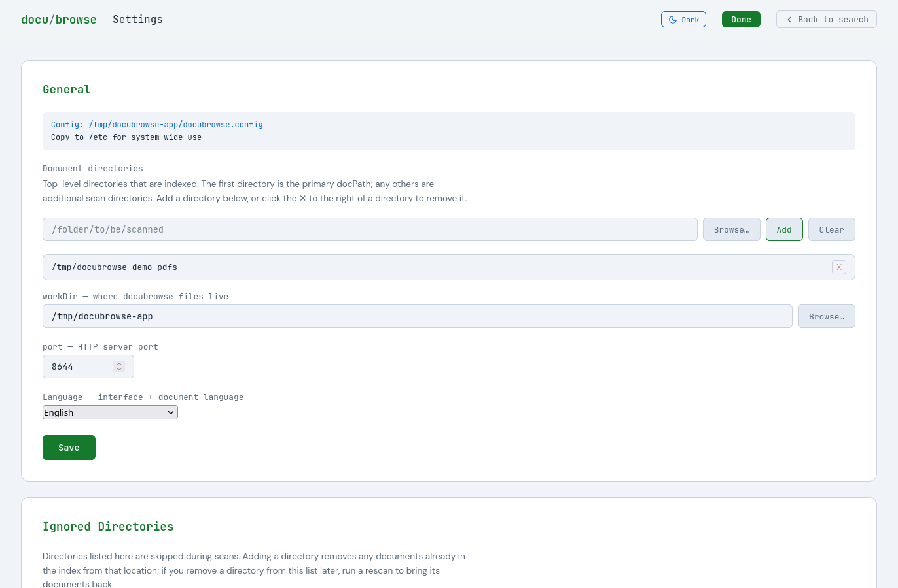

# DocuBrowse v0.8.0

<a name="top"></a>

> ⚠️ **Alpha — Active Development**
> Functional and in daily use, but interfaces and commands may change between versions.
> Check `status_docs/project_status.md` for current state before picking up dev work.

**DocuBrowse turns a messy pile of documents into something you can actually search.**
Point it at your files — PDFs, ebooks, Word docs, notes, whatever — and it builds a smart
index that understands not just keywords, but meaning. Ask for "that contract about the
lease renewal" and find it even if those exact words never appear. Click any result for
an instant AI summary before you even open the file. PII aware and works with multiple document directories.

DocuBrowse runs entirely on your own machine using local AI models — no internet
connection required, no accounts, no API keys, and no per-query costs eating into a
token budget. **Your data. Your AI.**

Under the hood: SQLite FTS5 keyword search plus AI-powered semantic similarity and
synopsis generation (Ollama + nomic-embed-text + dolphin3). Supports multiple document and source code types.

---

## Navigation

| | | |
|---|---|---|
| [Features](#features) | [Screenshots](#screenshots) | [Quick Start](#quick-start) |
| [CLI Reference](#cli-reference) | [Configuration](#configuration) | [Architecture](#architecture) |
| [API Endpoints](#api-endpoints) | [Search Algorithm](#search-algorithm) | [Security](#security) |
| [File Structure](#file-structure) | [Troubleshooting](#troubleshooting) | [Known Limitations](#known-limitations) |
| [Recent Changes](#recent-changes) | | |
| [Roadmap](#roadmap) | [AI-Assisted Dev](#ai-assisted-development) | [License](#license) |

---

## Features

[↑ Top](#top)

### 🔍 Dual Search Modes
- **Keyword Search** — fast full-text search via SQLite FTS5 (title, author, subject, tags, snippet)
- **Semantic Search** — AI-powered similarity via Ollama embeddings (nomic-embed-text:latest)
- **Hybrid Mode** (default) — 70% semantic + 30% keyword, merged and re-ranked

### 📖 AI Synopsis
- Click any document title for a Kindle-style book-jacket synopsis, generated on demand
  via Ollama (`dolphin3:latest`) and cached in the database after
  first generation

### 📚 Document Indexing
- **Formats**: PDF, DOCX, EPUB, MOBI, AZW3, AZW, HTML, TXT, Markdown
- **PDF intelligence**: pdfplumber (preferred) with pypdf fallback for bloated-object files; `layout=False` retry for complex layouts; scanned (image-only) PDFs detected and routed to `ocr_list_pdfs.txt`
- **Word documents**: python-docx extracts paragraphs, tables, and core properties (title, author, subject)
- **E-books**: ebooklib for EPUB; mobi package + Calibre fallback for MOBI/AZW3; DRM-encrypted AZW files indexed with metadata only (title/author visible, body not searchable)
- **Metadata**: title, author, subject extracted from document metadata fields; auto-generated tags from directory structure and content keywords
- **PII protection**: post-ingest scanner detects SSN, credit card, DOB, MRN, driver license, passport patterns; removes matching documents and permanently blacklists them

### 🎨 User Interface
- Dark/Light theme toggle
- Paginated results (50 docs/page) with Back/Next controls
- Alphabetic index bar (A–Z, 0–9) for quick navigation, with state preserved across page loads; Home button to reset
- Tag cloud for filtering by topic
- Relevance score badges (0–100%) on every result
- Click document title to open the file; 📋 copies path to clipboard; 🗑 deletes file from disk and index (with confirmation)
- Moved/deleted documents: clicking a doc whose file no longer exists shows a dismissable
  modal (and removes it from the index on dismiss) if its filesystem is mounted, or a
  toast (no index change) if the filesystem can't be verified (e.g. unmounted drive)

### ⚙️ Settings (`/settings`)
- General panel: document directory (with live directory browser), any number of additional scan directories (added/removed under the same panel, each shown with the rescan command needed to index it), working directory, and port
- Ignored Directories panel: browse to add a directory to `ignore_dirs.txt`, with a confirmation prompt before purging already-indexed documents under it, and a confirmation before removing an entry

### ⚡ Performance
- Search latency: <150ms typical
- Parallel PDF extraction with `ProcessPoolExecutor` (physical-core-aware worker count)
- Memory-safe: kernel-enforced RLIMIT_AS (6 GB/worker) + pause/resume on free-RAM threshold

---

## Screenshots

[↑ Top](#top)

Click any thumbnail to view full size.

| Light Mode | Dark Mode |
|---|---|
| [](screenshots/screenshot-dark-mode.png) | [](screenshots/screenshot-light-mode.png) |

| Settings | AI Synopsis |
|---|---|
| [](screenshots/screenshot-settings-page.png) | [](screenshots/screenshot-synopsis-modal.png) |

> Settings is a standalone page at `/settings` (opened in a new tab via the gear icon). The General panel covers the document directory (with live directory browser, plus any number of additional scan directories), working directory, and port; the Ignored Directories panel manages scan exclusions, each with a directory browser, add/clear controls, and confirmation before removal.

---

## Quick Start

[↑ Top](#top)

### Prerequisites
- Python 3.10+
- `pdfplumber`, `pypdf` — PDF extraction: `pip install pdfplumber pypdf`
- `python-docx` — Word documents: `pip install python-docx`
- `ebooklib`, `beautifulsoup4`, `mobi` — E-books: `pip install ebooklib beautifulsoup4 mobi`
- **Calibre** — E-book metadata and conversion (required for MOBI/AZW3/AZW indexing):
  `sudo dnf install calibre` or `sudo apt install calibre`
  DRM-encrypted AZW files additionally require [DeDRM_tools](https://deepwiki.com/apprenticeharper/DeDRM_tools/1.1-installation-and-setup)
- Ollama — installed automatically by `docubrowser.py start` if missing
- Modern browser (Chrome, Firefox, Safari, Edge)

See [INSTALL.md](INSTALL.md) for a full step-by-step guide.

### Install (recommended)

The bundled `install.sh` is the easiest way to get a working install. Download
and extract a release tarball (or `git clone` the repo), then run one of:

```bash
# USER install — no root, no systemd
./install.sh
#  → installs to ~/.docubrowse (its own venv)
#  → CLI wrapper at ~/.local/bin/docubrowser
#  → start it yourself with:  docubrowser start

# SYSTEM install — dedicated user + systemd unit
sudo ./install.sh
#  → installs to /opt/docubrowse as the 'docubrowse' system user
#  → installs systemd unit docubrowser.service (NOT auto-enabled)
#  → CLI wrapper at /usr/local/bin/docubrowser
#  → manage with:  systemctl start docubrowser   (plus the docubrowser CLI)
```

`install.sh` runs comprehensive pre-flight checks before touching anything —
python3 ≥ 3.9 (with venv/ensurepip), rsync, curl, tar, plus calibre and ollama,
and in system mode getent/useradd/groupadd/systemctl — and reports everything
missing at once. Python dependencies are declared in `requirements.txt`
(pdfplumber, pypdf, python-docx, python-pptx, openpyxl, ebooklib,
beautifulsoup4, mobi, numpy) and installed automatically via
`pip install -r requirements.txt`.

Once installed, the CLI is the `docubrowser` command — drop the `./` and `.py`
from every example below. For example, `docubrowser start` and
`docubrowser rescan`. The `./docubrowser.py <cmd>` form shown throughout the
rest of this README is the dev / cloned-repo path (running directly out of a
checkout).

To uninstall, run `./uninstall.sh` (or `sudo ./uninstall.sh` for a system
install).

### First Run (dev / cloned repo)

```bash
cd /path/to/DocuBrowse

# Scan and index your documents
./docubrowser.py rescan

# Start the server
./docubrowser.py start

# Open the UI
./docubrowser.py open
```

> On an installed system, use the `docubrowser` command instead, e.g.
> `docubrowser rescan` / `docubrowser start` / `docubrowser open`.

`docubrowser.py start` automatically verifies Ollama is installed, running, and has
both required models — `nomic-embed-text:latest` (embeddings) and
`dolphin3:latest` (synopsis generation) — installing/starting/pulling
as needed.

---

## CLI Reference

[↑ Top](#top)

```
Usage: docubrowser.py <command> [options]
```

### Commands

| Command | Description |
|---------|-------------|
| `start` | Start the search server (runs Ollama check first) |
| `stop` | Stop the server |
| `restart` | Stop then start |
| `status` | Show server status, document count, embedding count, tag count |
| `scan [TYPE ...]` | Scan and index documents (no embedding) |
| `rescan [TYPE ...]` | Scan + generate embeddings |
| `scan-file --file PATH` | Extract and index a single file, then embed it |
| `embed` | Generate/refresh embeddings for un-embedded documents |
| `open` | Open the DocuBrowse UI in your default browser |
| `purge` | Scan index for PII and remove matching documents |
| `ignore add\|remove\|list DIR` | Manage directories excluded from scanning (auto-purges on add) |
| `report` | Walk doc directory and show file-type breakdown (no DB changes) |
| `scan-missing [--db PATH] [--dry-run]` | Opt-in cleanup: classify every indexed path as present/missing/unmounted, delete `missing` rows (cascades), leave `unmounted` rows alone |
| `stopall` | Stop all running scans, embeds, and the server |
| `duplist` | List duplicate documents (exact SHA256 + optional near-duplicate) |
| `dupclean` | Interactive TUI to review and remove duplicate documents |

### Global Options

```
--db PATH      SQLite database path (overrides config)
--port PORT    Server port (overrides config)
--config FILE  Config file path
```

### Command Examples

```bash
# Server management
./docubrowser.py start
./docubrowser.py start --port 9000
./docubrowser.py status
./docubrowser.py stop
./docubrowser.py stopall

# Scanning
./docubrowser.py scan                          # scan all supported types
./docubrowser.py scan pdf                      # PDFs only
./docubrowser.py scan pdf txt                  # PDFs and plain text
./docubrowser.py scan --limit 100              # first 100 unindexed files only
./docubrowser.py rescan                        # scan + embed all types
./docubrowser.py rescan pdf --workers 4        # PDFs only, 4 workers
./docubrowser.py rescan --no-embed             # scan without embedding step
./docubrowser.py rescan --doc-dir /data/docs

# Single-file indexing (useful for retrying blacklisted files)
./docubrowser.py scan-file --file /path/to/document.pdf
./docubrowser.py scan-file --file /path/with spaces/doc.pdf   # no quoting needed
./docubrowser.py scan-file --file /path/to/doc.pdf --no-embed

# Reporting and maintenance
./docubrowser.py report                         # file-type breakdown, no DB changes
./docubrowser.py embed                          # embed any un-embedded docs
./docubrowser.py purge --dry-run               # preview PII matches (safe)
./docubrowser.py purge                         # remove PII documents (prompts)

# Excluding directories from scanning
./docubrowser.py ignore add /mnt/data/Documents/myWorkDocs   # exclude + purge indexed docs under it
./docubrowser.py ignore list                                  # show ignored directories
./docubrowser.py ignore remove /mnt/data/Documents/myWorkDocs # re-allow (rescan to re-index)

# Duplicate detection and cleanup
./docubrowser.py duplist                       # find exact SHA256 duplicates
./docubrowser.py duplist --near-dups           # also find near-duplicates (cosine ≥97%)
./docubrowser.py duplist --near-dups --threshold 0.95
./docubrowser.py dupclean                      # interactive Keep A/Keep B/Keep Both TUI
./docubrowser.py dupclean --near-dups          # include near-duplicates in cleanup

# Cleaning up moved/deleted documents (opt-in, not run automatically)
./docubrowser.py scan-missing --dry-run        # report counts only, no DB changes
./docubrowser.py scan-missing                  # delete rows for genuinely-missing files
```

### scan / rescan Type Filters

```
Types: pdf  txt  md  html  (default: all four)

Examples:
  rescan pdf             PDFs only
  rescan pdf txt         PDFs and plain text
  rescan                 all supported types (prompts if unfiltered)
```

### scan-file Details

`scan-file` is designed for retrying individual problem files:
- Removes the file from `scan_blacklist.txt` if listed (explicit retry)
- Refuses files in `pii_blacklist.txt` (permanent PII block)
- Detects scanned (image-only) PDFs → adds to `ocr_list_pdfs.txt`
- Paths with spaces work without quoting: `--file` accepts multiple tokens and rejoins them

---

## Configuration

[↑ Top](#top)

DocuBrowse reads the first config file it finds:

1. `/etc/docubrowse.config` (system-wide)
2. `./docubrowse.config` (next to `docubrowser.py`)

If neither exists, built-in defaults apply — except `doc_dir`, which has no
default. Until a document directory is configured (via the Settings gear icon
in the web UI, or by setting `doc_dir` in `docubrowse.config`), the web UI
shows a banner prompting you to configure one, and CLI commands that need a
document directory (`rescan`, `report`, `scan`) exit with an error explaining
how to set it.

### Config File Format

```ini
# docubrowse.config
doc_dir      = /mnt/data/Documents
db_path      = /home/user/DocuBrowse/du-docs.db
port         = 8643
work_dir     = /home/user/DocuBrowse
allow_remote = false
```

`allow_remote` (boolean, default `false`) controls whether the server binds
localhost-only (`127.0.0.1`) or all interfaces (`0.0.0.0`) for LAN access.
See [Security](#security) before enabling it.

### Defaults

| Key | Default |
|-----|---------|
| `doc_dir` | _(none — must be configured via Settings or docubrowse.config)_ |
| `db_path` | `<script dir>/du-docs.db` |
| `port` | `8643` |
| `work_dir` | `<script dir>` |
| `allow_remote` | `false` (localhost-only bind) |

---

## Architecture

[↑ Top](#top)

```
┌─────────────────────────────────────┐
│  docubrowser.py  (CLI entry point)  │
│  ensure_ollama.py (prereq check)    │
└──────────┬──────────────────────────┘
           │ subprocess / direct call
           ↓
┌──────────────────────┐  ┌─────────────────────────────────┐
│  scan_docs.py        │  │  doc_search.py  (HTTP :8643)    │
│  ProcessPoolExecutor │  │  GET /  /api/search             │
│  pdf_extractor.py    │  │  GET /api/stats  /api/tags      │
│  embed_docs.py       │  │  GET /api/open  /api/config     │
│                      │  GET /api/delete  /api/synopsis │
└──────────┬───────────┘  └──────────────┬──────────────────┘
           │                              │
           └──────────┬───────────────────┘
                      ↓
        ┌──────────────────────────────────────────────────┐
        │  du-docs.db  (SQLite FTS5)                       │
        │  Ollama (nomic-embed-text + dolphin3)  │
        └──────────────────────────────────────────────────┘
```

### Key Scripts

| Script | Role |
|--------|------|
| `docubrowser.py` | CLI launcher — all commands |
| `ensure_ollama.py` | Checks/installs Ollama binary, service, and required models |
| `doc_search.py` | HTTP server; search API and UI |
| `docubrowse_db.py` | SQLite schema and migrations |
| `scan_docs.py` | Document discovery, extraction, and DB writes |
| `pdf_extractor.py` | PDF-specific extraction with pdfplumber/pypdf |
| `docx_extractor.py` | Word document extraction (python-docx) |
| `ebook_extractor.py` | EPUB/MOBI/AZW3/AZW extraction (ebooklib + Calibre) |
| `hardware_utils.py` | CPU/GPU/RAM detection, worker count formula |
| `embed_docs.py` | Sends text to Ollama; stores 768-dim vectors |
| `purge_pii.py` | Scans index for PII; removes and blacklists matches |
| `dup_detect.py` | Exact (SHA256) and near-duplicate (cosine similarity) detection |

### Blacklist Files

| File | Purpose | Permanent? |
|------|---------|-----------|
| `scan_blacklist.txt` | Files that failed extraction | No — remove line to retry |
| `pii_blacklist.txt` | Files removed for containing PII | Yes — never re-ingest |
| `ocr_list_pdfs.txt` | Image-only PDFs needing OCR | N/A — informational |
| `ignore_dirs.txt` | Directories excluded from scanning (managed via `ignore` command) | No — `ignore remove` + `rescan` |

---

## API Endpoints

[↑ Top](#top)

Base URL: `http://localhost:8643`

| Method | Path | Description |
|--------|------|-------------|
| `GET` | `/` | Serve `index.html` (injects a per-process CSRF token) |
| `GET` | `/settings` | Serve `settings.html` |
| `GET` | `/api/stats` | Total docs, embedded count, unique tag count |
| `GET` | `/api/tags` | Tag list with counts (≥3 occurrences) |
| `GET` | `/api/search` | Search with pagination |
| `GET` | `/api/letters` | First-letter index for the alphabetic bar |
| `GET` | `/api/synopsis` | Generate/return an AI synopsis for a document |
| `GET` | `/api/config` | Current server configuration |
| `GET` | `/api/ignore-dirs` | List excluded directories |
| `GET` | `/api/scan-dirs` | List additional scan directories |
| 🔒 `GET` | `/api/browse` | Directory browser for Settings (token-gated) |
| 🔒 `POST` | `/api/open` | Open a file with xdg-open/gio (validates against DB) |
| 🔒 `POST` | `/api/delete` | Delete a file from disk and remove from index (path must be indexed) |
| 🔒 `POST` | `/api/config` | Save server configuration |
| 🔒 `POST` | `/api/ignore-dirs` | Add/remove an excluded directory |
| 🔒 `POST` | `/api/scan-dirs` | Add/remove an additional scan directory |

🔒 = state-changing or filesystem-exposing; requires the per-process
`X-CSRF-Token` header and a loopback `Origin`/`Referer`. The token is injected
into the served HTML, so only the first-party UI can call these. See
[Security](#security). All requests are also rejected unless the `Host` header
is `localhost`/`127.0.0.1`/`[::1]` (DNS-rebinding protection).

### /api/open — missing and unmounted files

If the indexed path no longer exists on disk, `/api/open` returns one of:

```json
{"ok": false, "error": "missing", "message": "..."}
{"ok": false, "error": "unmounted", "message": "..."}
```

`missing` means the file's filesystem is mounted and the file is genuinely gone — the UI
shows a dismissable modal and deletes the document from the index (and disk-adjacent DB
rows) when dismissed. `unmounted` means the path's filesystem can't currently be verified
(likely an unmounted drive) — the UI shows a toast and makes no DB changes. See
`scan-missing` for the equivalent batch cleanup.

### Search Parameters

```
GET /api/search?q=QUERY&offset=0&mode=both
```

| Param | Values | Default |
|-------|--------|---------|
| `q` | search string | `""` (returns all docs) |
| `mode` | `both` \| `keyword` \| `semantic` | `both` |
| `offset` | integer | `0` |

### Search Response

```json
{
  "documents": [
    {
      "id": 1,
      "name": "doc.pdf",
      "title": "Document Title",
      "author": "Jane Smith",
      "subject": "Cloud Security",
      "description": "First 500 chars of content...",
      "path": "/mnt/data/Documents/doc.pdf",
      "tags": ["pdf", "security", "cloud"],
      "modified_at": "2026-06-07T14:30:00",
      "score": 0.95,
      "fts_score": 0.8,
      "sem_score": 0.98
    }
  ],
  "query": "cloud security",
  "count": 50,
  "total": 312,
  "offset": 0,
  "has_more": true,
  "mode": "both"
}
```

### Quick API Test

```bash
# Read endpoints are plain GETs:
curl "http://localhost:8643/api/stats"
curl "http://localhost:8643/api/search?q=kubernetes&mode=both"
curl "http://localhost:8643/api/search?q=&offset=50"
```

Mutating endpoints (`/api/delete`, `/api/open`, the `POST` config/dir routes)
and `/api/browse` require the per-process CSRF token and a loopback origin, so
they aren't easily exercised with a bare `curl` — drive them from the UI, or
pass `-X POST -H "X-CSRF-Token: <token>" -H "Origin: http://localhost:8643"`
where `<token>` is read from the `<meta name="csrf-token">` tag in `/`.

---

## Search Algorithm

[↑ Top](#top)

A non-empty query is scored two ways and merged; metadata is then fetched only
for the requested page (the whole corpus is no longer loaded per request).

```
final_score = 0.3 × keyword_score + 0.7 × semantic_score   (mode=both)
```

### Keyword Scoring (FTS5 BM25)

- Backed by the SQLite **FTS5** index via `MATCH` + `bm25()` — not a Python
  substring scan.
- Query tokens are quoted and prefix-matched (`"tok"*`), OR-combined, so
  arbitrary input (operators, quotes, `C++`, `&`) can't break the query.
- Per-column BM25 weights echo the old field priorities
  (name 6, title 8, author 7, subject 5, description 3, content_snippet 3,
  tags 4); the result is normalized to 0–1.
- Orphan `doc_fts` rowids (contentless FTS has no FK cascade) are pruned
  against the live document set so they can't inflate totals.

### Semantic Scoring

- Cosine similarity between the query embedding and each document embedding.
- Computed against an **in-process, L2-normalized embedding matrix** (one
  vectorized NumPy matrix-vector product), cached and invalidated when the
  embeddings table changes — instead of reloading every BLOB per request.
- Range 0.0–1.0; minimum threshold (semantic-only mode): **0.30**.
- Embeddings: 768-dimensional float32 vectors (nomic-embed-text:latest).

---

## Security

[↑ Top](#top)

DocuBrowse binds to localhost and is intended for single-user local use, but it
is hardened so a malicious web page you happen to visit can't reach it:

- **Host-header allow-list** — every request is rejected unless `Host` is
  `localhost`/`127.0.0.1`/`[::1]` (optionally with the serving port). Defeats
  DNS-rebinding against the localhost-bound server.
- **No wildcard CORS** — `Access-Control-Allow-Origin: *` is gone, so other
  origins can't read the index/config cross-origin.
- **CSRF tokens on mutations** — `/api/delete` and `/api/open` are POST-only;
  they plus the POST config/dir routes and the filesystem-exposing
  `/api/browse` require a per-process `X-CSRF-Token` (injected into the served
  HTML, so only the first-party UI has it) and a loopback `Origin`/`Referer`.
- **No stored-data injection** — document fields are escaped for HTML and
  card actions use `data-*` attributes + delegated listeners (no inline
  `onclick` built from document data), closing a stored-XSS vector.
- **PII purge** validates structurally before deleting: SSNs against SSA
  allocation rules, credit cards by length + issuer prefix + Luhn — so it both
  catches more real PII and avoids deleting docs over incidental number groups.

Authentication is still not provided; this is for trusted local use, not a
network-exposed deployment.

### Remote (LAN) access

By default the server binds `127.0.0.1` (localhost only) and the firewall is
left untouched. Remote/LAN access is strictly **opt-in**:

- During install, `install.sh` asks **"Allow remote (LAN) access?"** (default
  **No**). Non-interactively, set `DOCUBROWSE_ALLOW_REMOTE=1` to enable it.
- When enabled, the installer binds `0.0.0.0`, opens the firewall for the
  configured port (firewalld `--add-port=8643/tcp`, or ufw), and sets
  `allow_remote=true` in `docubrowse.config`.

Security implications of enabling remote access:

- **No authentication yet** — remote access exposes read *and delete* to anyone
  on the network. This is opt-in and the installer warns about it.
- **DNS-rebinding is still blocked** — the Host allow-list always permits
  loopback names, and additionally permits this host's own names + IP-literal
  Host values when remote access is on.
- **Mutating requests still require the CSRF token AND a same-origin
  `Origin`/`Referer`** — this works for both local and LAN clients.

> **Switching local ↔ remote after install is currently manual:** edit
> `allow_remote` in `docubrowse.config`, open/close the firewall yourself, then
> `docubrowser restart`. A `docubrowser remote on|off` command is planned but
> **not yet available**.

---

## File Structure

[↑ Top](#top)

```
DocuBrowse/
├── docubrowser.py          # CLI entry point (all commands)
├── ensure_ollama.py        # Ollama prerequisite checker/installer
├── doc_search.py           # HTTP search server (port 8643)
├── docubrowse_db.py        # SQLite schema and migrations
├── scan_docs.py            # Scanner: discovery, extraction, DB writes
├── pdf_extractor.py        # PDF extraction (pdfplumber + pypdf fallback)
├── docx_extractor.py       # Word document extraction (python-docx)
├── ebook_extractor.py      # EPUB/MOBI/AZW3/AZW extraction (ebooklib + Calibre)
├── hardware_utils.py       # CPU/GPU/RAM detection, worker formula
├── embed_docs.py           # Embedding generation pipeline
├── purge_pii.py            # PII scanner and purge tool
├── dup_detect.py           # Exact (SHA256) and near-duplicate detection
├── index.html              # Frontend UI (single-file, dark/light theme)
├── du-docs.db              # SQLite database (gitignored)
├── du-docs.db.example      # Empty schema for new installs
├── scan_blacklist.txt      # Failed-extraction skiplist (gitignored)
├── pii_blacklist.txt       # PII-removed files — permanent (gitignored)
├── ocr_list_pdfs.txt       # Image-only PDFs needing OCR (gitignored)
├── ignore_dirs.txt         # Directories excluded from scanning (gitignored)
├── scan_dirs.txt           # Additional scan directories (gitignored)
├── docubrowse.config       # Local config (optional, gitignored)
├── INSTALL.md              # Step-by-step install guide
├── README.md               # This file
├── LICENSE                 # GPL-3.0
├── status_docs/            # Project planning and decision logs
│   ├── project_status.md   # Current version, session history
│   └── DECISIONS.md        # Deferred decisions and known issues
└── test_pdfs_live/         # 100 sample PDFs for testing
```

---

## Troubleshooting

[↑ Top](#top)

### Inotify watch limit

Large document collections may trigger:
```
OSError: [Errno 28] inotify watch limit reached
```
This is a Linux kernel limit, not a disk space issue. It's safe to ignore these
warnings — but if you'd rather not see them, raise the limit for the duration
of the scan:

1. Edit `/etc/sysctl.conf` and find the line:
   ```
   fs.inotify.max_user_instances=128
   ```
2. Raise it to `256` or `512`:
   ```
   fs.inotify.max_user_instances=256
   ```
3. Apply the change without rebooting:
   ```bash
   sudo sysctl -p
   ```

Once ingestion is finished, you can set the value back to `128` (edit the
file again and re-run `sudo sysctl -p`) — or just leave it raised.

### PDF hangs during scan

Some PDFs cause pdfminer to hang. These are auto-detected and blacklisted. If a specific
file is causing problems, check:

```bash
# How many PDF objects does it have? (>8000 is abnormal)
pdfinfo /path/to/file.pdf | grep -i objects

# Retry the file after it has been blacklisted
./docubrowser.py scan-file --file /path/to/file.pdf
```

Files with >8,000 PDF objects (usually caused by repeated ExifTool metadata updates) are
automatically routed through pypdf instead of pdfminer.

### Image-only (scanned) PDFs

PDFs with no extractable text are detected and added to `ocr_list_pdfs.txt`. They are
indexed with a placeholder (`[scanned PDF — OCR required]`) so they appear in browse
but won't match keyword or semantic searches until OCR is run.

### Scan progress appears stuck

Check the log:
```bash
tail -f /var/log/docubrowser.log
# or
tail -f ~/.local/share/docubrowser/docubrowser.log
```

### Ollama not starting

```bash
ollama serve                       # start manually
ollama list                        # verify both models are present
ollama pull nomic-embed-text:latest              # embeddings, if missing
ollama pull dolphin3:latest                      # synopsis generation, if missing
```

---

## Known Limitations

[↑ Top](#top)

| Limitation | Status |
|------------|--------|
| DRM-encrypted AZW not fully searchable | Metadata indexed; DeDRM_tools required for body text |
| Scanned PDFs not searchable | Listed in ocr_list_pdfs.txt; OCR deferred |
| Multiple top-level doc directories | Additional scan directories supported (General panel / `scan_dirs.txt`), but each requires a manual rescan via the printed CLI command — not yet automatic |
| Moved/renamed files | Not detected as moves — old path is removed (interactively or via `scan-missing`), new path is picked up on next rescan as a fresh entry; true duplicates are caught by `duplist`/`dupclean` |
| No authentication | Local use only; hardened against cross-origin/CSRF/DNS-rebinding (see [Security](#security)) but not meant for network exposure. Remote (LAN) access is opt-in and warned at install time — enabling it exposes read/delete to the whole network |
| ETA display drifts high | Uses simple average; sliding window deferred |

---

## Recent Changes

[↑ Top](#top)

### Unreleased — No-default doc_dir, configure banner, uninstall.sh
- `doc_dir`/`docPath` no longer default to `/mnt/data/Documents` — an
  unconfigured document directory is now a valid state across the CLI
  (`docubrowser.py`), API (`doc_search.py` `/api/config`), and `install.sh`'s
  generated config.
- CLI commands that need a document directory (`rescan`, `report`, `scan`)
  now exit with a clear error pointing to the Settings gear,
  `docubrowse.config`, or `--doc-dir` if none is configured.
- `index.html` shows a banner — "No document directory configured yet. Click
  the Settings (gear) icon..." — whenever `/api/config` reports an empty
  `docPath`.
- Added `uninstall.sh`, mirroring `install.sh`'s user/system mode detection:
  stops/disables/removes the systemd unit, removes the CLI wrapper and install
  directory, cleans up pid/log files, and (system mode, separate confirmation)
  can remove the dedicated `docubrowse` user/group.

### v0.8.0 — Installer & remote access (2026-06-13)
- **Installer:** rewritten `install.sh`/`uninstall.sh` with a clean user vs.
  system split — user mode installs to `~/.docubrowse` (own venv, wrapper at
  `~/.local/bin/docubrowser`, no root, no systemd); system mode installs to
  `/opt/docubrowse` as a dedicated `docubrowse` user with a (not auto-enabled)
  `docubrowser.service` systemd unit and `/usr/local/bin/docubrowser` wrapper.
- **Pre-flight checks:** the installer validates all prerequisites up front
  (python3 ≥ 3.9 + venv/ensurepip, rsync, curl, tar, calibre, ollama, plus
  getent/useradd/groupadd/systemctl in system mode) and reports everything
  missing at once before making any changes.
- **CLI:** the launcher is now installed as the `docubrowser` command (no `.py`).
- **requirements.txt** added and installed via `pip install -r requirements.txt`
  — now includes previously-missing deps (numpy, python-pptx, openpyxl)
  alongside pdfplumber, pypdf, python-docx, ebooklib, beautifulsoup4, mobi.
- **Opt-in LAN access:** localhost-only by default; when enabled the installer
  binds `0.0.0.0`, opens the firewall, sets `allow_remote=true`, and keeps the
  Host allow-list + CSRF/same-origin protections (see [Security](#security)).
- **Fresh installs start empty:** `du-docs.db.example` now ships empty, so new
  installs begin with no documents indexed.
- **Multiple document directories:** Settings now shows a single "Document
  directories" list (the old separate docPath + "additional directories" panels
  are merged). `rescan`/`scan` index **every** listed directory; an explicit
  `--doc-dir` still targets just one. `doc_dir` is now optional.

### v0.8.0 — Security & reliability hardening
Remediation of a full code-quality + security audit (details in
`status_docs/DECISIONS.md`). Highlights:
- **Security:** Host-header allow-list (anti DNS-rebinding); removed wildcard
  CORS; `/api/delete` and `/api/open` moved to POST and, with the POST config/
  dir routes and `/api/browse`, gated by a per-process CSRF token + loopback
  origin; stored-XSS vector closed (data-attribute + delegated listeners);
  PII purge now validates with SSA rules + Luhn/IIN.
- **Search:** keyword path now uses the FTS5 `bm25()` index and semantic scoring
  uses a cached NumPy embedding matrix instead of loading the whole corpus per
  request (keyword ~4ms, both ~55ms); server-side semantic search fixed (was
  silently returning nothing).
- **Reliability:** `INSERT … ON CONFLICT` upsert (re-indexing no longer wipes
  tags/embeddings/synopsis); worker-death "suspect isolation" blacklists only
  the real offender; schema init runs once per process; scan/embed commit on a
  ~2s time budget so the server isn't blocked; `dupclean` no longer corrupts
  the disk/DB on its main path; precise `/proc`-based worker termination;
  single shared document-delete helper; assorted medium/low fixes.
- **UI:** pagination Back/Next correct at all page sizes; a newer search now
  supersedes an in-flight page load (no stale results).

### Unreleased — Handle moved/missing/deleted documents
- `/api/open` now returns `{"ok": false, "error": "missing"|"unmounted", "message": ...}`
  for files that no longer exist, instead of a generic error.
- The UI shows a dismissable modal for `missing` files (and removes them from the index
  on dismiss), or a toast for `unmounted` files (filesystem can't be verified, no index
  change).
- New opt-in `scan-missing [--dry-run]` CLI command batch-cleans `missing` rows across
  the whole index without touching `unmounted` rows.

### v0.7.2.1 — Bugfix
- Fixed "Open file" (`/api/open`) silently doing nothing — the server's
  environment was missing `DBUS_SESSION_BUS_ADDRESS`/`DISPLAY`/`XAUTHORITY`/
  `XDG_RUNTIME_DIR`, so `xdg-open` exited successfully without launching the
  default app. `handle_open` now reconstructs the desktop session
  environment and prefers `gio open` for reliable launches.

---

## Roadmap

[↑ Top](#top)

### Phase 2b — Format Expansion ✅ Complete
- ✅ DOCX extractor (python-docx)
- ✅ EPUB/MOBI/AZW3/AZW extraction (ebooklib + Calibre)
- No-extension file classification (magic bytes)
- Scale to 10K+ documents

### Phase 2 — Housekeeping ✅ Complete
- ✅ `duplist` / `dupclean` — exact + near-duplicate detection and interactive cleanup
- ✅ Config read/write via Settings UI (port, docPath, workDir)
- Sliding window ETA for progress bar
- File-type filter in search UI

### Phase 3 — Polish
- Config persistence
- Advanced filtering (date range, type, author)
- Result export (CSV/JSON)
- OCR integration for scanned PDFs

### Phase 3+ — Advanced
- API key authentication
- Document similarity clustering
- Docker deployment

---

## AI-Assisted Development

[↑ Top](#top)

DocuBrowse is developed with Claude as an active coding partner. To resume a session
with full context, load these files at the start:

| File | Contents |
|------|---------|
| `.claude/CLAUDE.md` | Project rules, key files, hard-won lessons |
| `status_docs/project_status.md` | Version, session history, what's in progress |
| `status_docs/DECISIONS.md` | Deferred decisions, known problem files, rationale |

```bash
# Print all three for copy/paste into any AI assistant
cat .claude/CLAUDE.md status_docs/project_status.md status_docs/DECISIONS.md
```

---

## License

[↑ Top](#top)

GNU General Public License v3.0 or later (GPL-3.0-or-later).

Copyright (C) 2026 James Sparenberg

See [LICENSE](LICENSE) or https://www.gnu.org/licenses/gpl-3.0.html.

---

**DocuBrowse v0.8.0** — Fast, local, AI-powered document search.
