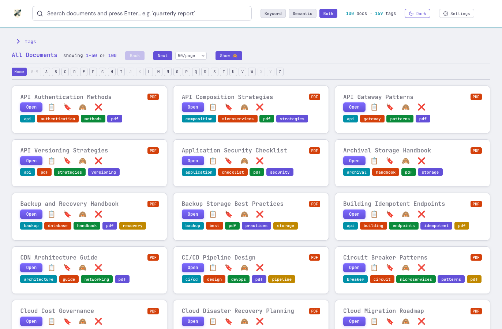
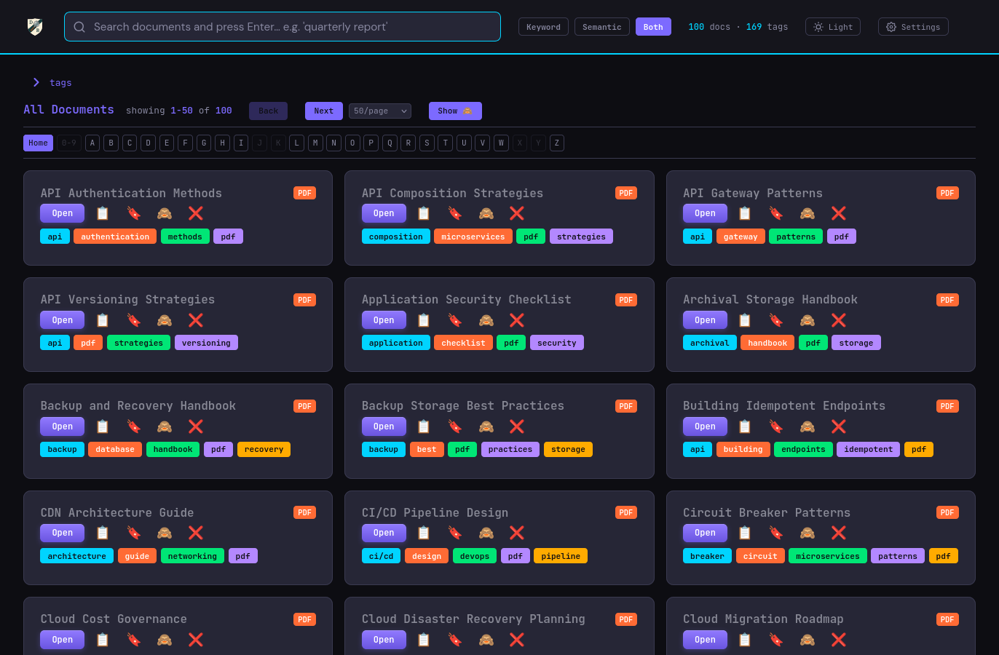
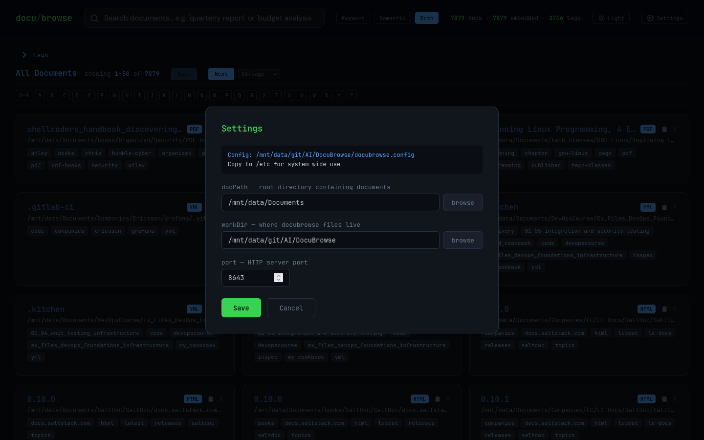
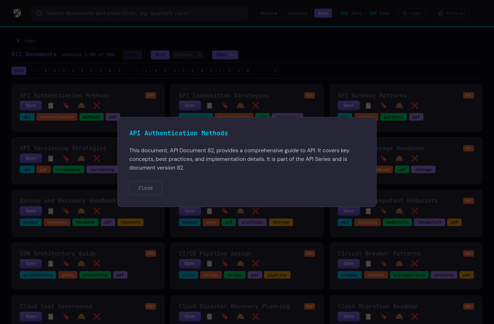

# DocuBrowse v0.7.0

<a name="top"></a>

> ⚠️ **Alpha — Active Development**
> Functional and in daily use, but interfaces and commands may change between versions.
> Check `status_docs/project_status.md` for current state before picking up dev work.

A fast, local document search and browsing tool. DocuBrowse indexes your filesystem using
SQLite FTS5 keyword search and AI-powered semantic similarity (Ollama + nomic-embed-text).
Supports PDF, DOCX, EPUB, MOBI, AZW3, HTML, TXT, and Markdown. Runs entirely on your
machine — no cloud, no API keys.

---

## Navigation

| | | |
|---|---|---|
| [Features](#features) | [Screenshots](#screenshots) | [Quick Start](#quick-start) |
| [CLI Reference](#cli-reference) | [Configuration](#configuration) | [Architecture](#architecture) |
| [API Endpoints](#api-endpoints) | [Search Algorithm](#search-algorithm) | [File Structure](#file-structure) |
| [Troubleshooting](#troubleshooting) | [Known Limitations](#known-limitations) | [Roadmap](#roadmap) |
| [AI-Assisted Dev](#ai-assisted-development) | [License](#license) | |

---

## Features

[↑ Top](#top)

### 🔍 Dual Search Modes
- **Keyword Search** — fast full-text search via SQLite FTS5 (title, author, subject, tags, snippet)
- **Semantic Search** — AI-powered similarity via Ollama embeddings (nomic-embed-text:latest)
- **Hybrid Mode** (default) — 70% semantic + 30% keyword, merged and re-ranked

### 📖 AI Synopsis
- Click any document title for a Kindle-style book-jacket synopsis, generated on demand
  via Ollama (`dolphin3:latest`) and cached in the database after
  first generation

### 📚 Document Indexing
- **Formats**: PDF, DOCX, EPUB, MOBI, AZW3, AZW, HTML, TXT, Markdown
- **PDF intelligence**: pdfplumber (preferred) with pypdf fallback for bloated-object files; `layout=False` retry for complex layouts; scanned (image-only) PDFs detected and routed to `ocr_list_pdfs.txt`
- **Word documents**: python-docx extracts paragraphs, tables, and core properties (title, author, subject)
- **E-books**: ebooklib for EPUB; mobi package + Calibre fallback for MOBI/AZW3; DRM-encrypted AZW files indexed with metadata only (title/author visible, body not searchable)
- **Metadata**: title, author, subject extracted from document metadata fields; auto-generated tags from directory structure and content keywords
- **PII protection**: post-ingest scanner detects SSN, credit card, DOB, MRN, driver license, passport patterns; removes matching documents and permanently blacklists them

### 🎨 User Interface
- Dark/Light theme toggle
- Paginated results (50 docs/page) with Back/Next controls
- Alphabetic index bar (A–Z, 0–9) for quick navigation
- Tag cloud for filtering by topic
- Relevance score badges (0–100%) on every result
- Click document title to open the file; 📋 copies path to clipboard; 🗑 deletes file from disk and index (with confirmation)

### ⚡ Performance
- Search latency: <150ms typical
- Parallel PDF extraction with `ProcessPoolExecutor` (physical-core-aware worker count)
- Memory-safe: kernel-enforced RLIMIT_AS (6 GB/worker) + pause/resume on free-RAM threshold

---

## Screenshots

[↑ Top](#top)

Click any thumbnail to view full size.

| Light Mode | Dark Mode |
|---|---|
| [](screenshots/screenshot-light-mode.png) | [](screenshots/screenshot-dark-mode.png) |

| Settings | AI Synopsis |
|---|---|
| [](screenshots/screenshot-settings-modal.png) | [](screenshots/screenshot-synopsis-modal.png) |

---

## Quick Start

[↑ Top](#top)

### Prerequisites
- Python 3.10+
- `pdfplumber`, `pypdf` — PDF extraction: `pip install pdfplumber pypdf`
- `python-docx` — Word documents: `pip install python-docx`
- `ebooklib`, `beautifulsoup4`, `mobi` — E-books: `pip install ebooklib beautifulsoup4 mobi`
- **Calibre** — E-book metadata and conversion (required for MOBI/AZW3/AZW indexing):
  `sudo dnf install calibre` or `sudo apt install calibre`
  DRM-encrypted AZW files additionally require [DeDRM_tools](https://deepwiki.com/apprenticeharper/DeDRM_tools/1.1-installation-and-setup)
- Ollama — installed automatically by `docubrowser.py start` if missing
- Modern browser (Chrome, Firefox, Safari, Edge)

See [INSTALL.md](INSTALL.md) for a full step-by-step guide.

### First Run

```bash
cd /path/to/DocuBrowse

# Scan and index your documents
./docubrowser.py rescan

# Start the server
./docubrowser.py start

# Open the UI
./docubrowser.py open
```

`docubrowser.py start` automatically verifies Ollama is installed, running, and has
both required models — `nomic-embed-text:latest` (embeddings) and
`dolphin3:latest` (synopsis generation) — installing/starting/pulling
as needed.

---

## CLI Reference

[↑ Top](#top)

```
Usage: docubrowser.py <command> [options]
```

### Commands

| Command | Description |
|---------|-------------|
| `start` | Start the search server (runs Ollama check first) |
| `stop` | Stop the server |
| `restart` | Stop then start |
| `status` | Show server status, document count, embedding count, tag count |
| `scan [TYPE ...]` | Scan and index documents (no embedding) |
| `rescan [TYPE ...]` | Scan + generate embeddings |
| `scan-file --file PATH` | Extract and index a single file, then embed it |
| `embed` | Generate/refresh embeddings for un-embedded documents |
| `open` | Open the DocuBrowse UI in your default browser |
| `purge` | Scan index for PII and remove matching documents |
| `report` | Walk doc directory and show file-type breakdown (no DB changes) |
| `stopall` | Stop all running scans, embeds, and the server |
| `duplist` | List duplicate documents (exact SHA256 + optional near-duplicate) |
| `dupclean` | Interactive TUI to review and remove duplicate documents |

### Global Options

```
--db PATH      SQLite database path (overrides config)
--port PORT    Server port (overrides config)
--config FILE  Config file path
```

### Command Examples

```bash
# Server management
./docubrowser.py start
./docubrowser.py start --port 9000
./docubrowser.py status
./docubrowser.py stop
./docubrowser.py stopall

# Scanning
./docubrowser.py scan                          # scan all supported types
./docubrowser.py scan pdf                      # PDFs only
./docubrowser.py scan pdf txt                  # PDFs and plain text
./docubrowser.py scan --limit 100              # first 100 unindexed files only
./docubrowser.py rescan                        # scan + embed all types
./docubrowser.py rescan pdf --workers 4        # PDFs only, 4 workers
./docubrowser.py rescan --no-embed             # scan without embedding step
./docubrowser.py rescan --doc-dir /data/docs

# Single-file indexing (useful for retrying blacklisted files)
./docubrowser.py scan-file --file /path/to/document.pdf
./docubrowser.py scan-file --file /path/with spaces/doc.pdf   # no quoting needed
./docubrowser.py scan-file --file /path/to/doc.pdf --no-embed

# Reporting and maintenance
./docubrowser.py report                         # file-type breakdown, no DB changes
./docubrowser.py embed                          # embed any un-embedded docs
./docubrowser.py purge --dry-run               # preview PII matches (safe)
./docubrowser.py purge                         # remove PII documents (prompts)

# Duplicate detection and cleanup
./docubrowser.py duplist                       # find exact SHA256 duplicates
./docubrowser.py duplist --near-dups           # also find near-duplicates (cosine ≥97%)
./docubrowser.py duplist --near-dups --threshold 0.95
./docubrowser.py dupclean                      # interactive Keep A/Keep B/Keep Both TUI
./docubrowser.py dupclean --near-dups          # include near-duplicates in cleanup
```

### scan / rescan Type Filters

```
Types: pdf  txt  md  html  (default: all four)

Examples:
  rescan pdf             PDFs only
  rescan pdf txt         PDFs and plain text
  rescan                 all supported types (prompts if unfiltered)
```

### scan-file Details

`scan-file` is designed for retrying individual problem files:
- Removes the file from `scan_blacklist.txt` if listed (explicit retry)
- Refuses files in `pii_blacklist.txt` (permanent PII block)
- Detects scanned (image-only) PDFs → adds to `ocr_list_pdfs.txt`
- Paths with spaces work without quoting: `--file` accepts multiple tokens and rejoins them

---

## Configuration

[↑ Top](#top)

DocuBrowse reads the first config file it finds:

1. `/etc/docubrowse.config` (system-wide)
2. `./docubrowse.config` (next to `docubrowser.py`)

If neither exists, built-in defaults apply.

### Config File Format

```ini
# docubrowse.config
doc_dir  = /mnt/data/Documents
db_path  = /home/user/DocuBrowse/du-docs.db
port     = 8643
work_dir = /home/user/DocuBrowse
```

### Defaults

| Key | Default |
|-----|---------|
| `doc_dir` | `/mnt/data/Documents` |
| `db_path` | `<script dir>/du-docs.db` |
| `port` | `8643` |
| `work_dir` | `<script dir>` |

---

## Architecture

[↑ Top](#top)

```
┌─────────────────────────────────────┐
│  docubrowser.py  (CLI entry point)  │
│  ensure_ollama.py (prereq check)    │
└──────────┬──────────────────────────┘
           │ subprocess / direct call
           ↓
┌──────────────────────┐  ┌─────────────────────────────────┐
│  scan_docs.py        │  │  doc_search.py  (HTTP :8643)    │
│  ProcessPoolExecutor │  │  GET /  /api/search             │
│  pdf_extractor.py    │  │  GET /api/stats  /api/tags      │
│  embed_docs.py       │  │  GET /api/open  /api/config     │
│                      │  GET /api/delete  /api/synopsis │
└──────────┬───────────┘  └──────────────┬──────────────────┘
           │                              │
           └──────────┬───────────────────┘
                      ↓
        ┌──────────────────────────────────────────────────┐
        │  du-docs.db  (SQLite FTS5)                       │
        │  Ollama (nomic-embed-text + dolphin3)  │
        └──────────────────────────────────────────────────┘
```

### Key Scripts

| Script | Role |
|--------|------|
| `docubrowser.py` | CLI launcher — all commands |
| `ensure_ollama.py` | Checks/installs Ollama binary, service, and required models |
| `doc_search.py` | HTTP server; search API and UI |
| `docubrowse_db.py` | SQLite schema and migrations |
| `scan_docs.py` | Document discovery, extraction, and DB writes |
| `pdf_extractor.py` | PDF-specific extraction with pdfplumber/pypdf |
| `docx_extractor.py` | Word document extraction (python-docx) |
| `ebook_extractor.py` | EPUB/MOBI/AZW3/AZW extraction (ebooklib + Calibre) |
| `hardware_utils.py` | CPU/GPU/RAM detection, worker count formula |
| `embed_docs.py` | Sends text to Ollama; stores 768-dim vectors |
| `purge_pii.py` | Scans index for PII; removes and blacklists matches |
| `dup_detect.py` | Exact (SHA256) and near-duplicate (cosine similarity) detection |

### Blacklist Files

| File | Purpose | Permanent? |
|------|---------|-----------|
| `scan_blacklist.txt` | Files that failed extraction | No — remove line to retry |
| `pii_blacklist.txt` | Files removed for containing PII | Yes — never re-ingest |
| `ocr_list_pdfs.txt` | Image-only PDFs needing OCR | N/A — informational |

---

## API Endpoints

[↑ Top](#top)

Base URL: `http://localhost:8643`

| Method | Path | Description |
|--------|------|-------------|
| `GET` | `/` | Serve `index.html` |
| `GET` | `/api/stats` | Total docs, embedded count, unique tag count |
| `GET` | `/api/tags` | Tag list with counts (≥3 occurrences) |
| `GET` | `/api/search` | Search with pagination |
| `GET` | `/api/open` | Open a file with xdg-open (validates against DB) |
| `GET` | `/api/config` | Current server configuration |
| `GET` | `/api/delete` | Delete a file from disk and remove from index (path must be indexed) |

### Search Parameters

```
GET /api/search?q=QUERY&offset=0&mode=both
```

| Param | Values | Default |
|-------|--------|---------|
| `q` | search string | `""` (returns all docs) |
| `mode` | `both` \| `keyword` \| `semantic` | `both` |
| `offset` | integer | `0` |

### Search Response

```json
{
  "documents": [
    {
      "id": 1,
      "name": "doc.pdf",
      "title": "Document Title",
      "author": "Jane Smith",
      "subject": "Cloud Security",
      "description": "First 500 chars of content...",
      "path": "/mnt/data/Documents/doc.pdf",
      "tags": ["pdf", "security", "cloud"],
      "modified_at": "2026-06-07T14:30:00",
      "score": 0.95,
      "fts_score": 0.8,
      "sem_score": 0.98
    }
  ],
  "query": "cloud security",
  "count": 50,
  "total": 312,
  "offset": 0,
  "has_more": true,
  "mode": "both"
}
```

### Quick API Test

```bash
curl "http://localhost:8643/api/stats"
curl "http://localhost:8643/api/search?q=kubernetes&mode=both"
curl "http://localhost:8643/api/search?q=&offset=50"
curl "http://localhost:8643/api/delete?path=/mnt/data/Documents/unwanted.pdf"
```

---

## Search Algorithm

[↑ Top](#top)

```
final_score = 0.3 × keyword_score + 0.7 × semantic_score
```

### Keyword Scoring

| Match | Boost |
|-------|-------|
| Full phrase in title | +0.8 |
| Full phrase in filename | +0.6 |
| Full phrase in author | +0.7 |
| Full phrase in subject | +0.5 |
| Full phrase in tags | +0.4 |
| Full phrase in description | +0.3 |
| Per token in title | +0.1 |
| Per token in author | +0.1 |
| Per token in subject | +0.05 |
| Per token in description | +0.05 |

### Semantic Scoring

- Cosine similarity between query embedding and document embedding
- Range: 0.0–1.0
- Minimum threshold (semantic-only mode): **0.30**
- Embeddings: 768-dimensional float32 vectors (nomic-embed-text:latest)

---

## File Structure

[↑ Top](#top)

```
DocuBrowse/
├── docubrowser.py          # CLI entry point (all commands)
├── ensure_ollama.py        # Ollama prerequisite checker/installer
├── doc_search.py           # HTTP search server (port 8643)
├── docubrowse_db.py        # SQLite schema and migrations
├── scan_docs.py            # Scanner: discovery, extraction, DB writes
├── pdf_extractor.py        # PDF extraction (pdfplumber + pypdf fallback)
├── docx_extractor.py       # Word document extraction (python-docx)
├── ebook_extractor.py      # EPUB/MOBI/AZW3/AZW extraction (ebooklib + Calibre)
├── hardware_utils.py       # CPU/GPU/RAM detection, worker formula
├── embed_docs.py           # Embedding generation pipeline
├── purge_pii.py            # PII scanner and purge tool
├── dup_detect.py           # Exact (SHA256) and near-duplicate detection
├── index.html              # Frontend UI (single-file, dark/light theme)
├── du-docs.db              # SQLite database (gitignored)
├── du-docs.db.example      # Empty schema for new installs
├── scan_blacklist.txt      # Failed-extraction skiplist (gitignored)
├── pii_blacklist.txt       # PII-removed files — permanent (gitignored)
├── ocr_list_pdfs.txt       # Image-only PDFs needing OCR (gitignored)
├── docubrowse.config       # Local config (optional, gitignored)
├── INSTALL.md              # Step-by-step install guide
├── README.md               # This file
├── LICENSE                 # GPL-3.0
├── status_docs/            # Project planning and decision logs
│   ├── project_status.md   # Current version, session history
│   └── DECISIONS.md        # Deferred decisions and known issues
└── test_pdfs_live/         # 100 sample PDFs for testing
```

---

## Troubleshooting

[↑ Top](#top)

### Inotify watch limit

Large document collections may trigger:
```
OSError: [Errno 28] inotify watch limit reached
```
This is a Linux kernel limit, not a disk space issue.

```bash
# Increase limit
sudo sh -c "echo fs.inotify.max_user_instances=0 >> /etc/sysctl.conf" && sudo sysctl -p

# Restore after scanning
sudo sh -c "echo fs.inotify.max_user_instances=128 >> /etc/sysctl.conf" && sudo sysctl -p
```

### PDF hangs during scan

Some PDFs cause pdfminer to hang. These are auto-detected and blacklisted. If a specific
file is causing problems, check:

```bash
# How many PDF objects does it have? (>8000 is abnormal)
pdfinfo /path/to/file.pdf | grep -i objects

# Retry the file after it has been blacklisted
./docubrowser.py scan-file --file /path/to/file.pdf
```

Files with >8,000 PDF objects (usually caused by repeated ExifTool metadata updates) are
automatically routed through pypdf instead of pdfminer.

### Image-only (scanned) PDFs

PDFs with no extractable text are detected and added to `ocr_list_pdfs.txt`. They are
indexed with a placeholder (`[scanned PDF — OCR required]`) so they appear in browse
but won't match keyword or semantic searches until OCR is run.

### Scan progress appears stuck

Check the log:
```bash
tail -f /var/log/docubrowser.log
# or
tail -f ~/.local/share/docubrowser/docubrowser.log
```

### Ollama not starting

```bash
ollama serve                       # start manually
ollama list                        # verify both models are present
ollama pull nomic-embed-text:latest              # embeddings, if missing
ollama pull dolphin3:latest                      # synopsis generation, if missing
```

---

## Known Limitations

[↑ Top](#top)

| Limitation | Status |
|------------|--------|
| DRM-encrypted AZW not fully searchable | Metadata indexed; DeDRM_tools required for body text |
| Scanned PDFs not searchable | Listed in ocr_list_pdfs.txt; OCR deferred |
| No config persistence in UI | Settings reset on reload |
| No authentication | Local use only |
| ETA display drifts high | Uses simple average; sliding window deferred |

---

## Roadmap

[↑ Top](#top)

### Phase 2b — Format Expansion ✅ Complete
- ✅ DOCX extractor (python-docx)
- ✅ EPUB/MOBI/AZW3/AZW extraction (ebooklib + Calibre)
- No-extension file classification (magic bytes)
- Scale to 10K+ documents

### Phase 2 — Housekeeping ✅ Complete
- ✅ `duplist` / `dupclean` — exact + near-duplicate detection and interactive cleanup
- ✅ Config read/write via Settings UI (port, docPath, workDir)
- Sliding window ETA for progress bar
- File-type filter in search UI

### Phase 3 — Polish
- Config persistence
- Advanced filtering (date range, type, author)
- Result export (CSV/JSON)
- OCR integration for scanned PDFs

### Phase 3+ — Advanced
- API key authentication
- Document similarity clustering
- Docker deployment

---

## AI-Assisted Development

[↑ Top](#top)

DocuBrowse is developed with Claude as an active coding partner. To resume a session
with full context, load these files at the start:

| File | Contents |
|------|---------|
| `.claude/CLAUDE.md` | Project rules, key files, hard-won lessons |
| `status_docs/project_status.md` | Version, session history, what's in progress |
| `status_docs/DECISIONS.md` | Deferred decisions, known problem files, rationale |

```bash
# Print all three for copy/paste into any AI assistant
cat .claude/CLAUDE.md status_docs/project_status.md status_docs/DECISIONS.md
```

---

## License

[↑ Top](#top)

GNU General Public License v3.0 or later (GPL-3.0-or-later).

Copyright (C) 2026 James Sparenberg

See [LICENSE](LICENSE) or https://www.gnu.org/licenses/gpl-3.0.html.

---

**DocuBrowse v0.7.0** — Fast, local, AI-powered document search.
