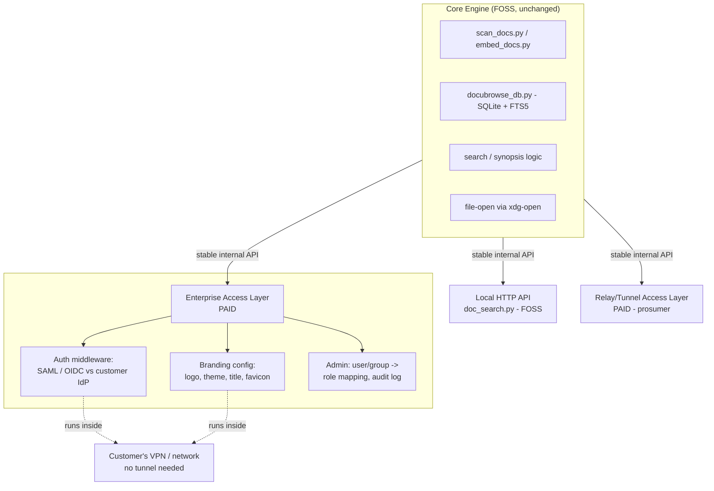

# Enterprise/Paid Tier — Plan & Architecture

Follow-up to `ARCHITECTURE_NOTES_transport_layer.md`. James's framing: most paying
customers will be orgs, not individuals, and orgs already solve "remote access"
via their own VPN. That changes what the paid tier actually needs to be.

## Reframing

The prior notes assumed the paid differentiator was a **relay/tunnel** (Tailscale-
for-your-doc-index). That's real, but mostly a **prosumer** play — individuals
without a VPN.

For **enterprise**, the three things that actually sell are:

1. **No relay needed** — they're already on their VPN/corp network. The "remote
   access" problem is solved before we show up.
2. **SSO integration** — SAML/OIDC against *their* IdP (Okta, Azure AD, Google
   Workspace), not a DocuBrowse-managed account system. This is usually the #1
   procurement blocker if missing.
3. **Branding / white-label** — logo, color scheme, title, favicon, maybe a
   custom internal hostname. Low engineering cost, high perceived value for
   internal-tool rollouts.

So there are really **two paid shapes**, not one:

| | Prosumer tier | Enterprise tier |
|---|---|---|
| Deploy | Vendor-hosted relay | Self-hosted, inside customer VPN |
| Auth | Simple/local | SSO (SAML/OIDC) |
| Branding | No | Yes (white-label) |
| Sells via | Convenience | Procurement checklist (SSO is often mandatory) |

These can share the same core engine and local access layer — they differ only
in which access-layer modules are enabled.

## Architecture Diagram



ASCII fallback:

```
                    +---------------------------+
                    |   Core Engine (FOSS)       |
                    |  scan/embed/index, FTS5,   |
                    |  search/synopsis, file-open|
                    +-------------+---------------+
                                   | stable internal API
        +--------------------------+--------------------------+
        |                          |                           |
+----------------+      +------------------------+   +----------------------+
| Local HTTP API |      | Enterprise Access Layer |   | Relay/Tunnel Layer    |
| (doc_search.py)|      | (PAID)                   |   | (PAID - prosumer)     |
| FOSS, today    |      |  - SSO (SAML/OIDC)       |   |  - tunnel to home     |
+----------------+      |  - Branding/white-label  |   |    server, vendor     |
                         |  - Admin / audit         |   |    hosted relay       |
                         | Deployed inside           |   +----------------------+
                         | customer VPN - no tunnel  |
                         +--------------------------+
```

## Q1: Separate repo for the paid layer?

**Recommendation: no, not yet.** One repo, with a clear module boundary:

```
DocuBrowse/
  core/            (existing: scan_docs, embed_docs, docubrowse_db, extractors)
  access_local/    (existing: doc_search.py + index.html — FOSS)
  access_enterprise/   (NEW — SSO, branding, admin; gated)
  access_relay/        (NEW, later — prosumer tunnel; gated)
```

Reasons:

- Core engine isn't packaged as a library yet (it's scripts + a shared SQLite
  DB). A separate repo importing it as a dependency would require packaging
  work *before* any enterprise feature exists — that's the wrong thing to do
  first.
- Single repo keeps the "fix a search bug once, both tiers benefit" property
  from the original notes intact.
- Gating doesn't require a separate repo — it requires (a) the enterprise
  modules to be optional imports that no-op or 404 if absent/unlicensed, and
  (b) a license-key check gating their activation. `access_enterprise/` can
  even ship under a different LICENSE file within the same repo (GitLab
  CE/EE-style: MIT core, separate license on the `access_enterprise/` tree).

**Revisit a split repo only if/when**: the core engine gets a real packaging
boundary (pip-installable, versioned API) — at that point `access_enterprise`
becomes a private repo that depends on `docubrowse-core==x.y` and the split is
cheap. Until then, a split repo is overhead with no payoff.

## Q2/Q3: SSO + Branding instead of VPN/relay

Confirmed by the diagram above — `access_enterprise/` assumes it's running
inside the customer's network already. No tunnel code needed for this tier.

### SSO (SAML/OIDC)
- Implement as **auth middleware in front of doc_search.py's existing routes**
  — doesn't touch core engine or DB schema (matches "stable internal API"
  principle from prior notes).
- Support OIDC first (Okta, Azure AD, Google Workspace all speak it cleanly;
  simpler than SAML). SAML as a second pass if a customer requires it.
- Map IdP groups/claims -> DocuBrowse roles (read-only vs admin-ish e.g. who
  can delete/purge). This is the natural place for any future "multi-user"
  permission model to live.
- Local-auth (today's no-auth-on-localhost model) stays the FOSS default;
  SSO middleware is purely additive and only active when configured.

### Branding / white-label
- A single config file (e.g. `branding.json`): logo path/URL, primary/accent
  colors, app title, favicon.
- `doc_search.py` serves these values to `index.html` (template the `<title>`,
  inject CSS variables, swap logo ``).
- Low effort, no core engine changes — good early "enterprise tier exists"
  proof point even before SSO is done.

## Suggested Execution Plan

1. **Phase 1 — API contract** (carryover from transport-layer notes): write
   down the formal spec for `doc_search.py`'s HTTP endpoints — routes,
   request params, response JSON shapes. One page, probably inline as
   structured comments/docstrings in `doc_search.py` plus a status doc. This
   is the foundation everything else builds on top of.
2. **Phase 2 — Branding** (cheapest, demoable fast): `branding.json` +
   template hooks in `index.html`/`doc_search.py`. Ship as
   `access_enterprise/branding/`, gated behind a simple config flag for now
   (no license enforcement yet — prove the feature first).
3. **Phase 3 — SSO middleware**: OIDC support in front of doc_search.py,
   group->role mapping, admin config UI or config file. This is the
   procurement-checklist item — prioritize Okta + Azure AD + Google
   Workspace.
4. **Phase 4 — Enterprise packaging**: install/deploy guide for "run this
   inside our VPN," license-key gating for Phases 2-3, basic audit log.
5. **Phase 5 (separate track, prosumer)** — relay/tunnel layer from the
   original transport-layer notes. Independent of Phases 1-4; can happen in
   parallel or be deferred entirely.

## Open Questions (not decisions)

- License-key enforcement mechanism for `access_enterprise/` — honor-system
  config flag vs. real license server? Affects how soon Phase 3 packaging
  matters.
- Pricing model — per-seat, per-deployment/site license, or both?
- SAML needed for v1, or is OIDC-only acceptable for first enterprise
  customers? (Affects Phase 2 scope significantly — SAML is much more work.)
- Does the admin/group->role mapping need a UI in v1, or is a config file
  sufficient until there's a real customer asking for self-service?
